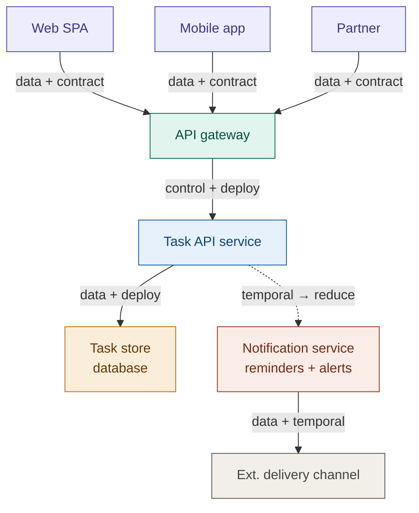

# Part 1: Coupling Analysis — Task Board REST API

---

## 1.0 Dependency Diagram

The diagram below maps all seven system elements. Node colour encodes tier (purple = consumers, teal = gateway, blue = application service, amber = data store, coral = outbound/notification). Edge style encodes coupling type: a solid arrow is a synchronous dependency; a dashed arrow is temporal coupling flagged for replacement with an async message queue. Badges call out the two tight-but-acceptable couplings (green) and the coupling most urgently recommended for reduction (red).

**Legend**

| Edge style | Meaning |
|---|---|
| Solid arrow → | Synchronous dependency (data / control / deployment) |
| Dashed arrow → | Temporal coupling — recommend async queue |
| `tight OK` badge | Tight coupling: acceptable trade-off |
| `reduce` badge | Coupling to reduce |

---

## 1.1 Coupling Inventory

The system consists of the following elements:

| # | Element |
|---|---------|
| 1 | Web SPA |
| 2 | Mobile App |
| 3 | Partner Integration (external, long-lived) |
| 4 | API Gateway |
| 5 | Task API Service |
| 6 | Task Store (database) |
| 7 | Notification Service |

---

### Dependency Table

#### Web SPA → Task API Service (via Gateway)

| Property | Detail |
|----------|--------|
| **Direction** | Web SPA depends on Task API |
| **Type** | **Data coupling + Contract coupling** |
| **Mechanism** | The SPA sends and receives JSON payloads over HTTP. It binds field names (`id`, `title`, `done`) directly in its UI rendering logic. |
| **Ripple risk** | Any rename (e.g. change B: `done` → `completed`) or field removal silently breaks the SPA's display or form submission unless the frontend is updated in lockstep. Adding a new optional field (change A: `priority`) is safe only if the SPA's JSON parser tolerates unknown keys — many typed frontends (TypeScript strict mode, for example) may not. |

---

#### Mobile App → Task API Service (via Gateway)

| Property | Detail |
|----------|--------|
| **Direction** | Mobile App depends on Task API |
| **Type** | **Data coupling + Deployment coupling** |
| **Mechanism** | Like the SPA, the app binds to field names and HTTP status codes. Unlike the SPA, mobile app versions are long-lived: users may stay on a months-old version indefinitely because they do not update. |
| **Ripple risk** | This is the most fragile dependency in the system. Breaking changes (field renames, stricter validation, required new headers like change C) will hit *installed but unupdated* mobile clients that the team cannot force to upgrade. A breaking change on the server side must co-exist with the old contract for as long as old app versions are in circulation, which can be 12–18 months. |

---

#### Partner Integration → Task API Service (via Gateway)

| Property | Detail |
|----------|--------|
| **Direction** | Partner depends on Task API |
| **Type** | **Contract coupling (tight) + Temporal coupling** |
| **Mechanism** | Partners write long-lived, often hand-maintained HTTP clients. They depend on stable URLs, stable field names, and predictable error shapes. They typically cannot update quickly and may have contractual SLAs tied to API stability. |
| **Ripple risk** | The longest blast radius of any consumer. Change D (shrinking `title` max length from 500 → 100 chars) is especially dangerous here: a partner's system may have been persisting and re-submitting titles of 200–300 characters for years. The validation rule change silently turns previously valid requests into errors. Any breaking change — field rename, new required header, stricter validation — risks breaching the partner's integration contract. |

---

#### API Gateway → Task API Service

| Property | Detail |
|----------|--------|
| **Direction** | Gateway depends on Task API (routing) |
| **Type** | **Control coupling + Deployment coupling** |
| **Mechanism** | The gateway routes requests by path and/or version header/prefix. It may also enforce auth, rate limits, and header injection before forwarding. If version routing (`/v1/`, `/v2/`) is added, the gateway must be updated to understand new route prefixes. |
| **Ripple risk** | If the gateway is configured as a "dumb proxy" it is minimally coupled; if it performs request/response transformation (e.g. translating v1 `done` ↔ v2 `completed` on the wire), it becomes tightly coupled to both versions simultaneously and becomes a risk surface for transformation bugs. |

---

#### All Clients (SPA, Mobile, Partner) → API Gateway (inbound)

| Property | Detail |
|----------|--------|
| **Direction** | All three consumers depend on the gateway's public hostname, TLS certificate, and base URL |
| **Type** | **Deployment coupling** |
| **Mechanism** | Every client has the gateway's base URL hardcoded or configured at build time. The clients also depend on the gateway's TLS certificate chain being valid and on its availability in the DNS. |
| **Ripple risk** | This coupling is easy to forget because it sits "outside" the API contract — it is infrastructure rather than payload coupling. If the gateway is re-hosted, migrated to a new domain, or has its certificate rotated in a way that breaks pinning (relevant for some mobile clients), all three consumer types are simultaneously affected. Partner integrations and old mobile builds are again the highest-risk consumers because they are updated least frequently. Any gateway-level change (re-hosting, TLS renewal, WAF policy update that changes error responses) must be treated as a coordinated change for all consumers. |

---

#### Task API Service → Task Store (database)

| Property | Detail |
|----------|--------|
| **Direction** | Task API depends on Task Store |
| **Type** | **Data coupling + Deployment coupling** |
| **Mechanism** | The API issues SQL (or equivalent) queries/mutations against a schema it shares with the database. Column names, data types, and constraints couple the two directly. |
| **Ripple risk** | If the database schema changes (e.g. adding a `priority` column for change A, or reducing `title` VARCHAR from 500 to 100 for change D), the API service must be deployed in coordination with the migration. A schema change that is not backward-compatible (e.g. dropping a column the API still reads) requires a carefully ordered multi-step migration. Internal to the system, this is the highest deployment-coordination risk. |

---

#### Task API Service → Notification Service

| Property | Detail |
|----------|--------|
| **Direction** | Task API depends on Notification Service |
| **Type** | **Temporal coupling** (synchronous call) → ideally reduced to **event/message coupling** |
| **Mechanism** | If Task API calls Notification Service synchronously (e.g. HTTP POST) when a task is created or updated, the two are temporally coupled: a Notification Service outage or slow response directly delays or fails the original task operation for the user. |
| **Ripple risk** | If the team splits or re-deploys Notification Service independently, any interface change (new required fields in the notification payload, new auth requirements) can break the Task API's outgoing calls without warning. Temporal coupling also means the Task API's latency is bounded below by the Notification Service's response time. |

---

#### Task Store → (no upstream consumers outside Task API)

| Property | Detail |
|----------|--------|
| **Direction** | Task Store is a leaf dependency |
| **Type** | **Data coupling** (schema) |
| **Mechanism** | The Task Store's schema is private to the Task API; no external client accesses it directly. This is an intentional encapsulation boundary. |
| **Ripple risk** | Low externally. Internally, schema migrations must be coordinated with API service deployments (see above). |

---

#### Notification Service → External Delivery Channel (email provider, push gateway)

| Property | Detail |
|----------|--------|
| **Direction** | Notification Service depends on one or more external delivery providers |
| **Type** | **Data coupling + Temporal coupling** (synchronous outbound HTTP) |
| **Mechanism** | To send a reminder or push alert, Notification Service makes an outbound call to a third-party provider (SMTP relay, APNs, FCM, etc.). The Notification Service binds to that provider's API contract — endpoint URL, authentication scheme, payload schema. |
| **Ripple risk** | This dependency is often overlooked in system-internal coupling analyses but is significant in the context of *internal service splits*: if the team splits Notification Service into separate email and push micro-services, each split service inherits a different external provider dependency. A provider API change (e.g. deprecating a legacy push API) ripples into Notification Service and must be handled without affecting the Task API or any consumer. If the outbound call is synchronous, a provider outage also propagates back up through Task API to the end user — reinforcing why the Task API → Notification link should be made async first. |

---

## 1.2 Tight Coupling: Acceptable Trade-offs

### Tight Coupling 1: Task API Service ↔ Task Store

**Why it is acceptable here:**  
The Task Store is a private implementation detail of the Task API. No other system touches the database directly. The coupling is contained within a single team and deployment domain. Tight schema coupling between the API service and its own database is the standard pattern for a backend service; it does not leak to any external consumer. The team controls both ends and can coordinate migrations safely.

**Mitigation of the residual risk:**  
Use expand-and-contract (parallel column) migrations: add the new column, deploy the new API code that reads both old and new, then drop the old column in a later release. This avoids requiring a perfectly atomic dual deployment.

---

### Tight Coupling 2: Web SPA ↔ Task API Contract (in early stages)

**Why it is acceptable here:**  
The Web SPA is a first-party client deployed by the same team. It can be updated and redeployed at the same time as the API (or even built and tested against the API in a single pipeline). Short-lived, coordinated deployment cycles mean the cost of tight coupling is low — the SPA does not need the same API stability guarantee as a partner or a mobile app.

**Justification of the trade-off:**  
Keeping the SPA tightly coupled to the latest API avoids the overhead of maintaining backwards-compatible shims for a client the team directly controls. The risk is manageable as long as SPA and API are deployed together.

---

## 1.3 Coupling to Reduce

### Reduce Coupling 1: Task API Service → Notification Service (Temporal → Async/Event)

**Current problem:**  
Synchronous HTTP calls from Task API to Notification Service create temporal coupling: both must be up simultaneously for a task creation to succeed. A Notification Service slowdown or crash degrades the user-facing task operation.

**Proposed reduction:**  
Introduce an **asynchronous message queue** (e.g. a simple internal event bus or message broker). When a task is created or updated, the Task API publishes a `task.created` / `task.updated` event to the queue and immediately returns the 201/200 response to the caller. The Notification Service consumes events independently at its own pace.

**Effect on coupling:**  
- Removes temporal coupling: the two services no longer need to be simultaneously available.
- Reduces deployment coupling: the Notification Service can be redeployed or even replaced without coordinating with the Task API, provided the event schema is stable.
- The remaining coupling is **data coupling on the event schema**, which is far weaker than temporal coupling and can be versioned independently.

---

### Reduce Coupling 2: Partner / Mobile Client → Task API Contract (Contract → Versioned Interface)

**Current problem:**  
Partners and mobile clients depend on the current (unversioned) contract. Any breaking change — field rename (B), required header (C), stricter validation (D) — hits all consumers simultaneously with no migration window.

**Proposed reduction:**  
Introduce **explicit API versioning** with a coexistence period:

- Expose a stable `v1` contract that is frozen for the duration of the deprecation window (e.g. minimum 12 months after a breaking change is published).
- Route breaking changes into a new `v2` contract.
- Coupling is reduced from *implicit contract coupling* (everyone assumes the same unversioned wire format) to *explicit version contract coupling* (each client declares which version it depends on, and that version's stability is a documented promise).
- Partners can migrate on their own schedule. Mobile clients can migrate across app release cycles. The team controls the coexistence window rather than having it forced on them by surprise breakage.

**Mechanism options:**  
URL path versioning (`/v1/tasks`, `/v2/tasks`) or `Accept` header versioning (`Accept: application/vnd.tasks.v2+json`). The gateway handles routing so the Task API service can implement both versions or a translation layer behind a single codebase.

---

## Summary Table

| Coupling | Type | Severity | Action |
|----------|------|----------|--------|
| All clients → API Gateway | Deployment (hostname, TLS) | Medium | Keep gateway stable; treat re-hosting as coordinated consumer change |
| Web SPA → Task API | Data + Contract | Medium | Acceptable (same team, coordinated deploys) |
| Mobile App → Task API | Data + Deployment | **High** | Reduce via versioning + long deprecation window |
| Partner → Task API | Contract + Temporal | **High** | Reduce via versioned endpoints + migration SLA |
| Gateway → Task API | Control + Deployment | Medium | Keep gateway dumb; avoid transformation logic |
| Task API → Task Store | Data + Deployment | Medium | Acceptable (private boundary); use expand-and-contract migrations |
| Task API → Notification Service | **Temporal** | **High** | Reduce via async event queue |
| Notification Service → Ext. Delivery | Data + Temporal | Medium | Isolate behind Notification abstraction; plan for provider change |

---

