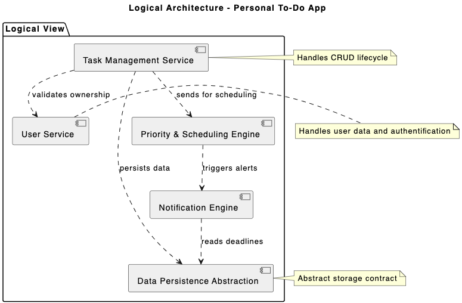
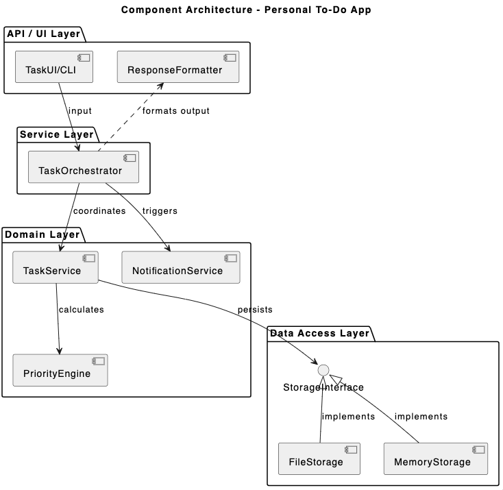

### Exercise 3.1: Refactoring for Reusability

## Personal To-Do Application
The Personal To-Do Application is a productivity tool designed to help users create, organize, and track their daily tasks.

1. **Logical Architecture**
The Logical Architecture describes the system's functional components and their responsibilities.

**Components:**
- **Task Management Service:** The primary logic for handling the lifecycle of a task, including creation, editing, and deletion.

- **Priority & Scheduling Engine:** The logic that calculates task importance and manages deadlines or recurring schedules.

- **User Service:** The logical gatekeeper that ensures users can only access their personal task lists.

- **Notification Engine:** A service that monitors task deadlines to trigger timely alerts for the user.

- **Data Persistence Abstraction:** A logical representation of "storage" that ensures information is saved and retrieved reliably.

2. **Component Architecture**
The Component View shows the actual code components, layers, and their dependencies. This is the "implementation" view for developers.

**Components:**
- **API / UI Layer (TaskUI, ResponseFormatter):** Handles user interaction and standardizes data output.

- **Service Layer (TaskOrchestrator):** A central mediator coordinating logic across different domain services.

- **Domain Layer (TaskService, PriorityEngine, NotificationSvc):** Contains the core business logic and rules.

- **Data Access Layer (StorageInterface, File/Memory Storage):** Provides a pluggable persistence system using the Strategy Pattern.

3. **Deployment Architecture**
This view shows the actual infrastructure and where components run. Useful for DevOps.

                    ┌──────────────────┐
                    │     Internet     │
                    └────────┬─────────┘
                             │
                    ┌────────▼────────┐
                    │  User Browser   │ (Client Device)
                    └────────┬────────┘
                             │
            ┌────────────────┼────────────────┐
            │         Cloud App Server        │
            │      (Python/Docker Cont.)      │
            └────────────────┬────────────────┘
                             │
                    ┌────────▼────────┐
                    │    Database     │ (Managed SQL/NoSQL)
                    └─────────────────┘

**Components:**

- **User Browser:** Runs the frontend interface on the user's local hardware.

- **App Server:** Hosts the Python backend and business logic in a virtualized environment.

- **Database:** Stores all persistent task and user data, typically on a replicated, managed cluster.

