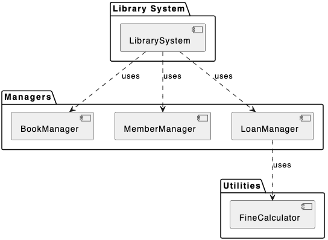

### Exercise 1.1 Storage Abstraction
**Brief explanation:**: 

The 'DocumentManager' class interacts with a 'Storage' interface, which abstracts away the details of how the data is stored and retrieved. This allows us to switch between different storage implementations (like 'FileSystemStorage' and 'InMemoryStorage') without changing the logic in 'DocumentManager'. The abstraction provided by the 'Storage' interface decouples the document management logic from the storage logic, making the code easier to maintain. From this abstraction,  we can see the use of Dependency Injection which will allow us to easily update the code should we decide to change the Storage class.

### Exercise 2.1: Breaking down a monolithic System

**Component Diagram:**

**Why Seperation of Concerns works**
In the old monolithic class, all the code was "tangled." If we wanted to change how a book was stored, we might accidentally break the fine calculation logic because they shared the same space.

We had a God class problem. By separating concerns, a developer only needs to understand the class of concern to fix a  bug. They don't have to wade through hundreds of lines of code to find what you're looking for.

Testing also becomes easier. You can test the FineCalculator by giving it a date and checking the number. You don't need to create a Book, a Member, and a Loan just to see if the logic works.

We can also reuse some of the components. Suppose the library now wants to loan out gadgets. We can leverage the already existing MemberManager and FineCalculator classes.

