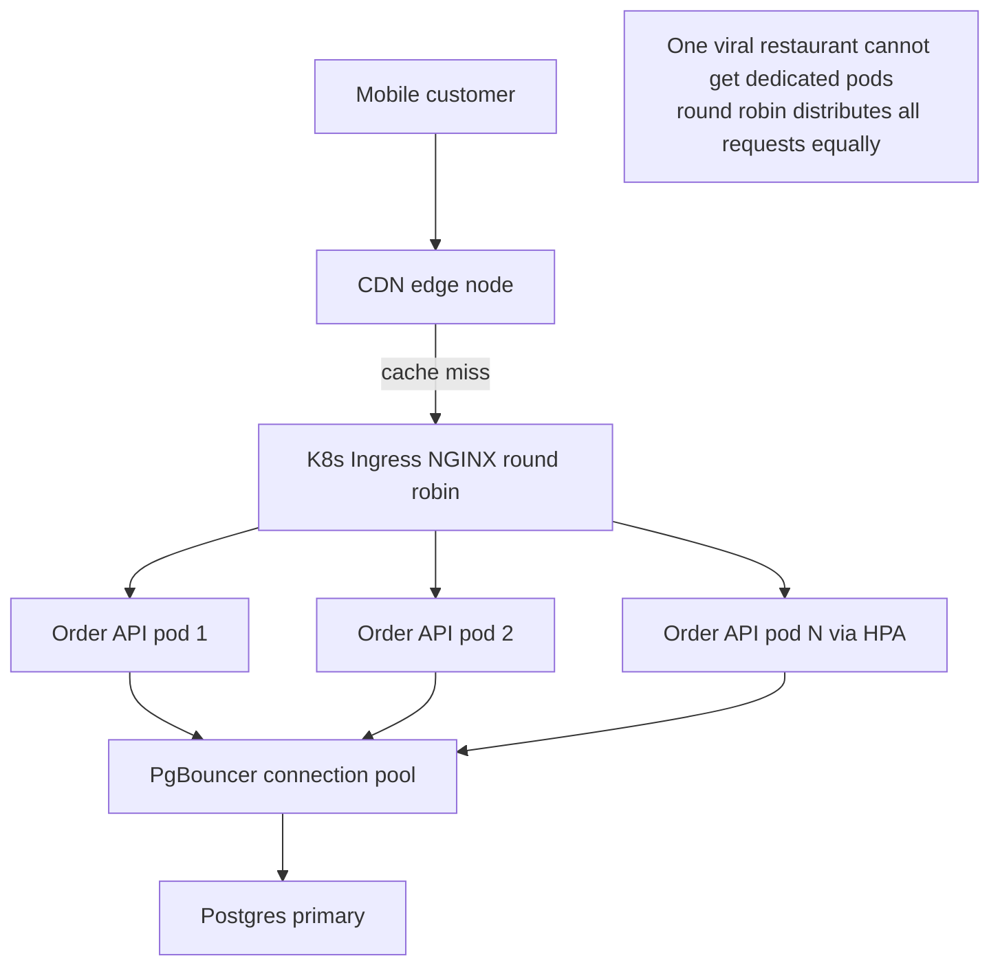
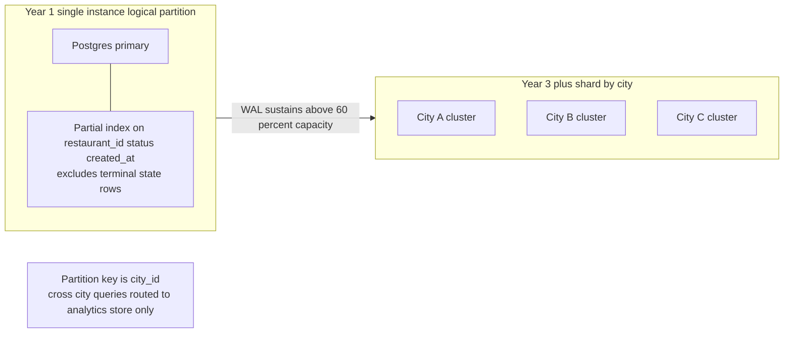
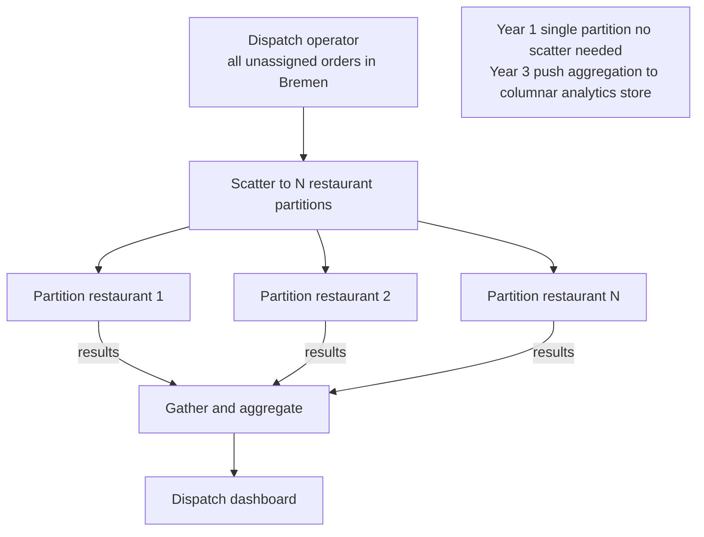
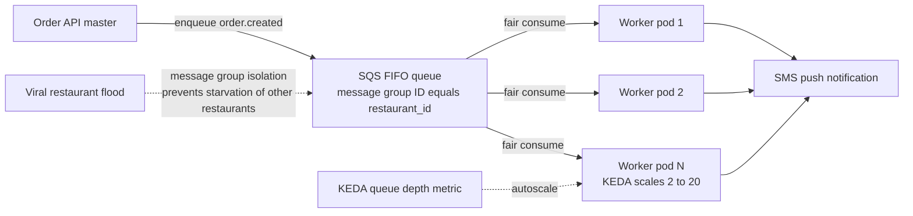
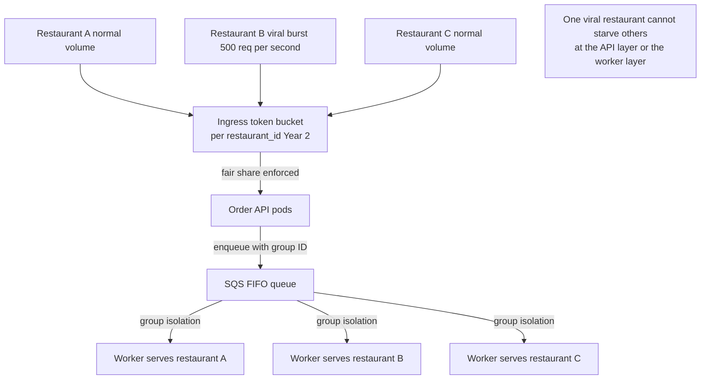

# Part 3 — Task 3.1: Pattern Checklist
**CityBite Scalability Architecture | Lecture 10 Assignment**

---

## Load Balancing

Kubernetes Ingress (NGINX) already provides Layer 7 load balancing across all Order API pod replicas using round-robin by default, which is sufficient at Year 1 because every pod is stateless and identical in capability. Under peak load, HPA adds replicas and the Ingress controller discovers them automatically via Kubernetes service endpoints, so no manual reconfiguration is needed. A least-connections algorithm would be marginally better during dinner spikes — when some pods are mid-transaction — but the operational gain over round-robin is small until the pod count grows into the tens. Within the database tier, PgBouncer acts as a connection-level load balancer, multiplexing hundreds of application connections onto a small, fixed pool of actual Postgres server connections, which is the single most impactful load-balancing change available for the current bottleneck. At the CDN layer, menu image requests are load-balanced across the CDN provider's global edge nodes transparently, so origin load is reduced to cache misses only.

**Multi-tenant fairness note:** With round-robin load balancing, a sudden burst from one restaurant's customer base (e.g. a viral social media post driving 500 simultaneous checkouts at one venue) will consume API pods proportionally to its request rate. If that burst is large enough to trigger HPA, the new pods serve all restaurants equally — the viral restaurant does not get a dedicated pod pool, so it cannot starve other restaurants of capacity. Rate limiting at the Ingress level (e.g. per-`restaurant_id` token bucket) is the recommended Year 2 addition to enforce explicit fairness guarantees rather than relying on statistical load distribution alone.

---

## Sharding / Partitioning

CityBite does not shard its Postgres database at Year 1 because the write volume of a single-city operation sits comfortably below the ceiling of a well-sized RDS primary instance (estimated 2 000–4 000 OLTP TPS). The natural partition key when sharding becomes necessary is `city_id` or `region_id` — each city's orders, restaurants, and accounts are almost entirely self-contained, with cross-city queries limited to analytics and platform-level reporting that can tolerate eventual consistency. Within the existing single instance, logical partitioning is already applied at the index level: the partial index on `orders(restaurant_id, status, created_at)` that excludes terminal-state rows is functionally equivalent to partitioning the hot dataset away from the cold historical dataset, giving the query planner a much smaller index to scan. The operational cost of introducing true sharding — separate backup schedules, schema migrations across N clusters, cross-shard transaction handling for any order that spans a city boundary during expansion — is not justified until write latency on the primary consistently approaches its throughput ceiling, which should be monitored via the WAL write rate metric and acted on when it sustains above 60% of capacity.

---

## Scatter / Gather

Scatter/gather is not a primary pattern for CityBite's current read workload because the most frequent queries — active orders for one restaurant, menu for one restaurant — are narrow, single-partition reads that are fully served by the `restaurant_id` index without fanning out. The pattern becomes relevant in two future scenarios: first, when a dispatch operator queries "all unassigned orders across all restaurants in Bremen right now" — this would scatter to N restaurant partitions and gather results for the dashboard; second, when CityBite expands to multiple cities and an analytics query needs to aggregate revenue across all regional Postgres clusters simultaneously. In both cases the gather step is the bottleneck, so the mitigation is to push aggregation work into a dedicated analytics store (e.g. a columnar warehouse fed by the SQS analytics worker) rather than scattering live OLTP queries. At Year 1, the single-city, single-database topology means scatter/gather overhead does not yet exist, and introducing a distributed query layer prematurely would add latency and operational complexity for no current benefit.

---

## Master / Worker (Worker Pool)

CityBite already implements the master/worker pattern in its notification pipeline: the Order API acts as the master by writing events to the SQS queue, and the notification worker Deployment acts as the worker pool by consuming and processing those events independently of the master's request lifecycle. This is precisely the decoupling demonstrated in `example2_scalability_queue_workers_citybite.py` — the master never blocks on worker availability, and the worker pool scales horizontally (via KEDA) in response to queue depth without any coordination from the master. The pattern extends naturally to other async workloads: a dispatch-assignment worker pool, a menu-image-resizing worker pool, and an analytics-ingestion worker pool can all consume from the same or separate SQS queues, each autoscaled independently based on its own queue depth metric.

**Multi-tenant fairness note:** A naive single-queue worker pool creates a fairness risk — if one viral restaurant generates a flood of `order.created` events, its messages will dominate the queue and delay notifications for all other restaurants' customers. The mitigation is a **per-restaurant message priority or a weighted fair-queue design**: in SQS terms, this means either routing high-volume restaurants to a separate lower-priority queue (so the main queue remains responsive for normal-volume restaurants) or using a message group ID equal to `restaurant_id` with FIFO queues, which ensures that one restaurant's backlog does not block another's messages from being picked up by an available worker. At Year 1 with a single city and moderate order volume, the risk is low; at Year 2+ with viral events becoming common, the fair-queue design should be implemented before it becomes a customer-facing incident.

---

## Summary Table

| Pattern | CityBite status | Key mechanism | When to revisit |
|---|---|---|---|
| Load balancing | Active (Ingress + PgBouncer) | Round-robin pods; connection pool | Add per-restaurant rate limiting at Year 2 |
| Sharding / partitioning | Deferred — logical only | Partial index as hot/cold partition | Shard by city when WAL > 60% capacity |
| Scatter / gather | Not yet needed | Single-partition reads dominate | Introduce with multi-city analytics store |
| Master / worker pool | Active (SQS + KEDA workers) | API enqueues; workers autoscale | Add fair-queue by restaurant_id at Year 2 |

---

*Terminology aligned with `example1_scalability_hot_path_citybite.py` (partition key, hot path) and `example2_scalability_queue_workers_citybite.py` (master/worker decoupling via SQS).*

---

## Diagrams

> Paste each block into draw.io via **Extras → Edit Diagram → switch dropdown to Mermaid → OK**.

### Diagram 1 — Load Balancing layers

---

### Diagram 2 — Sharding deferred, logical partition at Year 1

---

### Diagram 3 — Scatter Gather future state

---

### Diagram 4 — Master Worker pool with fair queue

---

### Diagram 5 — Multi-tenant fairness across both layers

