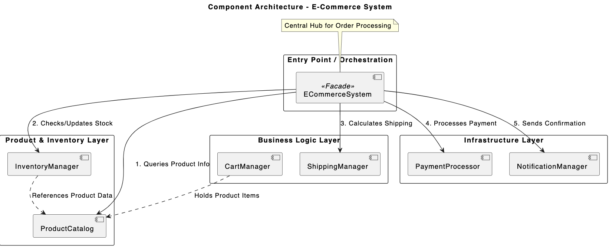

### Exercise 1.2: Refactoring Bad Code to Use Abstraction
**Before and After Refactoring:**
    1. NotificationService is now only responsible for the workflow of notifying a user. It is no longer responsible for knowing how to talk to the internet or manage API keys.
    2. The NotificationService used to be hard to test because it was tightly coupled to the SendGrid API. Now it is easy to test because we can inject a mock email provider that does not actually send real emails.
    3. If SendGrid doubles their prices and you want to switch toto another email provider, we only have to write one new class (NewEmailProvider) and don't have to touch the NotificationService logic at all.

### Exercise 2.2: Designing a Modular E-commerce System
**Component Diagram:**

So in this exercise, I decided to use the Mediator design pattern by creating an orchestrator - ECommerceService to decoupleyour system’s logic. Components like PaymentProcessor and InventoryManager remain unaware of one another and only communicate through a central hub - orchestrator. This ensures that the components do not directly talk to each other. I also ensured that the each class has a single responsibility(SRP). The use of dataclasses provides a "Data Model" layer. Unlike standard classes, dataclasses are designed specifically to carry state such as  product IDs and prices, without holding complex behavior. This allows information to be used in the orchestrator without the components needing to understand the internal stat or mechanics of the objects they are processing. This combination results in a highly modular system.

### Exercise 2.2: Designing a Modular E-commerce System