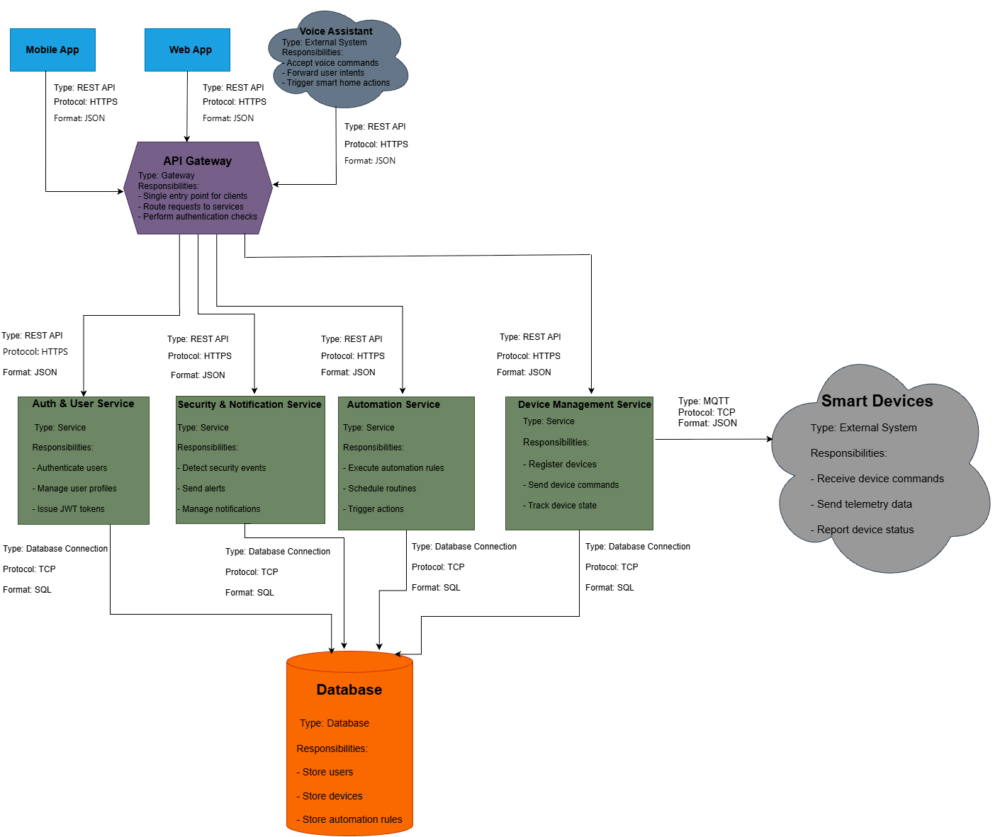

# Assignment Submission Guide: Using Pull Requests

This guide will walk you through submitting your Lecture 3 assignment via GitHub Pull Request.

## Prerequisites

- GitHub account
- Git installed on your computer
- Basic familiarity with Git commands
- All assignment files completed

## Step-by-Step Submission Process

### Step 1: Fork the Repository

1. Go to the course repository: `https://github.com/[COURSE_REPO]/arch-course-cu`
2. Click the **"Fork"** button in the top right corner
3. This creates a copy of the repository in your GitHub account

### Step 2: Clone Your Fork

```bash
# Replace YOUR_USERNAME with your GitHub username
git clone https://github.com/YOUR_USERNAME/arch-course-cu.git
cd arch-course-cu
```

### Step 3: Create Your Submission Branch

```bash
# Create and switch to a new branch
git checkout -b assignment-lecture3-YOUR_NAME

# Example:
# git checkout -b assignment-lecture3-john-doe
```

### Step 4: Create Your Submission Directory

```bash
# Create your submission directory
mkdir -p arch-course-cu/lecture-3/submissions/YOUR_NAME
cd arch-course-cu/lecture-3/submissions/YOUR_NAME
```

### Step 5: Prepare Your Files

#### 5.1 Export Draw.io Diagrams as Images

For each `.drawio` file you created:

1. Open the file in draw.io
2. Go to **File → Export as → PNG**
3. Settings:
   - **Zoom**: 200% (for high quality)
   - **Border**: 10px
   - **Transparent Background**: Optional
4. Save with the same name as your `.drawio` file
   - Example: `part1_component_connector_diagram.png`

#### 5.2 Organize Your Files

Your directory structure should look like:

```
submissions/YOUR_NAME/
├── part1_component_connector_diagram.drawio
├── part1_component_connector_diagram.png
├── part1_architecture_vs_design.md
├── part2_quality_attributes.md
├── part2_multiple_views.drawio
├── part2_multiple_views.png
├── part3_architectural_pattern.drawio
├── part3_architectural_pattern.png
├── part3_pattern_justification.md
├── part3_architectural_decisions.md
├── part4_technical_debt.md
├── part4_architectural_smells.md
├── part4_smell_refactoring.drawio
├── part4_smell_refactoring.png
├── code/                              # Optional
│   ├── component_examples.py
│   └── architecture_models.py
└── README.md
```

#### 5.3 Create README.md

Create a `README.md` file in your submission directory with:

```markdown
# Assignment Submission: Lecture 3

**Student Name**: [Your Name]  
**Student ID**: [Your ID]  
**Submission Date**: [Date]

## Overview

[Brief overview of your submission]

## Files Included

- [List all files with brief descriptions]

## Key Highlights

- [Highlight 1]
- [Highlight 2]
- [Highlight 3]

## How to View

1. Open `.drawio` files in draw.io to see editable diagrams
2. View `.png` files for quick reference
3. Read `.md` files for documentation
4. Run code examples (if included) with Python 3
```

### Step 6: Reference Images in Your Markdown Files

In your `.md` files, include images using:

```markdown

```

### Step 7: Commit Your Changes

```bash
# Make sure you're in the repository root
cd /path/to/arch-course-cu

# Stage all your files
git add arch-course-cu/lecture-3/submissions/YOUR_NAME/

# Commit with a descriptive message
git commit -m "Submit Lecture 3 Assignment - [Your Name]

- Component and connector diagram
- Multiple architecture views
- Architectural decisions and patterns
- Technical debt analysis
- All diagrams exported as PNG images"
```

### Step 8: Push to GitHub

```bash
git push origin assignment-lecture3-YOUR_NAME
```

### Step 9: Create Pull Request

1. Go to your fork on GitHub: `https://github.com/YOUR_USERNAME/arch-course-cu`
2. You should see a banner saying "Your recently pushed branches" with your branch
3. Click **"Compare & pull request"**
4. Or go to the original repository and click **"New Pull Request"**
5. Select:
   - **Base repository**: `[COURSE_REPO]/arch-course-cu`
   - **Base branch**: `main` (or `master`)
   - **Compare**: `YOUR_USERNAME/arch-course-cu` → `assignment-lecture3-YOUR_NAME`

### Step 10: Fill Out PR Template

1. **Title**: `[Assignment] Lecture 3 - [Your Name]`
2. **Description**: Fill out the PR template (see `.github/pull_request_template.md`)
3. **Checklist**: Mark all completed items
4. **Review**: Double-check everything before submitting

### Step 11: Submit PR

Click **"Create Pull Request"**

## After Submission

### Monitor Your PR

- Check for any feedback or comments
- Address any requested changes
- Update your PR if needed

### Making Changes After Submission

If you need to make changes:

```bash
# Make your changes
# Then commit and push again
git add .
git commit -m "Update: [description of changes]"
git push origin assignment-lecture3-YOUR_NAME
```

The PR will automatically update with your new commits.

## Troubleshooting

### Issue: Can't push to GitHub

**Solution**: Make sure you've forked the repository and are pushing to your fork, not the original.

### Issue: PR shows conflicts

**Solution**: 
1. Pull latest changes from upstream
2. Merge or rebase your branch
3. Resolve conflicts
4. Push again

### Issue: Images not showing in PR

**Solution**: 
- Make sure PNG files are committed and pushed
- Check that image paths in markdown are correct
- Images should be relative to the markdown file location

### Issue: Draw.io files too large

**Solution**: 
- Remove unnecessary elements
- Simplify diagrams if possible
- GitHub has a 100MB file size limit

## Best Practices

1. **Commit Often**: Make small, logical commits
2. **Clear Messages**: Write descriptive commit messages
3. **Test Locally**: Verify all files before pushing
4. **Check PR Preview**: Review how your PR looks on GitHub
5. **Follow Naming**: Use consistent naming conventions
6. **Include Both Formats**: Always include both `.drawio` and `.png` files

## Need Help?

- Check GitHub documentation: https://docs.github.com/en/pull-requests
- Ask your instructor
- Review the example solutions in `lecture-3/sol/`

## Checklist Before Submitting PR

- [ ] All required files are included
- [ ] All diagrams exported as PNG images
- [ ] All markdown files reference images correctly
- [ ] Code (if any) is in `code/` directory
- [ ] README.md is complete
- [ ] All files are committed
- [ ] Branch is pushed to GitHub
- [ ] PR description is filled out completely
- [ ] PR title follows the format: `[Assignment] Lecture 3 - [Your Name]`

Good luck with your submission! 🚀

