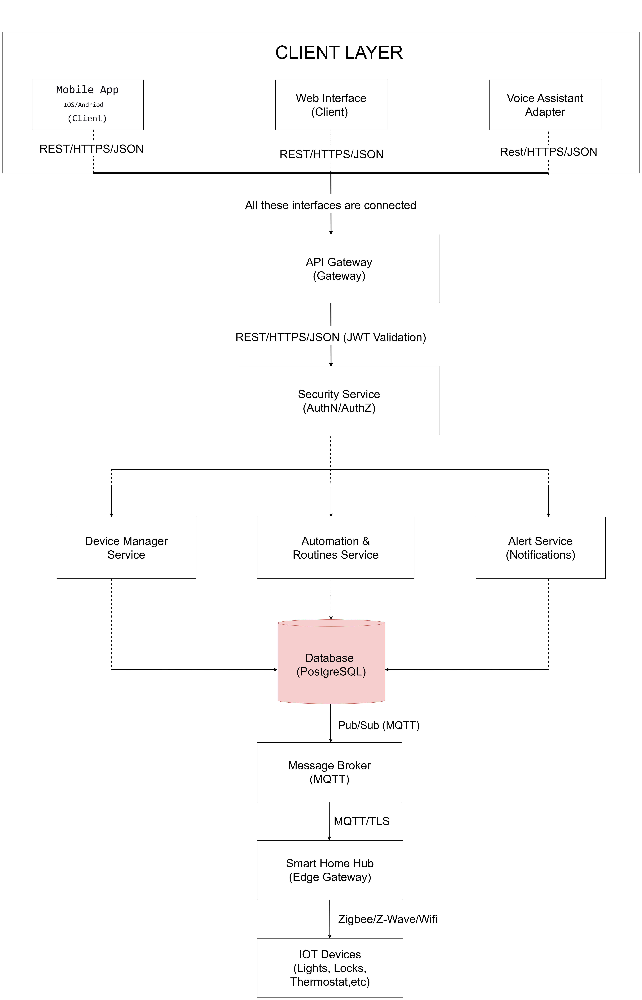

                                                                 

# Task 1.2 — Architecture vs. Design Documentation  
**System:** Smart Home Management System (Mobile/Web/Voice control for IoT devices)

## 1) Architectural Decisions (Strategic, System-wide)

### AD1 — Use a Microservices Architecture for Core Domains
**Decision statement:**  
Implement the backend as microservices separated by business domains (e.g., Identity, Device Management, Automation, Notifications, Analytics).

**Context/Assumptions:**

This decision assumes the system will scale to 100,000+ connected homes and will be developed by multiple autonomous teams (e.g., Team Identity, Team Devices, Team Automation). For a smaller startup phase, a modular monolith would be simpler, but this architecture anticipates future growth and team independence.

**Rationale (why this decision):**  
- Independent scaling of high-traffic services (e.g., real-time device control vs. reporting)  
- Clear domain boundaries improve maintainability and team ownership  
- Enables safer deployments and faster iteration per service
- Business alignment: The business requires rapid innovation in features like “AI-powered energy saving” without risking the stability of core device control. Microservices enable this velocity by isolating changes.

**Alternatives considered:**  
- **Modular monolith** (single deployable with internal modules): Rejected because projected growth of telemetry data would require scaling device ingestion independently from user management; a monolith would force over‑provisioning of hardware. 
- **SOA with ESB** (central enterprise service bus): Rejected due to complexity and risk of central bottleneck; microservices with lightweight communication (HTTP/gRPC/events) offer better flexibility.

**Consequences:**  
- (+) Better scalability, fault isolation, and team autonomy  
- (+) Easier to introduce new features per domain  
- (-) Higher operational complexity (service discovery, monitoring, tracing)  
- (-) Requires disciplined API versioning and distributed data handling

**Mitigation of complexity:**
To manage operational overhead during initial launch, we will adopt a **“microservices‑lite”** approach:

- Deploy services in a shared Kubernetes cluster with resource quotas.

- Use a service mesh (e.g., Istio) for service discovery, mTLS, and observability out‑of‑the‑box.

- Standardize on common libraries for logging, metrics, and tracing to reduce cognitive load.

### AD2 — Introduce an API Gateway as the Single Entry Point
**Decision statement:**  
All client channels (mobile app, web app, voice assistant integrations) access backend services through an API Gateway.

**Rationale:**  
- Centralizes cross-cutting concerns: authentication, rate limiting, request validation, routing  
- Simplifies client development (one endpoint surface)  
- Improves security posture by shielding internal services

**Alternatives considered:**  
- Clients call services directly (no gateway): rejected because it would scatter security logic and make client updates harder. 
- Backend-for-Frontend (separate gateways per channel): considered for later optimization but postponed for simplicity; single gateway is sufficient initially.  

**Consequences:**  
- (+) Consistent policy enforcement and monitoring  
- (+) Reduced duplication of auth and throttling logic  
- (-) Gateway becomes a critical component; needs HA and careful scaling  
- (-) Risk of “god gateway” if too much business logic is pushed into it

### AD3 — Use Event-Driven Messaging for Device Events and Notifications
**Decision statement:**  
Adopt an event bus/message broker (e.g., MQTT + broker or Kafka/RabbitMQ) to handle telemetry, state changes, alerts, and automation triggers.

**Rationale:**  
- Smart home systems are naturally asynchronous (device offline/online, sensor events)  
- Decouples producers (devices/services) from consumers (automation/notification/analytics)  
- Supports scalability and reliability for bursty traffic (alarms, motion events)

**Alternatives considered:**  
- Pure synchronous REST for all interactions  
- Direct WebSocket streaming only (no durable event stream)

**Consequences:**  
- (+) Improved responsiveness and decoupling  
- (+) Better resilience (buffering/retry)  
- (-) Debugging is harder (distributed, asynchronous flow)  
- (-) Requires schema management and exactly-once/at-least-once strategy decisions

### AD4 — Adopt a Zero-Trust Security Model with OAuth2/OIDC
**Decision statement:**  
Use OAuth2/OIDC for user authentication/authorization, short-lived tokens, and service-to-service authentication (mTLS or signed service tokens).

**Rationale:**  
- Sensitive environment (door locks, cameras) requires strong security guarantees  
- Token-based auth supports multiple clients and integrations  
- Zero-trust reduces lateral movement risk if a component is compromised

**Alternatives considered:**  
- Session-based auth stored in a central DB  
- API keys only (insufficient for end-user security needs)

**Consequences:**  
- (+) Stronger security baseline and auditable access control  
- (+) Easier integration with external identity providers  
- (-) Added complexity (token refresh flows, key rotation, secrets management)  
- (-) Requires careful authorization design (RBAC/ABAC, least privilege)

### AD5 — Use Polyglot Persistence with Clear Data Ownership per Service
**Decision statement:**  
Each service owns its data store; use fit-for-purpose databases (e.g., relational for users/billing, time-series for telemetry, document store for device metadata).

**Rationale:**  
- Different data shapes and workloads (telemetry vs. configuration)  
- Reduces coupling across services and prevents “shared DB” anti-pattern  
- Improves performance and scalability for each domain

**Alternatives considered:**  
- Single shared relational database for everything  
- Only NoSQL (simplifies ops but may harm transactional needs)

**Consequences:**  
- (+) Better scalability and data governance  
- (+) Services can evolve independently  
- (-) Harder cross-service queries (need data replication or APIs)  
- (-) Eventual consistency becomes a design reality for some workflows

---

## 2) Design Decisions (Tactical, Component-level)

### DD1 — Use an In-Memory Cache for Device State in the Device Manager
**Decision statement:**  
Maintain a bounded in-memory cache of latest device states (e.g., `HashMap<DeviceId, DeviceState>` or an LRU cache) in the Device Manager service.

**Rationale:**  
- Minimizes database reads for frequent “current state” queries  
- Improves latency for UI refresh and automation checks

**Design pattern used (if any):**  
- **Cache-Aside** pattern (load on miss, update/evict on changes)

**Scope (class, method, component):**  
- Component: Device Manager service  
- Class/module: DeviceStateCache, DeviceStateRepository wrapper

### DD2 — Apply the Strategy Pattern for Automation Rule Evaluation
**Decision statement:**  
Implement automation rules using a Strategy interface (e.g., `TriggerStrategy`, `ConditionStrategy`, `ActionStrategy`) to support new rules without rewriting the engine.

**Rationale:**  
- Automations vary widely (time-based, sensor-based, geofence, etc.)  
- Strategy allows extension and testing per rule type

**Design pattern used:**  
- **Strategy Pattern**

**Scope:**  
- Component: Automation Service  
- Classes: `RuleEngine`, `TriggerStrategy` implementations, `ActionStrategy` implementations

### DD3 — Use the Observer (Pub/Sub) Pattern Inside the Notification Service
**Decision statement:**  
When events arrive (security alert, device offline), notify multiple channels (push, email, SMS) via internal subscribers.

**Rationale:**  
- One event can fan out to many notification providers  
- Keeps the Notification service extensible (add WhatsApp/Telegram later)

**Design pattern used:**  
- **Observer / Publish-Subscribe**

**Scope:**  
- Component: Notification Service  
- Classes/modules: `EventDispatcher`, `PushNotifier`, `EmailNotifier`, `SmsNotifier`

### DD4 — Use Repository Pattern for Persistence Access in Each Service
**Decision statement:**  
Encapsulate database operations in repositories (e.g., `UserRepository`, `DeviceRepository`) instead of direct DB calls from controllers/handlers.

**Rationale:**  
- Improves testability (mock repositories)  
- Keeps business logic separate from persistence concerns  
- Makes DB migrations/refactors less invasive

**Design pattern used:**  
- **Repository Pattern**

**Scope:**  
- Component: All backend services  
- Classes: repositories + service-layer classes

### DD5 — Use Circuit Breaker + Retries for External Integrations
**Decision statement:**  
Wrap calls to external services (SMS provider, voice assistant APIs, push notification gateway) with circuit breaker, retry with backoff, and timeouts.

**Rationale:**  
- External providers fail or throttle unexpectedly  
- Prevents cascading failures and thread exhaustion  
- Improves system resilience under partial outages

**Design pattern used:**  
- **Circuit Breaker** (resilience pattern)

**Scope:**  
- Component: Notification Service + Integrations module  
- Methods: `sendSms()`, `sendPush()`, `publishToVoiceAssistant()`

---

## Summary: How to Tell Architecture vs Design
- **Architecture decisions** shape the whole system structure, quality attributes (scalability, security, availability), and long-term evolution.
- **Design decisions** optimize how specific components/classes are built and implemented within the chosen architecture.
