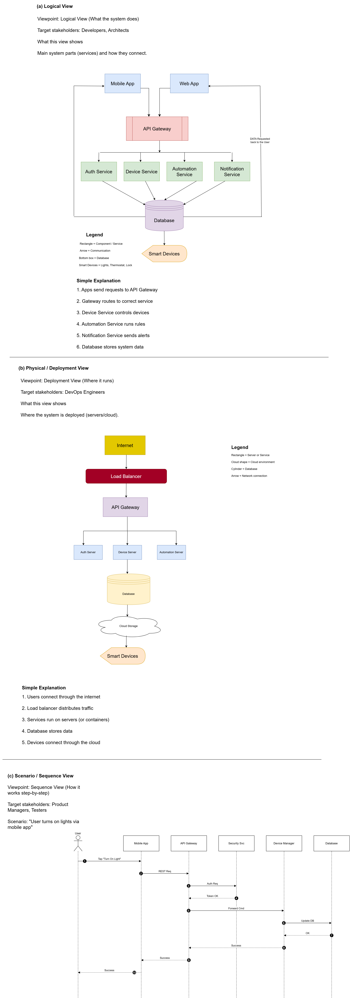

                                                            

# Task 2.1 — Quality Attributes Analysis  
**System:** Smart Home Management System (mobile/web/voice control, automation routines, security alerts, energy monitoring)

---

## 1) Top 5 Quality Attributes (Prioritized)

1. **Security & Privacy**
2. **Availability & Reliability**
3. **Performance (Low Latency)**
4. **Scalability**
5. **Modifiability (Maintainability/Extensibility)**

> Rationale for this selection: this system controls safety-critical devices (locks/cameras), must remain usable during incidents, must feel “instant” to users, must handle growth in devices/events, and must evolve as new devices and integrations appear.

---

## 2) Quality Attribute Analyses

## QA1 — Security & Privacy
**Definition (internal/external, static/dynamic):**  
- **External**, **Dynamic** (measured at runtime: access control correctness, breach resistance, data protection, auditability)

**Why it’s important for this system:**  
- The system controls **door locks, cameras, alarms**: unauthorized access has real-world consequences.  
- User data includes sensitive information (presence patterns, camera feeds, routines).

**How the architecture supports it:**  
- **API Gateway** enforces authentication, rate limiting, and request validation at a single entry point.  
- **OAuth2/OIDC** (token-based auth) and strong authorization model (RBAC/ABAC).  
- **Zero-trust** service-to-service authentication (e.g., mTLS or signed internal tokens).  
- **Encryption**: TLS in transit; encryption at rest for sensitive stores.  
- **Audit logging** for security-sensitive actions (unlock, camera access, routine changes).

**Trade-offs made:**  
- Strong security increases **complexity** (token flows, secret rotation, IAM policies).  
- Additional checks can add **latency** (performance trade-off).  
- More logging improves auditability but increases **storage cost** and privacy risk if not handled carefully.

---

## QA2 — Availability & Reliability
**Definition (internal/external, static/dynamic):**  
- **External**, **Dynamic** (uptime, fault tolerance, recovery time, message delivery reliability)

**Why it’s important for this system:**  
- Users expect to control devices anytime (lights, heating).  
- During security incidents (intrusion alerts), the system must still deliver notifications and allow response actions.

**How the architecture supports it:**  
- **Microservices** isolate failures (notification outage shouldn’t break device control).  
- **Event-driven messaging** buffers bursts (alerts, telemetry spikes) and supports retries.  
- **Circuit breaker + retries + timeouts** for external providers (SMS, push).  
- **Horizontal scaling** for critical services (API Gateway, Device Manager, Notification Service).  
- **Graceful degradation**: if analytics/energy reports fail, core control functions remain available.

**Trade-offs made:**  
- Higher availability requires more infrastructure (replication, monitoring), raising **cost**.  
- Event-driven retries improve reliability but can create **duplicate events** (needs idempotency).  
- Strong fault tolerance may increase **operational complexity**.

---

## QA3 — Performance (Low Latency / Responsiveness)
**Definition (internal/external, static/dynamic):**  
- **External**, **Dynamic** (response time for “turn on lights”, UI refresh speed, alert delivery time)

**Why it’s important for this system:**  
- Smart home control feels broken if actions take long (lights should respond in near real-time).  
- Alerts must arrive quickly (motion detected, door opened).

**How the architecture supports it:**  
- **In-memory caching** of device state in Device Manager (cache-aside) reduces DB reads.  
- **MQTT/WebSockets** for near real-time event delivery instead of polling.  
- **API Gateway** can route efficiently and apply lightweight validation.  
- **Asynchronous processing** for non-critical tasks (analytics, reporting) to keep control paths fast.

**Trade-offs made:**  
- Caching improves speed but risks **stale state** (consistency trade-off).  
- Real-time connections increase **resource usage** (more open sockets).  
- Aggressive performance optimizations can reduce **modifiability** (harder to change later).

---

## QA4 — Scalability
**Definition (internal/external, static/dynamic):**  
- **External**, **Dynamic** (ability to handle more users, devices, telemetry events without unacceptable degradation)

**Why it’s important for this system:**  
- Growth drivers: more homes, more devices per home, more sensors generating continuous telemetry.  
- Some workloads are bursty (security events, notifications during incidents).

**How the architecture supports it:**  
- **Microservices** allow scaling “hot” services independently (Device Manager, Event Ingestion).  
- **Event bus/message broker** supports high-throughput ingestion and fan-out to multiple consumers.  
- **Polyglot persistence**: time-series store for telemetry; relational for transactional data.  
- Stateless services behind load balancers enable **horizontal scaling**.

**Trade-offs made:**  
- Scaling out increases **cost** (compute, broker partitions, storage).  
- Distributed systems introduce **eventual consistency** and more complex debugging.  
- Polyglot persistence increases operational burden (multiple DB technologies).

---

## QA5 — Modifiability (Maintainability / Extensibility)
**Definition (internal/external, static/dynamic):**  
- **Internal**, mostly **Static** (code structure, coupling/cohesion, ease of change) with **Dynamic** effects (deployment frequency, change failure rate)

**Why it’s important for this system:**  
- New device types and vendor integrations appear frequently.  
- Automation features evolve quickly (new triggers/conditions/actions).  
- Security requirements change over time.

**How the architecture supports it:**  
- **Domain-based microservices** reduce coupling and allow independent evolution.  
- **Well-defined APIs + versioning** prevent breaking clients.  
- **Event-driven integration** lets new consumers subscribe without changing producers.  
- **Design patterns** (Strategy for rules, Repository for persistence) support extension and testing.

**Trade-offs made:**  
- Microservices improve modifiability but add **operational complexity**.  
- API versioning increases **maintenance overhead** (support multiple versions).  
- Too many abstractions/patterns can slow development if overused.

---

## 3) Quality Attribute Priority Matrix

### 3.1 Priority Ranking (Criticality)
| Quality Attribute | Priority | Why (system context) |
|---|---:|---|
| Security & Privacy | P1 (Highest) | Controls locks/cameras; sensitive personal data |
| Availability & Reliability | P1 | Must work during incidents; core functions always needed |
| Performance (Low Latency) | P2 | User trust depends on instant device response |
| Scalability | P2 | Device/telemetry growth and bursty events |
| Modifiability | P3 | Continuous evolution of devices/integrations over time |

### 3.2 Conflict / Tension Matrix
Legend: **H = High conflict**, **M = Medium**, **L = Low**, **— = same attribute**

|  | Security | Availability | Performance | Scalability | Modifiability |
|---|---:|---:|---:|---:|---:|
| **Security** | — | M | H | M | M |
| **Availability** | M | — | M | M | L |
| **Performance** | H | M | — | M | M |
| **Scalability** | M | M | M | — | M |
| **Modifiability** | M | L | M | M | — |

### 3.3 How competing attributes were balanced (Key decisions)
- **Security vs Performance (High conflict):**  
  Balanced by putting security checks in the **API Gateway** and using efficient token validation; caching is used carefully for device state but not for authorization decisions.
- **Availability vs Consistency (implicit conflict):**  
  Event-driven design favors reliability and uptime with **at-least-once delivery**, while components are designed for **idempotency** to manage duplicates.
- **Scalability vs Modifiability:**  
  Microservices + event bus improve scalability and extensibility, but we limit complexity via clear service boundaries, API versioning rules, and standard observability.
- **Performance vs Modifiability:**  
  Performance optimizations (caching, WebSockets/MQTT) are encapsulated behind interfaces to avoid spreading complexity across the codebase.

---

## 4) Summary
This Smart Home Management System prioritizes **Security** and **Availability** first because it controls safety-critical devices and handles sensitive data. **Performance** and **Scalability** come next to ensure real-time responsiveness and growth readiness. **Modifiability** supports long-term evolution, but is balanced against operational complexity by using clear service boundaries and event-driven integration.
