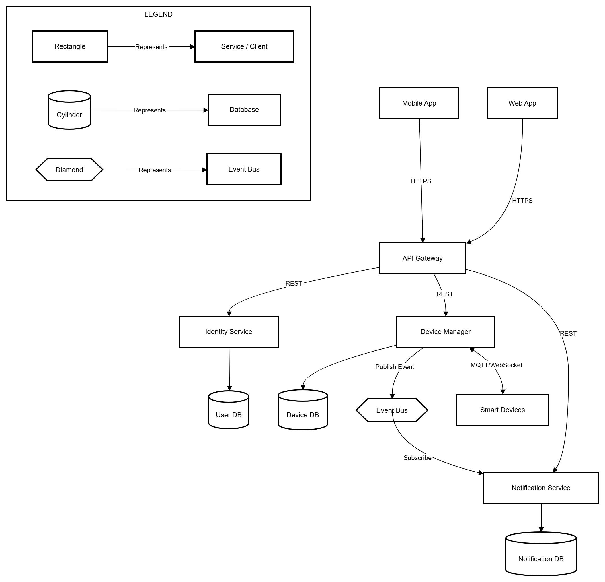

                                                                            

# Task 3.1 — Architectural Pattern Selection
**System:** Smart Home Management System (mobile/web/voice control, device management, automations, alerts)

## Selected Architectural Pattern
**Hybrid approach: Microservices + Event-Driven Architecture**

- **Microservices** organizes the system into independently deployable services aligned to business domains.
- **Event-Driven** messaging connects services via publish/subscribe for device events, alerts, and automation triggers.

---

## Why this pattern was chosen
### 1) Fits the domain (smart home is naturally event-based)
Smart home systems produce continuous events (motion detected, door opened, device offline/online, state changes). Event-driven messaging models this naturally and reduces tight coupling between components.

### 2) Supports independent scaling and releases
Different parts of the system have different load profiles:
- Device Manager and messaging handle frequent state changes
- Notification may spike during incidents
- Analytics may require high throughput ingestion
Microservices allow scaling and deploying each service independently.

### 3) Improves fault isolation
If Analytics or Reporting fails, core functions (device control, authentication, notifications) can continue. Microservices boundaries plus async messaging prevents failures in one area from immediately breaking the whole system.

---

## How it addresses system requirements (quality attributes)
### Security & Privacy
- Centralized enforcement at the **API Gateway** (authentication, rate limits, validation).
- **Identity Service** handles OAuth2/OIDC flows and authorization rules.
- Service-to-service communication can use mTLS or signed internal tokens.

### Availability & Reliability
- Event bus enables buffering and retry, improving reliability for bursts (alerts, telemetry spikes).
- Failures are isolated (e.g., notification provider outage doesn’t crash device control).
- At-least-once event delivery supports resilience when components temporarily fail.

### Performance (Low latency)
- Synchronous calls are kept on the critical path only (client → gateway → device manager).
- Heavy or non-critical work (analytics, reporting, fan-out notifications) is handled asynchronously via events.

### Scalability
- Hot services scale independently (Device Manager, Notification, Event Bus consumers).
- Event-driven fan-out supports multiple consumers without changing producers.

### Modifiability
- Adding a new consumer (e.g., “Energy Saver Service”) often requires only subscribing to existing events.
- Clear domain boundaries reduce coupling and allow teams to own services.

---

## Trade-offs made
### Operational complexity (main cost)
Microservices and event-driven systems require:
- Monitoring, logging, distributed tracing
- Service discovery / configuration management
- Broker operations and schema/version management

### Data consistency challenges
Database-per-service and async events introduce eventual consistency:
- Device state in the UI may briefly lag behind reality.
- Requires idempotent handlers and careful event design.

### Debugging complexity
Event-driven flows are harder to trace end-to-end than a single synchronous call chain, so observability is essential.

### Cost
More services + broker + monitoring = more infrastructure cost than a simple monolith.

---

## Alternative patterns considered
### 1) Layered Architecture
**Pros:** Simple, easy to understand, strong separation of concerns.  
**Why not chosen:** Doesn’t handle high-volume device events and async workflows as cleanly; can become a bottleneck under scale.

### 2) MVC
**Pros:** Great for UI/web applications.  
**Why not chosen:** MVC is mainly a presentation-layer pattern; it doesn’t define backend distributed structure needed for smart home events and integrations.

### 3) Client-Server
**Pros:** Straightforward and common for CRUD apps.  
**Why not chosen:** Smart home requires multiple backend domains and asynchronous messaging; a simple client-server model does not address event fan-out and independent scaling well.

### 4) Pure Event-Driven (no microservices boundaries)
**Pros:** Strong decoupling through events.  
**Why not chosen:** Without clear service/domain boundaries, the system can become hard to own and evolve; microservices provide clearer ownership and deployment isolation.

---

## Summary
A **Microservices + Event-Driven hybrid** best matches smart home needs: it supports real-time device events, scalable fan-out notifications, independent service scaling, and strong fault isolation—at the cost of increased operational complexity and eventual consistency challenges.
