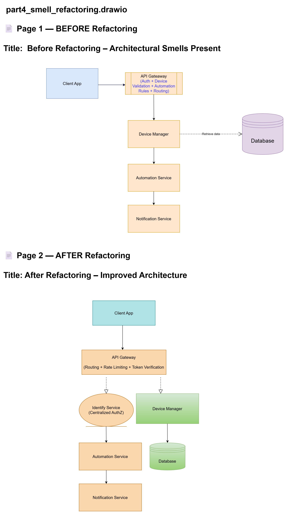

                                                                    

# Task 4.2 — Architectural Smells Detection
System: Smart Home Management System  
Architecture: Microservices + Event-Driven

---

## 1) Smell 1 — God Component (Overloaded API Gateway)

### Name of Smell
**God Component** (a.k.a. “God Service / God Gateway”)

### Where it appears in the architecture
The **API Gateway** is at risk of containing more than gateway responsibilities, such as:
- device ownership and authorization rules (“can this user control this lock?”)
- request validation with domain rules (“is this routine valid?”)
- orchestration logic (“call Device Manager then notify then update state”)

This concentrates core business behavior into a single component.

### Why it is a problem (Quality Attributes perspective)
This smell degrades multiple quality attributes:

- **Modifiability:** changes to device/automation rules force gateway changes (high coupling, low cohesion).
- **Performance:** gateway becomes a throughput bottleneck under bursty traffic (e.g., security events).
- **Availability:** gateway becomes a single point of failure; overload or regression impacts the entire system.
- **Security:** inconsistent or duplicated authorization rules increase likelihood of vulnerabilities.

In textbook terms, it violates separation of concerns and weakens architectural tactics for modifiability and availability.

### Proposed solution (Refactoring to eliminate smell)
Refactor the gateway into a **thin gateway** that only handles:
- routing, rate limiting, request shaping
- token verification (authentication)
- basic validation (syntax, schema)

Move domain logic to **domain services**:
- Authorization decisions to **Identity/AuthZ** service (policy-based access control)
- Device-specific validation and command orchestration to **Device Manager**
- Automation rule validation to **Automation Service**

Introduce:
- **Policy Enforcement Point (PEP)** at gateway
- **Policy Decision Point (PDP)** in Identity/AuthZ service
This centralizes authorization while keeping the gateway thin.

---

## 2) Smell 2 — Scattered Concerns (Scattered Security / Authorization Logic)

### Name of Smell
**Scattered Concerns** (Cross-cutting concern duplication)

### Where it appears in the architecture
Security checks (authorization, ownership validation, role checks) may be duplicated across:
- API Gateway
- Device Manager
- Automation Service
- Notification Service (e.g., who can receive alerts)

This is common when each service implements its own access rules without a shared policy model.

### Why it is a problem (Quality Attributes perspective)
- **Security:** inconsistent enforcement causes privilege escalation paths (“one endpoint forgets a check”).
- **Modifiability:** policy changes require edits in multiple services (high change cost).
- **Testability:** hard to verify policy correctness when logic is spread out.
- **Reliability:** mismatched checks create inconsistent system states (e.g., command accepted by one service but rejected by another).

Textbook framing: scattered concerns increase coupling and reduce the ability to reason about the system, harming maintainability and assurance.

### Proposed solution (Refactoring to eliminate smell)
Implement **centralized policy-based authorization**:
- Define policies once (RBAC/ABAC) in the Identity/AuthZ service.
- Expose authorization decisions via an internal API (PDP).
- Services call PDP for sensitive decisions, or use a shared “AuthZ library” generated from policies.
- Standardize auth tokens and claims to avoid local rule reimplementation.

Add architectural tactics:
- **Audit logging** for security-sensitive operations (unlock, camera access).
- **Security regression tests** using quality attribute scenarios (unauthorized access attempts).

---

# 3) Refactoring Diagram Requirements
Deliverable: `part4_smell_refactoring.drawio`

Create ONE draw.io file with TWO pages:
- Page 1: BEFORE
- Page 2: AFTER

Use simple rectangles and labeled arrows. Add short callout notes.

---

## Page 1 — BEFORE (Smells Present)

### Title
**Before Refactoring: God Gateway + Scattered Security**

### Draw this structure
Clients → API Gateway → Services → DB/Broker, but with notes showing the smell.

