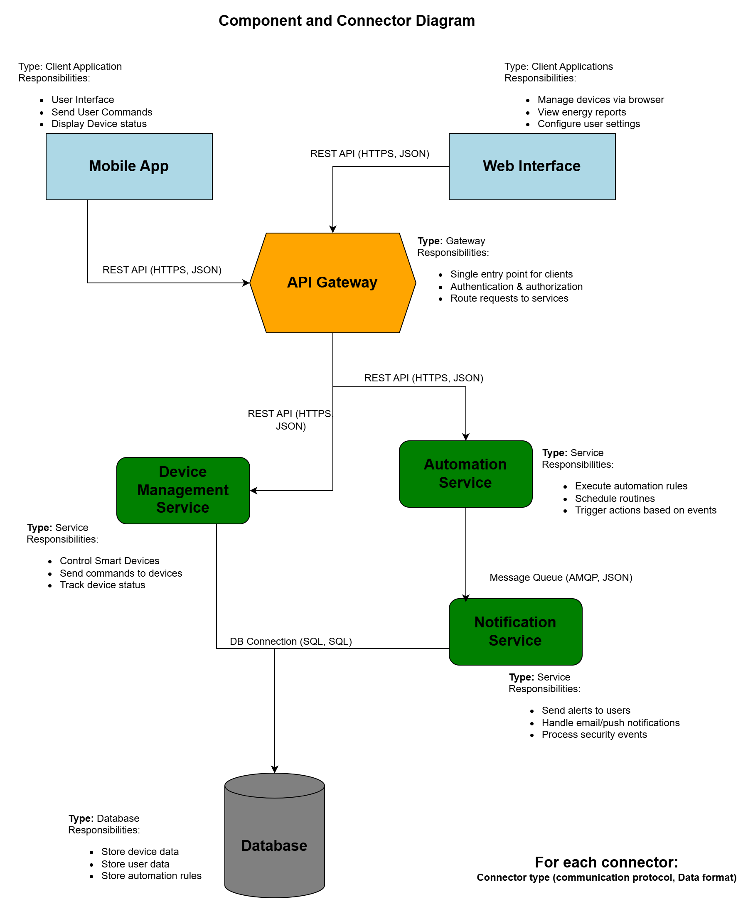

# Part 1.2 – Architecture vs. Design Decisions
## Smart Home Management System

This document distinguishes between **architectural decisions** (strategic, system-wide)
and **design decisions** (tactical, component-level) for the Smart Home Management System.

---

## Architectural Decisions (System-Wide)

Architectural decisions define the overall structure of the system and are costly to change.

---

### Architectural Decision 1: Use Client–Server Architecture

**Decision**  
The system is designed using a client–server architecture.

**Rationale**  
Separates user interfaces from backend services and supports multiple clients
(mobile app, web interface, voice assistants).

**Alternatives Considered**  
- Standalone local application  
- Peer-to-peer architecture  

**Consequences**  
- Enables scalability and centralized control  
- Requires reliable network connectivity  

---

### Architectural Decision 2: Introduce an API Gateway

**Decision**  
All external requests are routed through a centralized API Gateway.

**Rationale**  
Provides a single entry point for authentication, routing, and monitoring.

**Alternatives Considered**  
- Direct client-to-service communication  
- Backend-for-Frontend approach  

**Consequences**  
- Centralized security and request management  
- API Gateway becomes a critical system component  

---

### Architectural Decision 3: Separate Device Management as a Service

**Decision**  
Device control logic is implemented as an independent Device Management Service.

**Rationale**  
Improves modularity and allows independent scaling of device-related functionality.

**Alternatives Considered**  
- Monolithic backend service  
- Device logic embedded in API Gateway  

**Consequences**  
- Clear separation of responsibilities  
- Increased inter-service communication  

---

### Architectural Decision 4: Use Asynchronous Messaging for Notifications

**Decision**  
Security alerts and notifications are handled asynchronously.

**Rationale**  
Decouples alert generation from delivery and improves system reliability.

**Alternatives Considered**  
- Synchronous REST communication  
- Polling mechanisms  

**Consequences**  
- Better fault tolerance  
- Added architectural complexity  

---

### Architectural Decision 5: Use Dedicated Databases per Service Domain

**Decision**  
Each major service manages its own database.

**Rationale**  
Ensures data ownership and service independence.

**Alternatives Considered**  
- Shared database  
- File-based storage  

**Consequences**  
- Clear data boundaries  
- Requires data consistency strategies  

---

## Design Decisions (Component-Level)

Design decisions define how individual components are implemented and are easier to change.

---

### Design Decision 1: Use REST Controllers in API Gateway

**Decision**  
REST controllers handle incoming client requests.

**Rationale**  
REST is widely supported and easy to integrate.

**Design Pattern Used**  
Controller Pattern

**Scope**  
Component

---

### Design Decision 2: Use In-Memory Cache for Device State

**Decision**  
Device states are cached in memory.

**Rationale**  
Improves response time for frequently accessed device information.

**Design Pattern Used**  
Cache-Aside Pattern

**Scope**  
Component

---

### Design Decision 3: Use JSON for Data Exchange

**Decision**  
JSON is used as the data format between components.

**Rationale**  
Human-readable and supported across platforms.

**Design Pattern Used**  
None

**Scope**  
Method / API

---

### Design Decision 4: Apply Observer Pattern for Notifications

**Decision**  
Notification service uses the Observer pattern.

**Rationale**  
Supports multiple notification channels reacting to events.

**Design Pattern Used**  
Observer Pattern

**Scope**  
Component

---

### Design Decision 5: Use JWT for Authentication

**Decision**  
JWT tokens are used for user authentication.

**Rationale**  
Supports stateless authentication suitable for distributed systems.

**Design Pattern Used**  
None

**Scope**  
Component

---

## Architecture vs. Design Summary

- Architectural decisions define system structure and communication.
- Design decisions define component implementation details.
- Architectural decisions are expensive to change.
- Design decisions are local and easier to modify.

## Component and Connector Diagram

