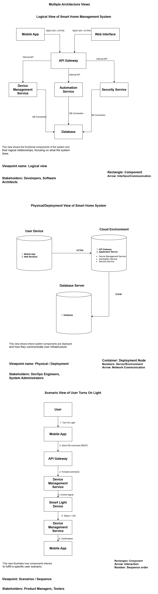

# Part 2.1 – Quality Attributes Analysis
## Smart Home Management System

This document identifies and analyzes the most important quality attributes
for the Smart Home Management System.

---

## Selected Quality Attributes

The following five quality attributes are the most important for this system:
1. Performance
2. Availability
3. Security
4. Scalability
5. Maintainability

---

## 1. Performance

**Definition**  
- External quality attribute  
- Dynamic (measured at runtime)

**Why It Is Important**  
Users expect immediate feedback when controlling smart devices

**Architecture Support**  
- API Gateway enables efficient request routing  
- In-memory caching for device states  
- Asynchronous processing for alerts  

**Trade-offs**  
- Performance optimizations may make the system harder to modify and debug. 
- Caching increases memory usage  

---

## 2. Availability

**Definition**  
- External quality attribute  
- Dynamic

**Why It Is Important**  
Smart home systems must be accessible at all times, especially for
security-related features such as alarms and door locks.

**Architecture Support**  
- Service isolation prevents total system failure  
- Asynchronous messaging improves fault tolerance  
- Microservices allow independent scaling  

**Trade-offs**  
- Higher availability increases infrastructure cost  
- Increased deployment complexity  

---

## 3. Security

**Definition**  
- External quality attribute  
- Dynamic

**Why It Is Important**  
The system controls sensitive devices and user data, making it a target
for unauthorized access and attacks.

**Architecture Support**  
- Centralized authentication via API Gateway  
- Token-based authentication (JWT)  
- Separation of security-related services  

**Trade-offs**  
- Strong security measures can reduce usability  
- Additional authentication steps may affect performance  

---

## 4. Scalability

**Definition**  
- External quality attribute  
- Dynamic

**Why It Is Important**  
The system must support growth in users, devices, and automated routines
without performance degradation.

**Architecture Support**  
- Microservices architecture  
- Independent database per service  
- Stateless API Gateway  

**Trade-offs**  
- Scalability increases architectural complexity  
- Requires careful monitoring  

---

## 5. Maintainability

**Definition**  
- Internal quality attribute  
- Static

**Why It Is Important**  
The system must evolve over time as new devices, features, and protocols
are introduced.

**Architecture Support**  
- Clear separation of concerns between services  
- Well-defined interfaces and responsibilities  
- Modular architecture enables easier changes  

**Trade-offs**  
- Improved maintainability may reduce performance  
  

---

## Quality Attribute Priority Matrix

| Quality Attribute | Priority  | Conflicts With | Balance Strategy |
|------------------|-----------|---------------|------------------|
| Performance | High      | Maintainability | Use caching selectively |
| Availability | Very High | Cost | Focus on critical services |
| Security | Very High | Usability | Apply risk-based security |
| Scalability | Medium    | Complexity | Scale only where needed |
| Maintainability | Medium    | Performance | Favor clarity over optimization |

---

## Multiple Architecture Views

