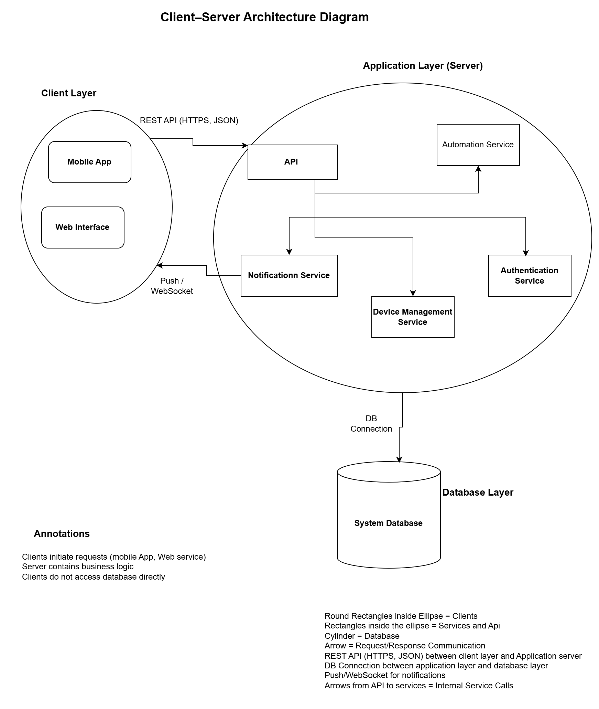

# Part 3 – Architectural Pattern Selection

## Selected Architectural Pattern
**Client–Server Architecture**

---

## Why I Chose Client-Server

The Smart Home Management System follows a Client–Server architectural pattern because it involves multiple client applications (mobile app, web interface) that interact with a centralized backend system.

This pattern clearly separates:
- User interaction (clients)
- Business logic and control (server)
- Data management (database)

---

## How the Pattern Addresses System Requirements

- **Multiple access channels**: Mobile app, web app, and voice assistants act as clients.
- **Centralized control**: All device logic and automation rules are handled on the server.
- **Security**: Authentication and authorization are enforced server-side.
- **Maintainability**: Changes to business logic do not require client updates.
- **Scalability**: Server components can be scaled independently of clients.

---

## Pattern-Specific Components

- **Clients**: Mobile App, Web Interface  
- **Server**: API Server, Authentication Service, Device Management Service, Automation Service, Notification Service  
- **Data Store**: Central System Database

Clients initiate requests, while the server processes requests, applies business rules, and manages data.

---

## Trade-Offs Made

### Advantages
- Clear separation of responsibilities
- Easier security enforcement
- Simplified data consistency
- Easy to understand and document

### Disadvantages
- Server can become a bottleneck
- Requires high server availability
- Less autonomy for clients

---

## Alternative Patterns Considered

- **Microservices**: Provides better scalability but adds complexity and operational overhead.
- **Event-Driven Architecture**: Good for asynchronous systems but unnecessary complexity for this use case.
- **Layered Architecture**: Useful for internal organization but does not define client-server communication clearly.

---

## Client–Server Architecture Diagram

