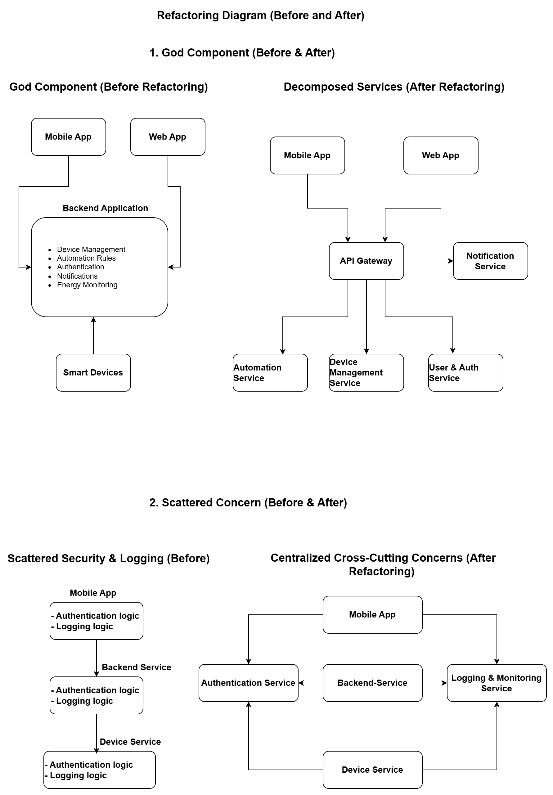

# Architectural Smells Detection – Smart Home Management System

---

## Architectural Smell 1: God Component

### Description
The Backend Application acts as a single component responsible for device management, automation rules, user authentication, notification handling, and energy monitoring.

### Where It Appears
The central backend service handles almost all system responsibilities and communicates with all other components.

### Why This Is a Problem
- The tight coupling between multiple responsibilities within a single deployment unit increases architectural rigidity and makes independent scaling difficult.
- Violates the Single Responsibility Principle
- Hard to understand, test, and maintain
- Any change risks breaking multiple features
- Limits scalability and independent deployment

### Proposed Solution
Refactor the backend into smaller, well-defined services:
- Device Management Service
- Automation Service
- User & Authentication Service
- Notification Service

This reduces coupling and improves scalability and maintainability.

---

## Architectural Smell 2: Scattered Concern (Security & Logging)

### Description
Security validation and logging are partially implemented at the API layer and partially within backend services.

### Where It Appears
Authentication validation and logging statements are duplicated across services instead of being centralized.

### Why This Is a Problem
- Code duplication
- Inconsistent security enforcement
- Hard to update or audit
- Increased maintenance effort

### Proposed Solution
Introduce centralized cross-cutting components:
- Central Authentication Service
- Central Logging & Monitoring Service

Other components delegate these concerns instead of implementing them themselves.

---

## Summary

Identifying and eliminating architectural smells improves system maintainability, scalability, and clarity. Refactoring the God Component and centralizing scattered concerns leads to a cleaner and more robust architecture.

## Refactoring Diagram (Before and After)

