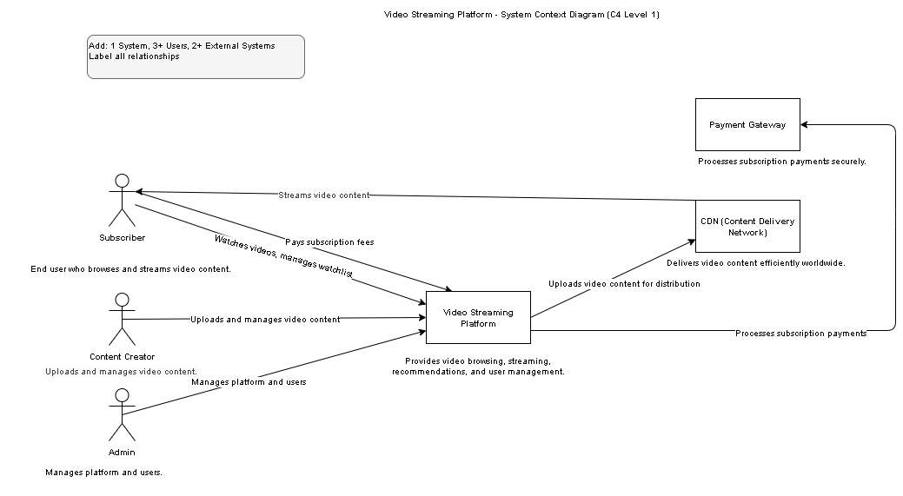
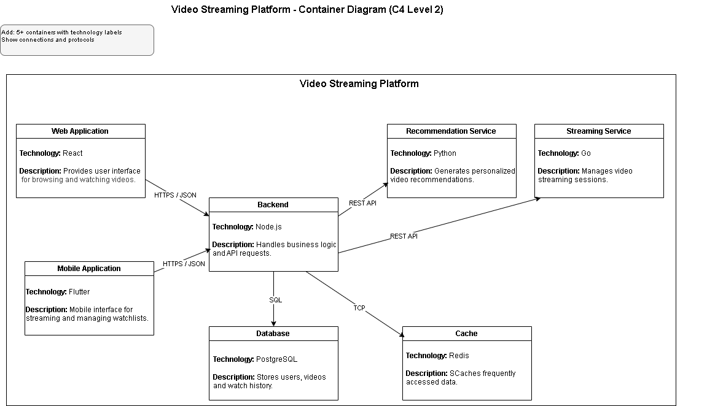
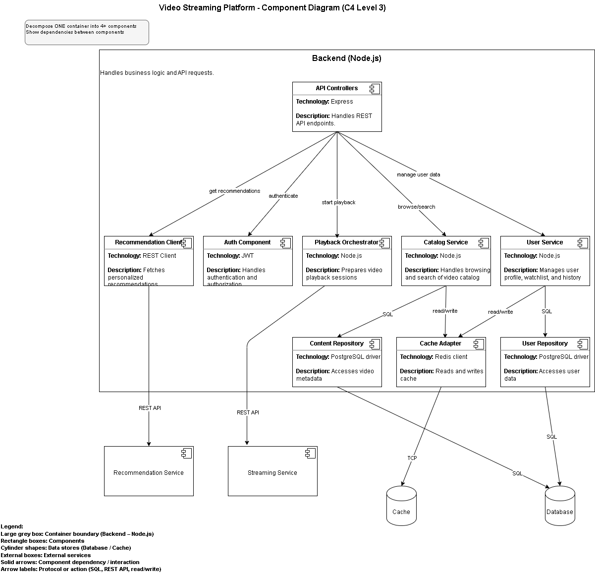
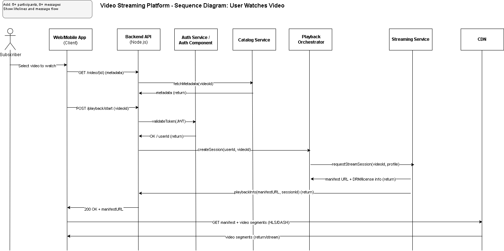
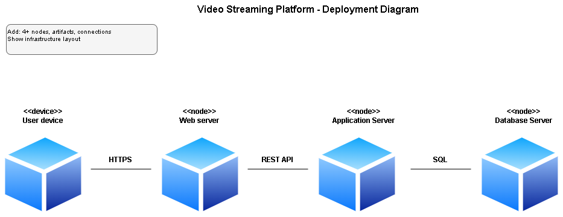

# Architecture Modeling Documentation
## Video Streaming Platform
 
## 1. Modeling Approach
 
In this assignment, we used two main architecture modeling notations:
 
### C4 Model
The C4 model was used to describe the system architecture at different levels of abstraction.
 
- **Level 1: System Context Diagram**
  Shows the system boundary and interactions with users and external systems.
 
- **Level 2: Container Diagram**
  Shows the high-level architecture of the platform including the main containers such as the web application, API server, recommendation service, and database.
 
- **Level 3: Component Diagram**
  Shows the internal structure of one container by breaking it down into smaller components and their interactions.
 
### UML Diagrams
UML diagrams were used to describe system behavior and infrastructure.
 
- **Sequence Diagram**
  Shows the interaction between system components when a user watches a video.
 
- **Deployment Diagram**
  Shows the physical deployment of the system infrastructure including servers and databases.
 
---
 
# 2. Diagram Index
 
| Diagram Name | Type | Purpose | Audience |
|--------------|------|--------|---------|
| System Context Diagram | C4 Level 1 | Shows system boundary and external actors | Stakeholders |
| Container Diagram | C4 Level 2 | Shows main system containers and architecture | Architects / Developers |
| Component Diagram | C4 Level 3 | Shows internal structure of a container | Developers |
| Sequence Diagram | UML | Shows interaction when a user watches a video | Developers |
| Deployment Diagram | UML | Shows infrastructure and system deployment | DevOps / Architects |
 
---
 
# 3. Consistency Check
 
Consistency across diagrams was maintained by using the same naming conventions for system components such as:
 
- Web Server
- Application Server
- Recommendation Service
- Database Server
 
The diagrams follow a logical progression:
- The **Context Diagram** defines the system and external actors.
- The **Container Diagram** shows the main building blocks of the system.
- The **Component Diagram** explains the internal structure of a container.
- The **Sequence Diagram** shows runtime interactions.
- The **Deployment Diagram** shows the physical infrastructure.
 
Some simplifications were made for clarity. For example, the infrastructure was simplified into four main nodes: user device, web server, application server, and database server.
 
---
 
# 4. Diagrams
 
## System Context Diagram

 
## Container Diagram

 
## Component Diagram

 
## Sequence Diagram

 
## Deployment Diagram
