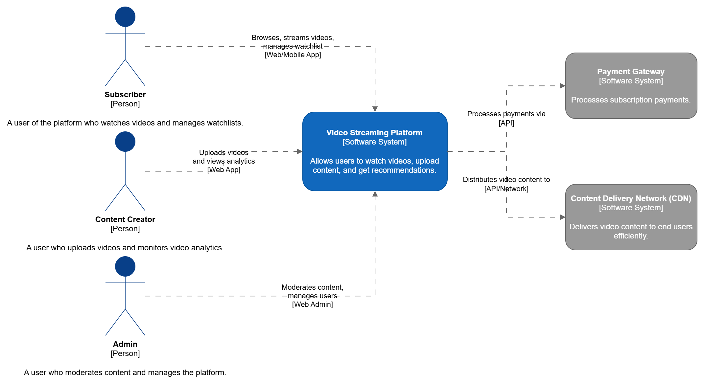
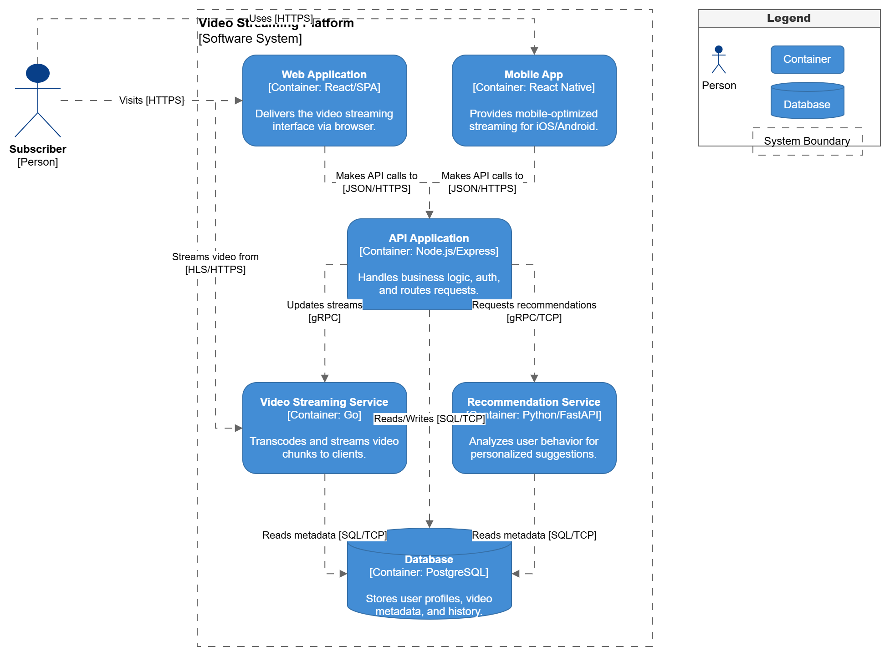
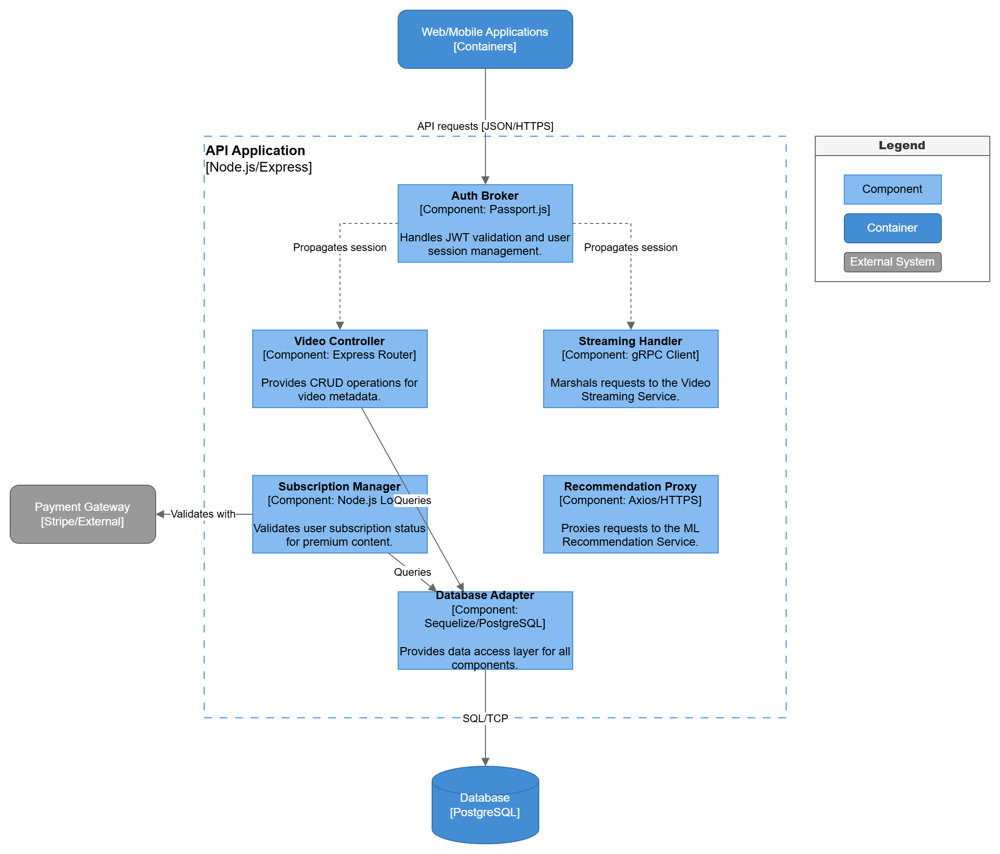
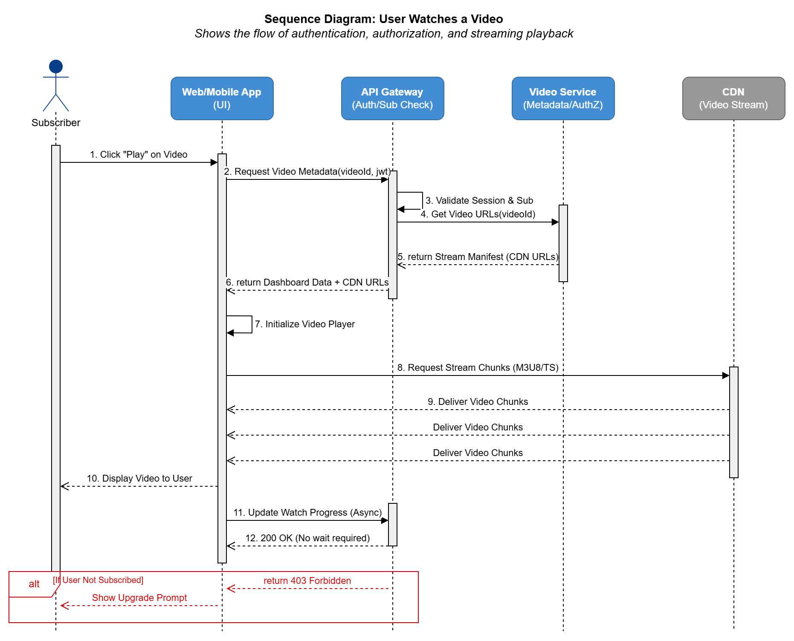
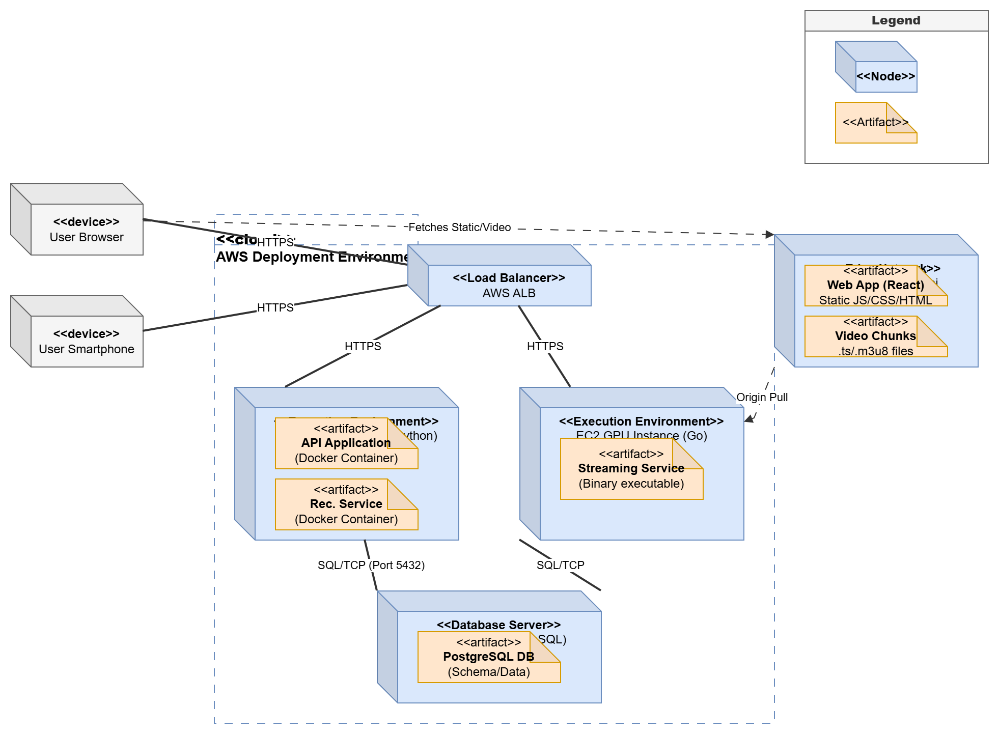

# Architecture Modeling Documentation: Video Streaming Platform

## a) Modeling Approach

For this architecture assignment, I utilized a combination of the **C4 Model** and **Unified Modeling Language (UML)**:
- **C4 Model (Context, Container, and Component)**: I chose C4 to provide a hierarchical, intuitive view of the software architecture. The C4 model excels at breaking down a system for different audiences, moving from a high-level abstraction (Context) suitable for non-technical stakeholders to deep structural views (Component) for developers. 
- **UML Diagrams (Sequence and Deployment)**: I used UML to capture physical infrastructure mapping and dynamic behavioral flows that the static C4 model cannot adequately depict. 

### Diagram Relationships
The diagrams are intrinsically related through progressive disclosure:
1.  The **Context diagram** treats the *Video Streaming Platform* as a monolithic black box. 
2.  The **Container diagram** zooms into that box, showing the high-level executable units (like the Node.js API and the Video Service) that make up the platform. 
3.  The **Component diagram** zooms further into *only the API Container*, revealing its internal modules (like Auth Broker and Video Controller).
4.  The **Sequence diagram** shows a temporal dimension, taking the actors from the Context diagram and having them interact dynamically with the systems found in the Container diagram.
5.  Finally, the **Deployment diagram** takes the executable units from the Container diagram and maps them to physical physical/cloud infrastructure nodes.

---

## b) Diagram Index

| Diagram Name | Type | Purpose | Intended Audience |
| :--- | :--- | :--- | :--- |
| **System Context** | C4 Level 1 | Shows the system's boundary and its relationships to external systems and users. | Business stakeholders, Product Managers, all team members |
| **Container Architecture** | C4 Level 2 | Shows the high-level technical architecture and how executable containers communicate. | Software Architects, Developers, Operations |
| **API Component Architecture** | C4 Level 3 | Details the internal structure and responsibilities of the API Application container. | Software Developers |
| **"Watch Video" Flow** | UML Sequence | Illustrates the step-by-step messaging for authentication, metadata retrieval, and stream delivery. | Developers, QA Engineers |
| **Infrastructure Deployment** | UML Deployment | Maps software artifacts (containers/databases) to physical execution environments (AWS/CDN). | DevOps, Systems Engineers, Infrastructure Operations |

---

## c) Consistency Check

To ensure consistency across the five diagrams, I maintained a strict naming convention and mapping strategy:
*   **Actor Consistency**: The primary actor, "Subscriber", is identical in the System Context, Container, and Sequence diagrams.
*   **System Boundary Consistency**: The external systems defined in the Context diagram (*Payment Gateway*, *CDN*) appear consistently throughout the lower levels, maintaining their roles.
*   **Container to Component Mapping**: In the Component diagram, I explicitly defined the boundary as the "API Application [Node.js/Express]", which directly matches the container definition from Level 2.
*   **Artifact to Deployment Mapping**: The artifacts placed on the deployment nodes (e.g., *API Application Docker Container*, *PostgreSQL DB*) trace directly back to the containers modeled in C4 Level 2.

### Assumptions and Simplifications
*   **Authentication Flow**: In the Sequence diagram, authentication checking is abstracted as a singular synchronous flow against a generic API Gateway/Auth Broker combination to prioritize readability.
*   **Microservices Complexity**: While real-world streaming giants use thousands of microservices, the Container and Component diagrams simplify this into a monolithic API Gateway and a distinct Video Service to meet assignment constraints while maintaining clarity. 

---

## Diagrams Reference

*Please ensure the `.png` exports of the draw.io diagrams are located in the same directory as this document for the links to work properly.*

### Part 1
*   **Context:** 
*   **Container:** 
*   **Component:** 

### Part 2
*   **Sequence:** 
*   **Deployment:** 
