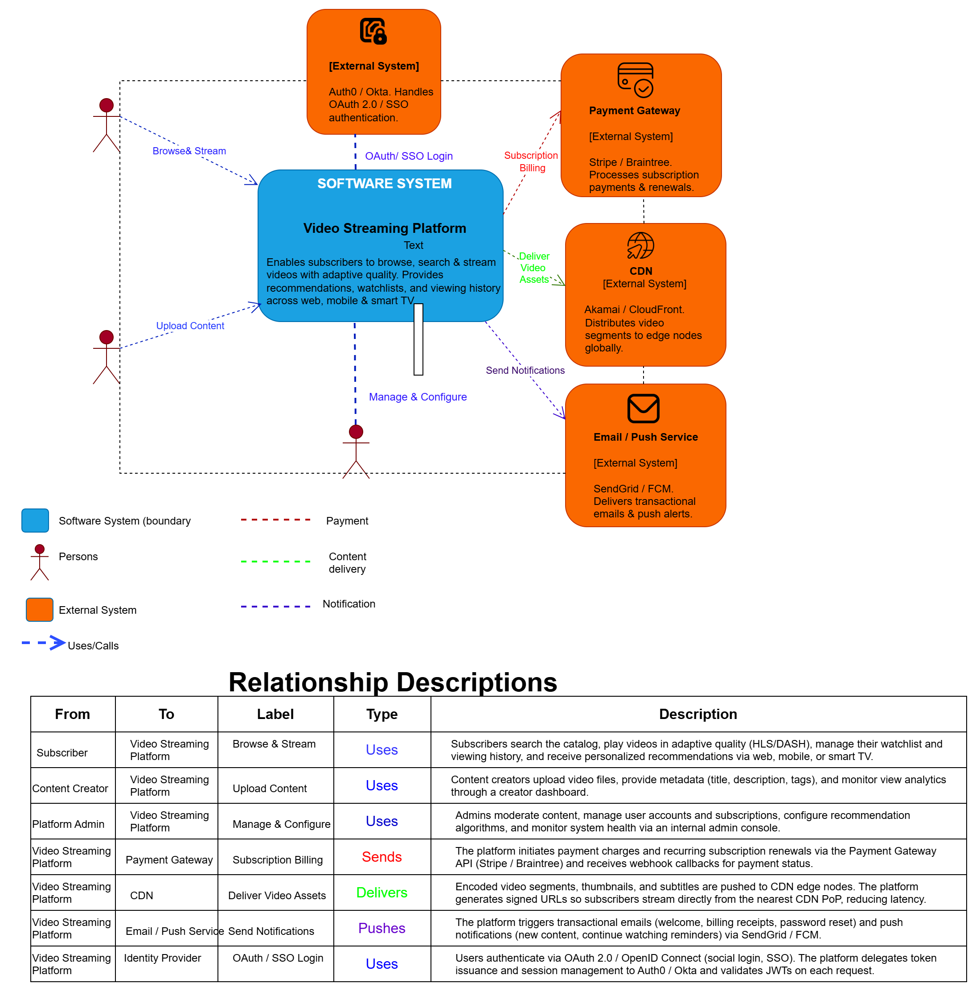
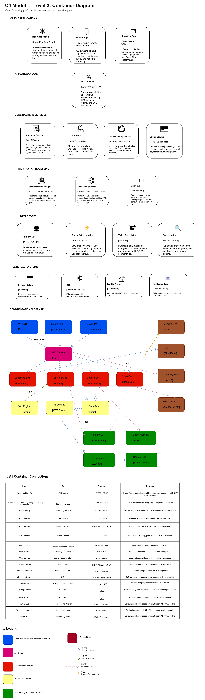
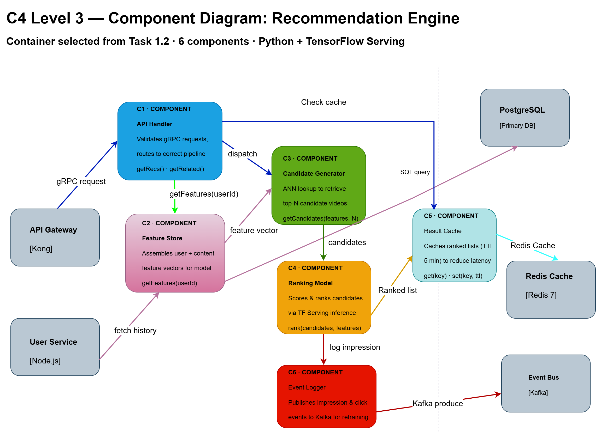
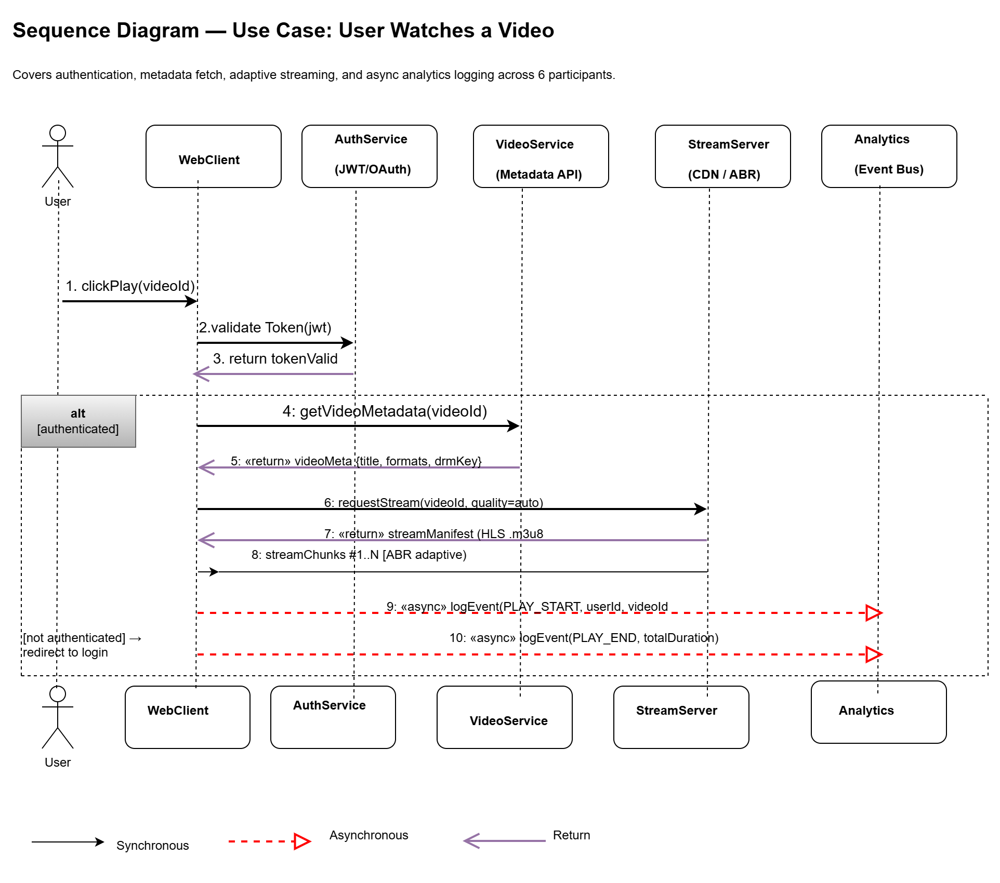
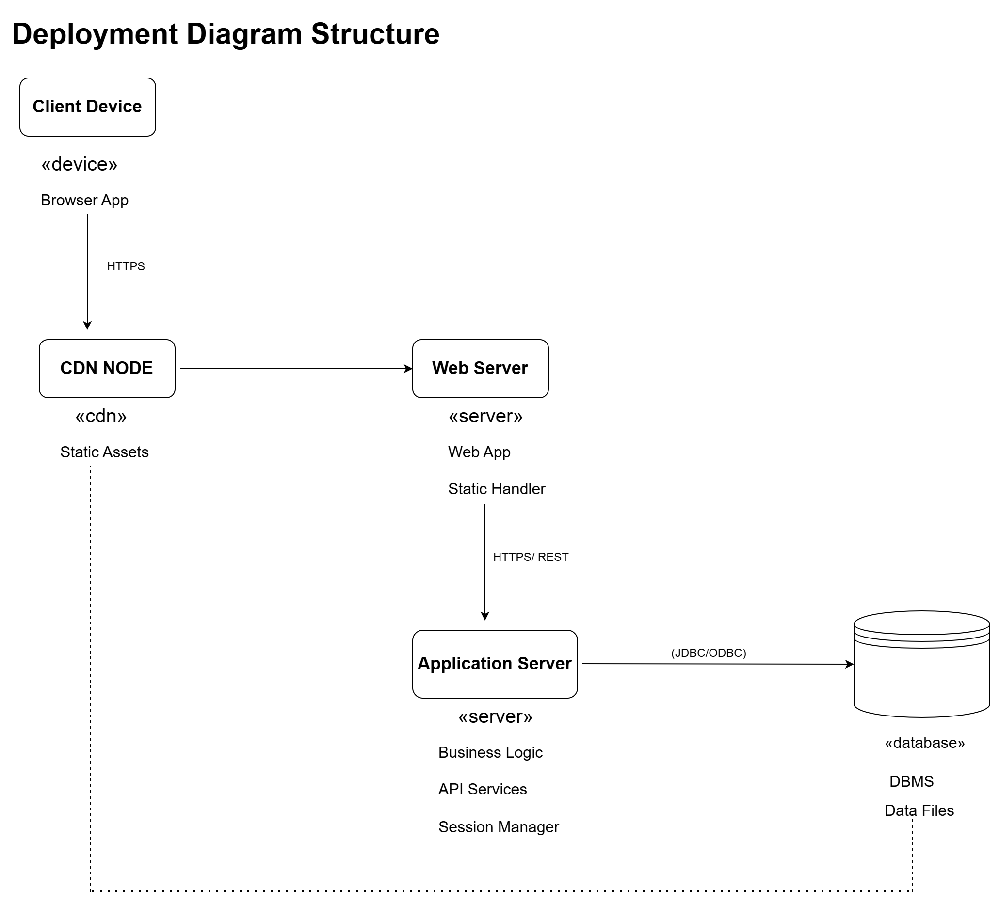

# Assignment Submission: Lecture 4

**Student Name**: [Your Name]  
**Student ID**: [Your ID]  
**Submission Date**: [Date]

---

## Overview

This submission documents the architecture of a **Netflix-style Video Streaming Platform** using two complementary modeling notations: the **C4 Model** (Levels 1–3) and **UML** (Sequence + Deployment diagrams). All diagrams are provided as editable `.drawio` files and exported `.png` images, alongside a full modeling report.

---

## Files Included

### Part 1 — C4 Model Diagrams

| File | Type | Description |
|------|------|-------------|
| `part1_context_diagram.drawio` | Editable | C4 Level 1 — System boundary, 3 actors, 4 external systems |
| `part1_context_diagram.png` | Export | C4 Level 1 — Quick reference image |
| `part1_container_diagram.drawio` | Editable | C4 Level 2 — 15 containers with technology labels and protocols |
| `part1_container_diagram.png` | Export | C4 Level 2 — Quick reference image |
| `part1_component_diagram.drawio` | Editable | C4 Level 3 — Recommendation Engine, 6 components with interfaces |
| `part1_component_diagram.png` | Export | C4 Level 3 — Quick reference image |

### Part 2 — UML Diagrams

| File | Type | Description |
|------|------|-------------|
| `part2_sequence_diagram.drawio` | Editable | UML Sequence — "User Watches a Video", 6 participants, 11 messages |
| `part2_sequence_diagram.png` | Export | UML Sequence — Quick reference image |
| `part2_deployment_diagram.drawio` | Editable | UML Deployment — AWS infrastructure, 8 nodes, all containers mapped |
| `part2_deployment_diagram.png` | Export | UML Deployment — Quick reference image |

### Part 3 — Model Documentation

| File | Description |
|------|-------------|
| `part3_model_documentation.md` | Full modeling report — approach, diagram index, consistency check |
| `part3_model_documentation.docx` | Word version of the modeling report |

---

## Key Highlights

- **5 architecture diagrams** covering every required level: C4 L1, L2, L3, UML Sequence, and UML Deployment
- **15 containers** identified and consistently labeled `[C-01]` to `[C-15]` across all diagrams — from the Container Diagram through to the Deployment nodes
- **Full traceability** from business context (who uses the system) down to physical infrastructure (what AWS service each container runs on), with a complete container-to-node mapping table in the documentation
- **Editable `.drawio` files** included for every diagram — open in [draw.io](https://app.diagrams.net) to inspect or modify any diagram

---

## How to View

1. Open `.drawio` files in [draw.io](https://app.diagrams.net) to see editable diagrams
2. View `.png` files for quick reference
3. Read `part3_model_documentation.md` for the full modeling report
4. Open `part3_model_documentation.docx` in Word for the formatted report

---

## Diagram Previews

### C4 Level 1 — System Context

### C4 Level 2 — Container Diagram

### C4 Level 3 — Component Diagram

### UML Sequence Diagram

### UML Deployment Diagram

