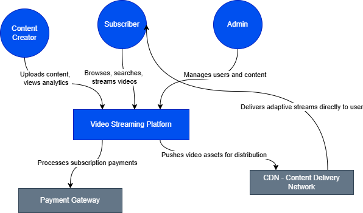
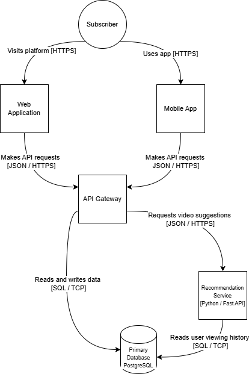
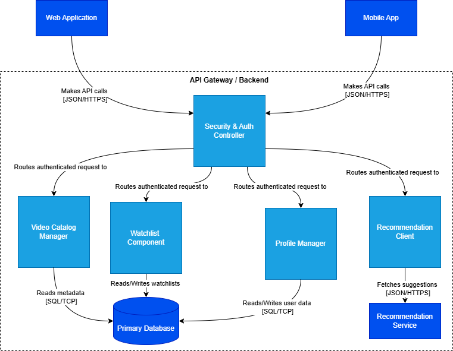
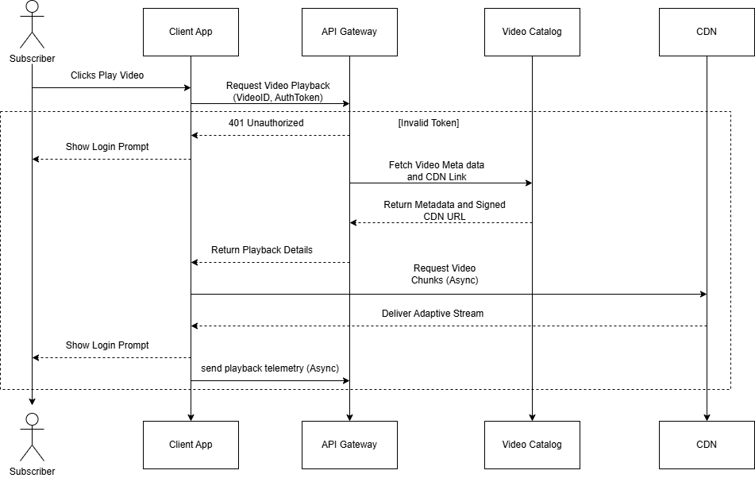
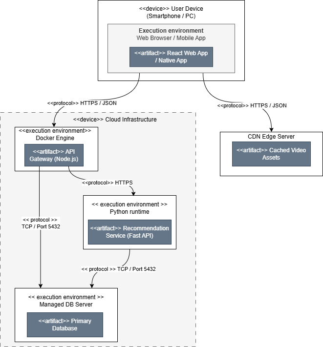

# Architecture Documentation: Video Streaming Platform

## a) Modeling Approach

**Notations Used:**
* **C4 Model:** Used for static structural modeling (Level 1: Context, Level 2: Container, Level 3: Component).
* **UML (Unified Modeling Language):** Used for dynamic behavioral modeling (Sequence Diagram) and physical infrastructure mapping (Deployment Diagram).

**Rationale for Chosen Notations:**
The C4 model was chosen because it provides a hierarchical, audience-focused abstraction of the software architecture. It allows us to easily "zoom in" from a high-level business view down to technical components without cluttering a single diagram. UML was integrated to fill the gaps where C4 is less expressive: specifically, showing the chronological flow of messages over time (Sequence) and the mapping of software artifacts to hardware/cloud nodes (Deployment).

**Diagram Relationships:**
The diagrams act as a nested map. The **Context Diagram** establishes the absolute boundary of the platform. Opening that boundary reveals the **Container Diagram**, which shows the separate deployable units. Opening the *API Gateway* container reveals the **Component Diagram**, detailing its internal modules. The **Sequence Diagram** illustrates how the containers and external actors from Level 2 interact in real-time to achieve a specific use case. Finally, the **Deployment Diagram** takes the containers from Level 2 and places them onto physical/virtual infrastructure nodes.

---

## b) Diagram Index

| Diagram Name | Type | Purpose | Target Audience |
| :--- | :--- | :--- | :--- |
| `part1_context_diagram.png` | C4 Level 1 (Context) | Shows the system boundary, external users, and external system integrations. | Non-technical stakeholders, Business Analysts, PMs |
| `part1_container_diagram.png` | C4 Level 2 (Container) | Displays high-level software architecture, deployable units, and data flow. | Software Architects, Engineering Leads, DevOps |
| `part1_component_diagram.png` | C4 Level 3 (Component) | Details the internal building blocks and responsibilities of the API Gateway container. | Software Developers, Code Reviewers |
| `part2_sequence_diagram.png` | UML Sequence | Maps the chronological, step-by-step message flow for the "User watches a video" use case. | Software Developers, QA Engineers |
| `part2_deployment_diagram.png` | UML Deployment | Illustrates how software artifacts (containers) are mapped to infrastructure nodes. | DevOps Engineers, Cloud Architects, SysAdmins |

*(Note: Ensure all referenced `.png` files are located in the same directory as this document to view them properly).*

---

## c) Consistency Check

**Ensuring Consistency:**
To maintain consistency across the model, a strict top-down tracing approach was used. Every container present in the Level 2 diagram respects the boundaries established in the Level 1 diagram. The API Gateway components in Level 3 exclusively map to the API Gateway container in Level 2. Terminology, system names (e.g., "Primary Database", "Recommendation Service"), and actor definitions ("Subscriber") were kept identical across both C4 and UML diagrams to prevent ambiguity.

**Assumptions and Simplifications:**
1.  **Technology Stack:** It is assumed that the backend utilizes modern, lightweight frameworks (e.g., deploying a Python/FastAPI Recommendation Service and Node.js API Gateway).
2.  **Deployment Environment:** We assume a containerized deployment strategy using Docker, hosted on a modern cloud platform (such as Render or Google Cloud). 
3.  **CDN Offloading:** For simplicity in the Sequence Diagram, we assume the CDN handles 100% of the heavy video streaming traffic directly to the client edge, bypassing the internal API Gateway entirely to reduce system load. 
4.  **Security:** Authentication is simplified to a standard JWT token exchange; internal network security protocols (like VPC peering between the API and Database) are assumed but omitted from the Container diagram for readability.

---
### Embedded Diagrams

