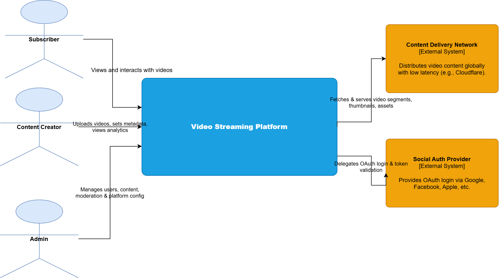
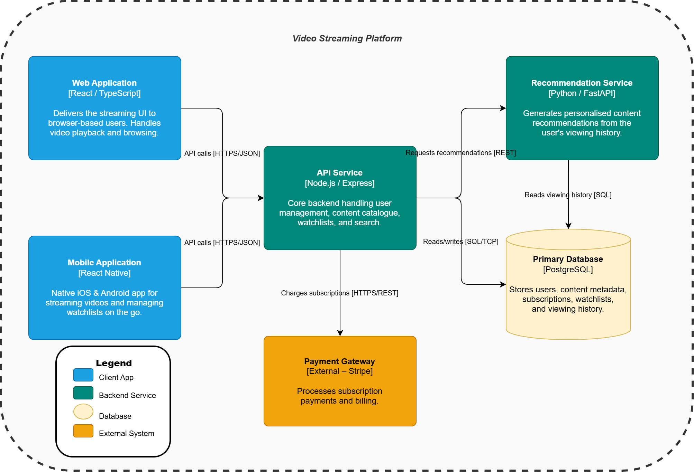
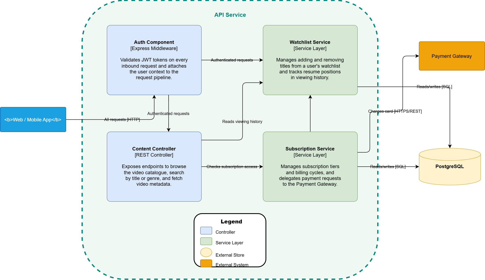
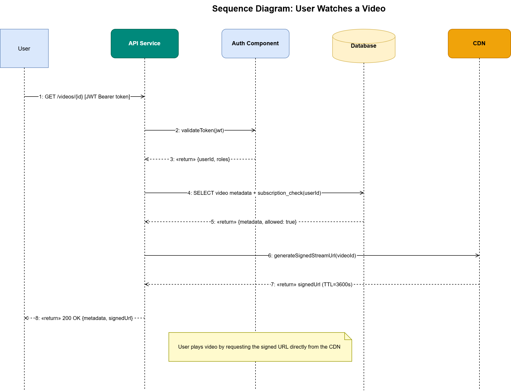
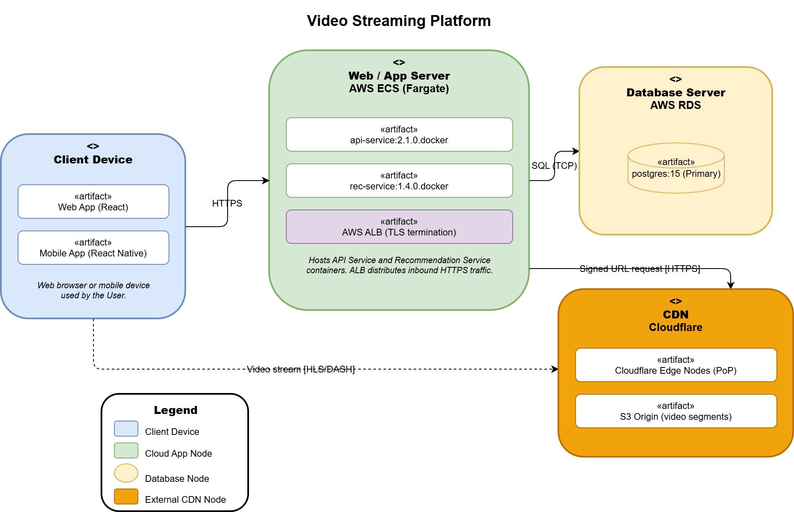

# Part 3: Architecture Model Documentation
## Video Streaming Platform

---

## a) Modeling Approach

The diagrams use a mix of C4 and UML. C4 handles the structural side — it's readable by non-technical stakeholders and naturally guides you from the big picture down to implementation detail. UML fills in what C4 doesn't cover: runtime behavior (sequence) and infrastructure layout (deployment).

The three C4 levels nest directly into each other. The context diagram establishes the system boundary, the container diagram breaks it into its five main pieces, and the component diagram zooms into the API Service specifically. The two UML diagrams sit alongside: the sequence diagram shows what actually happens at runtime when a user plays a video, and the deployment diagram shows where everything runs.

Element names — "API Service", "PostgreSQL", "CDN" — are kept identical across all five diagrams so there's no ambiguity when cross-referencing them.

---

## b) Diagram Index

| # | File | Type | Purpose | Audience |
|---|------|------|---------|----------|
| 1 | `part1_context_diagram.drawio` | C4 L1 – Context | System boundary, 3 personas, 2 external systems | Stakeholders |
| 2 | `part1_container_diagram.drawio` | C4 L2 – Container | 5 containers with tech labels and protocols | Developers, architects |
| 3 | `part1_component_diagram.drawio` | C4 L3 – Component | 4 internal components of the API Service | Backend developers |
| 4 | `part2_sequence_diagram.drawio` | UML Sequence | "User watches a video" — 5 participants, 8 messages | Developers, QA |
| 5 | `part2_deployment_diagram.drawio` | UML Deployment | 4 infrastructure nodes with artifacts and stereotypes | DevOps, architects |

---

## c) Consistency Check

All five diagrams share the same color palette: blue for client apps, teal for backend services, yellow for databases, and orange for external systems. Every connection is labelled with its protocol (e.g., `HTTPS/JSON`, `SQL/TCP`, `HLS/DASH`), and the deployment diagram uses standard UML stereotypes (`<<device>>`, `<<cloud>>`, `<<external/cloud>>`).

---

## Diagram Images

### System Context

### Container Diagram

### Component Diagram

### Sequence Diagram

### Deployment Diagram
