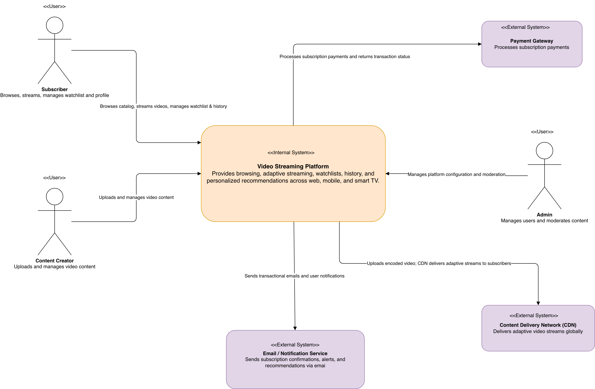
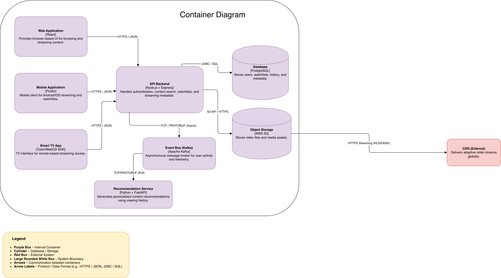
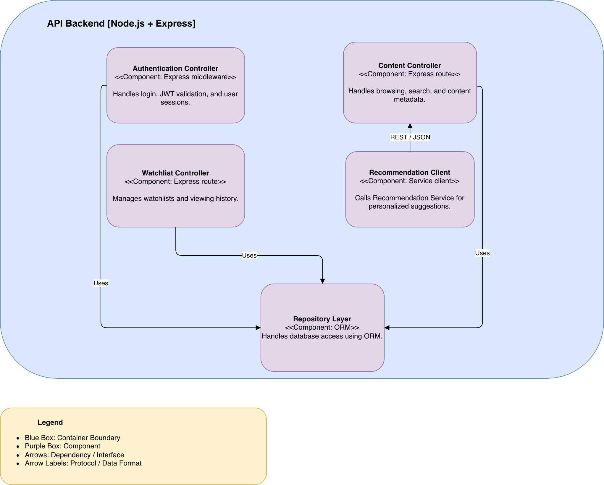
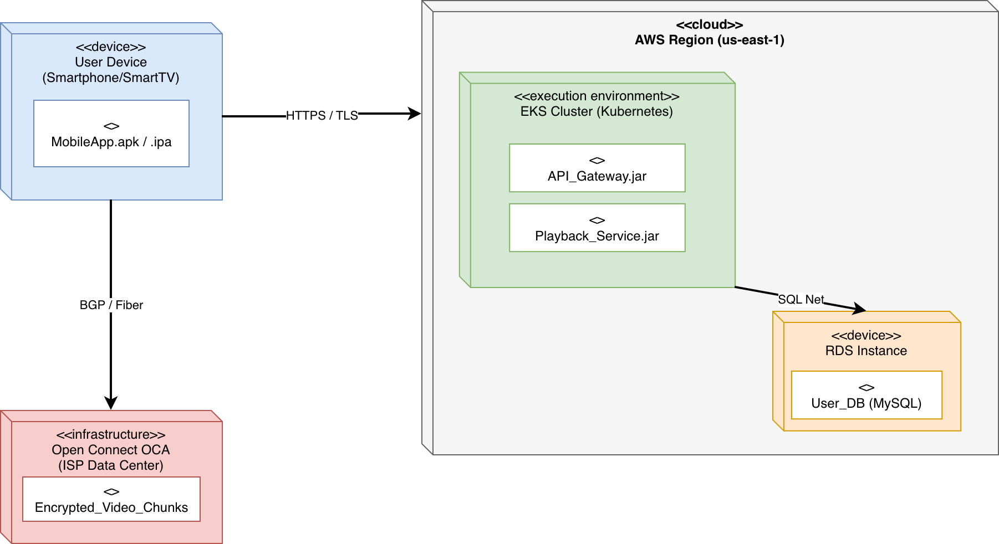
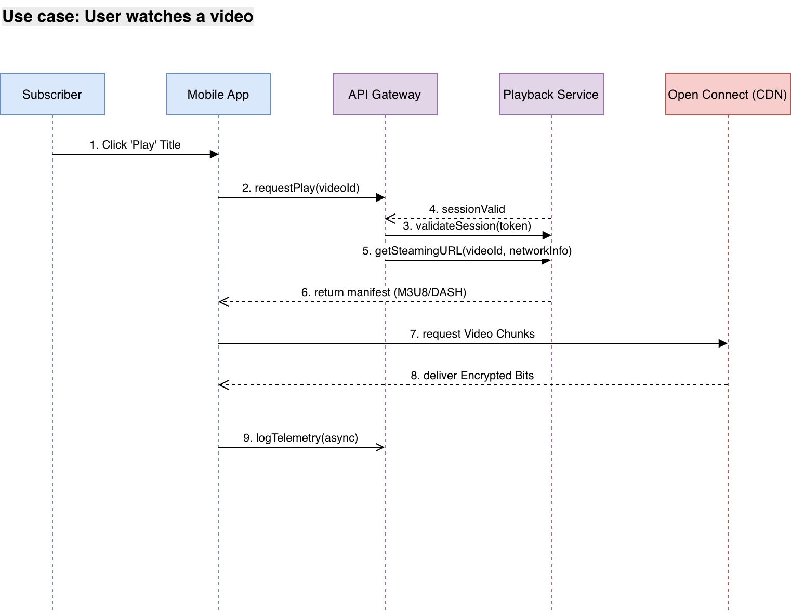

# Architecture Documentation: Video Streaming Platform

---

## a) Modeling Approach

For this assignment, I used a hybrid modeling approach combining the **C4 Model** and **UML (Unified Modeling Language)**.

In the first part, I focused more on the C4 model.  I created a component, context and container diagrams to show how the structure of the system. In the second part, I looked at the UML diagrams (sequence and deployment diagrams).

I have found that UML and C4 each fulfill unique requirements the project's workflow. UML offers the technical precision many development teams rely on, whereas C4 helps speed up communication and offers abstracton which is essential for non-technical stakeholders.

### Why These Notations?

#### C4 Model

The C4 Model enables stakeholders to progressively move from:

- A high-level business view (Context Diagram – Level 1)
- To major architectural building blocks (Container Diagram – Level 2)
- To internal implementation structure (Component Diagram – Level 3)

This approach is effective for communicating complex distributed systems, such as a video streaming platform, to both technical and non-technical stakeholders. It clearly separates concerns while maintaining traceability across abstraction levels.

The diaagrams below show abstraction through zooming. The goal is to start identifying "Who uses the system?" and end with "How does this specific service work?".

#### 1. Context Diagram: The system's place in the ecosystem.

#### 2. Container Diagram: High-level technology building blocks.

#### 3. Component Diagram: Internal structure of a single application.

---

#### UML Sequence Diagram

While C4 is excellent for modeling **structure**, it does not capture **time-based interactions**.

To address this, a UML Sequence Diagram was used to model the dynamic behavior of the system — specifically the process of how a user initiates and receives a video stream. This diagram illustrates request flow, authentication, metadata retrieval, and streaming initiation in chronological order.

---

#### 1. UML Deployment Diagram

A UML Deployment Diagram was used to represent how logical containers are mapped onto physical infrastructure.

For a high-traffic streaming platform, infrastructure placement (cloud region, edge delivery, storage services) is critical. The deployment diagram demonstrates:

- Cloud-hosted backend services
- Database placement
- Edge-based CDN delivery nodes

#### 2. UML Sequence Diagram

A UML Sequence Diagram was used to model the dynamic behavior and chronological interaction between system components for the "User Watches a Video" use case.

While the structural diagrams (C4) show what the system is, the sequence diagram demonstrates how the system functions in real-time. 

---

### Relationship Between Diagrams

The diagrams follow a **top-down decomposition strategy**:

1. The **Context Diagram (C4 Level 1)** defines the system boundary and external actors.
2. The **Container Diagram (C4 Level 2)** decomposes the system into high-level technology building blocks. Specifies how the system componets will interact with each other and what technologies will be used.
3. The **Component Diagram (C4 Level 3)** further decomposes one container (API Backend) into internal components. Focuses on building blocks of one component. In this assignment, I focused on the API backend component 
4. The **Sequence Diagram** reuses these containers/components to show runtime behavior.
5. The **Deployment Diagram** maps these containers onto physical infrastructure.

This architectural modeling approach employs a top-down decomposition strategy using the C4 model and UML to provide an overall view of a video streaming platform. By transitioning from the high-level System Context (Level 1) to the specific Container (Level 2) and Component (Level 3) structures, the design establishes clear boundaries and identifies technical stacks like Node.js, Kafka, and PostgreSQL.  These structural models are then validated through a UML Sequence Diagram, which maps runtime behavior for core use cases, and a UML Deployment Diagram, which assigns logical software artifacts to physical infrastructure like AWS EKS and Open Connect CDN nodes.  Collectively, this layered approach ensures that every functional requirement is traceable to a specific, consistently named technical implementation across all architectural views.

---

## b) Diagram Index

| Name | Type | Purpose | Audience |
|------|------|----------|----------|
| Context Diagram | C4 Level 1 | Defines system boundary and external actors (CDN, Payment Gateway, Email Service). | Business Stakeholders |
| Container Diagram | C4 Level 2 | Maps high-level technology choices (React, Node.js, PostgreSQL, S3). | Software Architects |
| API Component Diagram | C4 Level 3 | Decomposes API Backend into controllers, clients, and repository layer. | Backend Developers |
| Playback Flow | UML Sequence | Details the logic of initiating and delivering a video stream. | Engineering Lead |
| Infrastructure Map | UML Deployment | Shows cloud deployment and CDN edge distribution. | DevOps / SREs |

---

## c) Consistency Check

To maintain a **Single Source of Truth** across all diagrams, the following checks were implemented:

### Naming Standards

The container named **“API Backend”** in the Container Diagram (Level 2) is consistently referenced in:

- The Component Diagram (Level 3)
- The Sequence Diagram
- The Deployment Diagram

This avoids ambiguity between API Gateway, Backend Service, or Web Service naming.

---

### External Integration Consistency

The **CDN** identified as an external system in the System Context Diagram (Level 1):

- Is the same entity delivering adaptive video streams in the Sequence Diagram
- Is represented as an edge node in the Deployment Diagram

This ensures architectural consistency between static and dynamic views.

---

### Data Integrity & Persistence Mapping

The **Repository Layer** defined in the Component Diagram (Level 3):

- Serves as the abstraction layer for the **PostgreSQL** database defined in the Container Diagram (Level 2)
- Ensures that all data access flows through a single architectural boundary

This maintains logical separation between business logic and persistence logic.

---

## Assumptions & Simplifications

To keep diagrams readable and aligned with assignment scope, the following simplifications were made:

### Security

Complex OAuth2 / OIDC authentication flows were simplified into a single function call in the Sequence Diagram:

---

## References

GeeksforGeeks (2025) *System Design Netflix | A Complete Architecture*.  
Available at: https://www.geeksforgeeks.org/system-design/system-design-netflix-a-complete-architecture/  
(Used for technical specifications of Netflix's microservices architecture, Kafka-based event streaming, and Open Connect CDN design.)

Cloudairy (2024) *C4 Model vs UML: Which One is Better for Software Architecture?*  
Available at: https://cloudairy.com/blog/c4-vs-uml  
(Used for defining the modeling strategy and understanding the relationship between C4 structural abstractions and UML behavioral diagrams.)