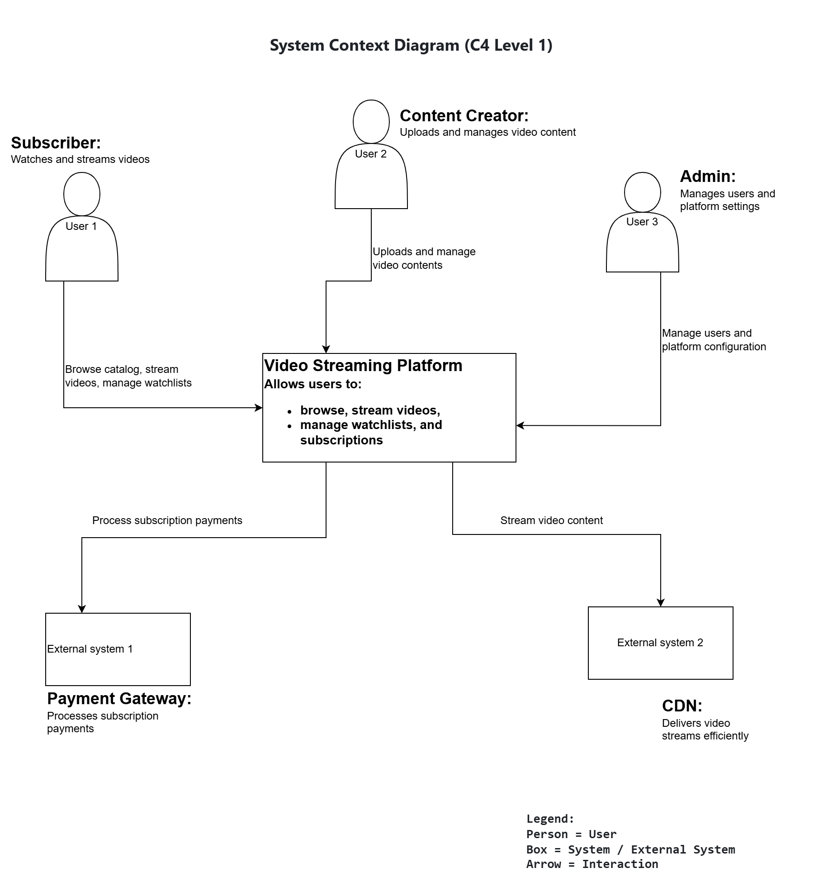
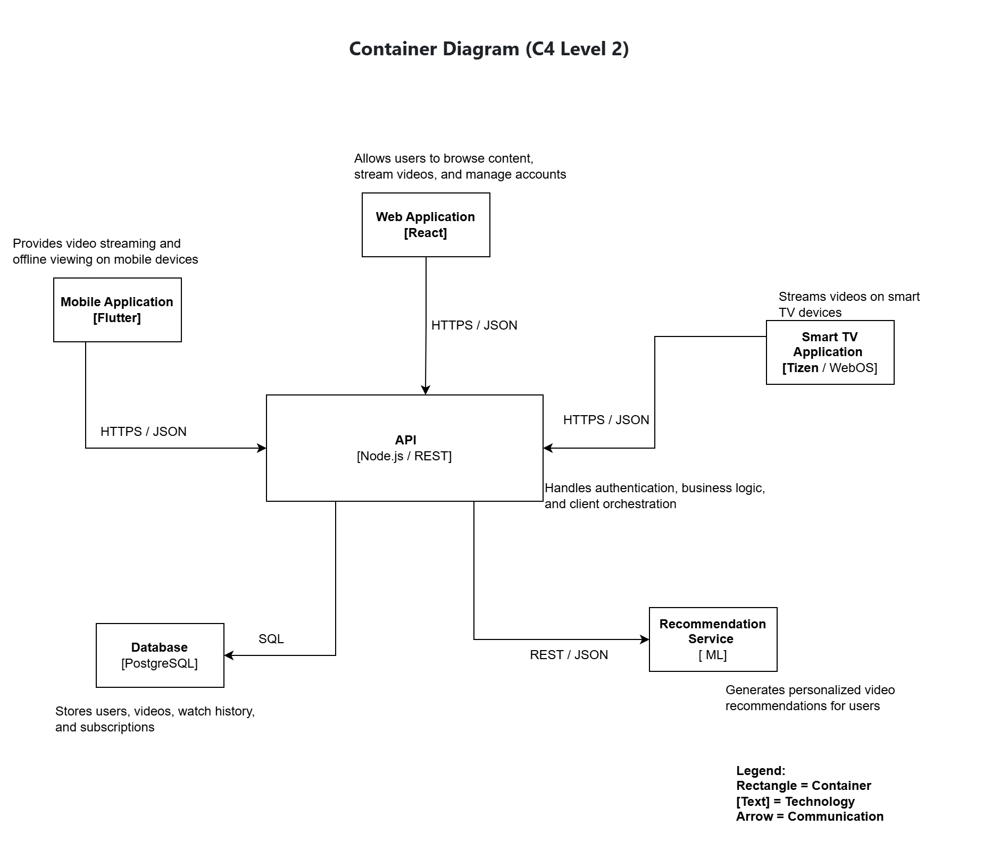
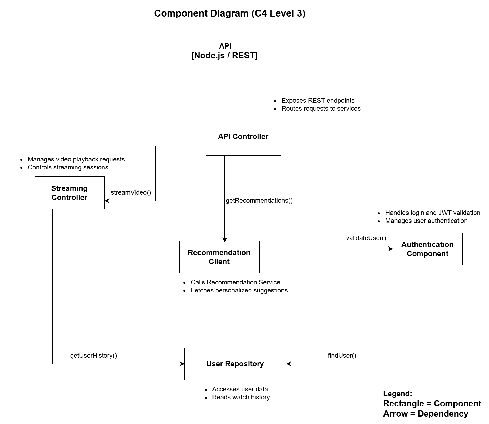
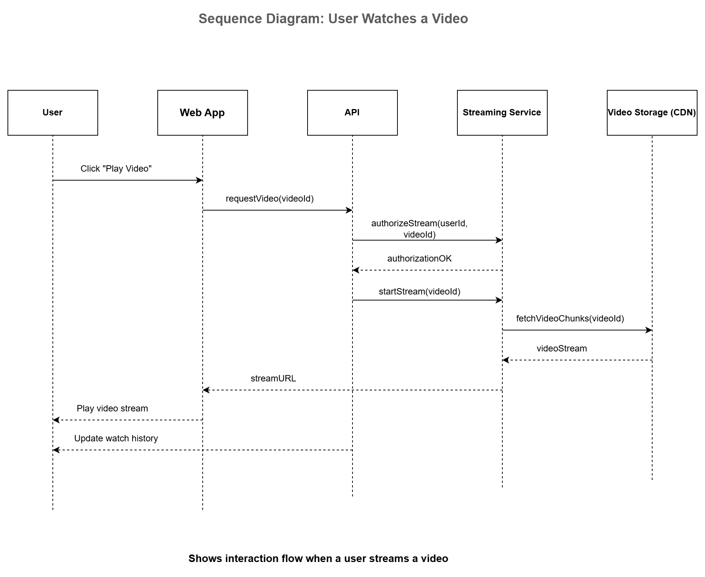
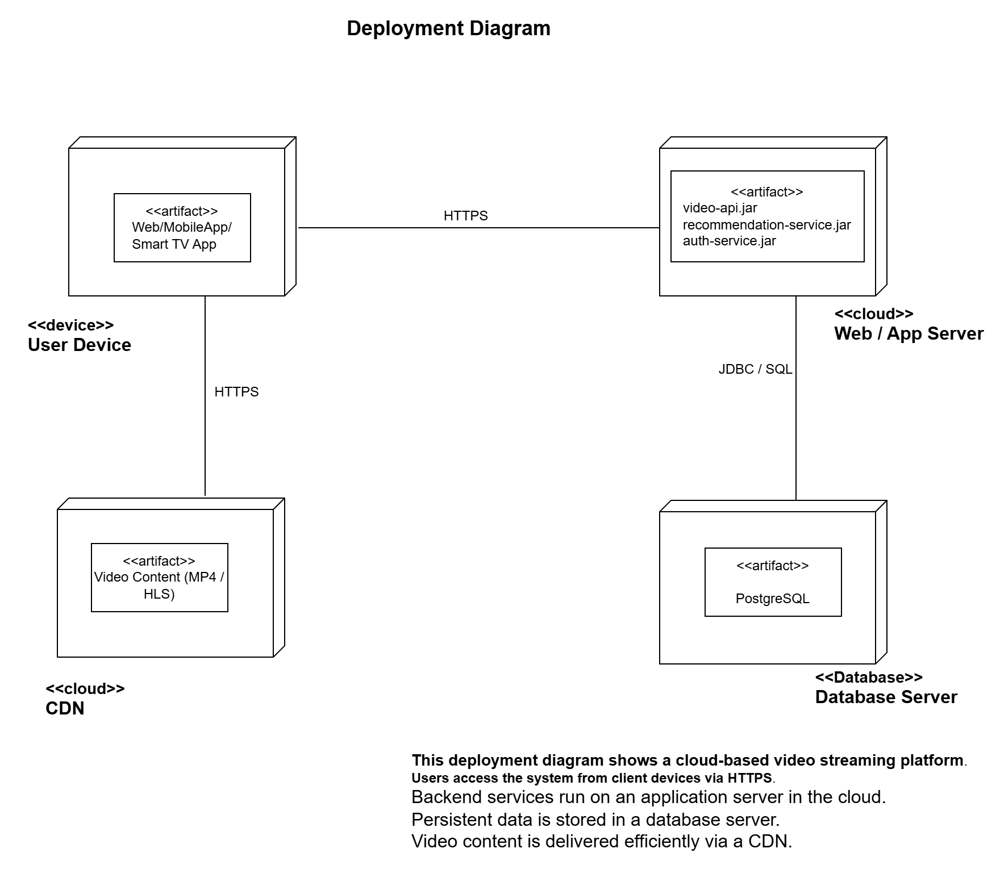

# Part 3: Architecture Model Documentation  
**System**: Video Streaming Platform  
**Course**: Software Architecture – Lecture 4  

---

## 1. Modeling Approach

### 1.1 Modeling Notations Used

For this assignment, I used the following modeling notations:

- **C4 Model**
  - **Context Diagram (Level 1)**: To show the system boundary, users, and external systems.
  - **Container Diagram (Level 2)**: To describe the high-level software architectures.
  - **Component Diagram (Level 3)**: To decompose one container into internal components and responsibilities.

- **UML Diagrams**
  - **Sequence Diagram**: To model interactions over time for a key use case.
  - **Deployment Diagram**: To show how software artifacts are deployed on physical and cloud infrastructure.

### 1.2 Why These Notations Were Chosen

- The **C4 model** was chosen because it provides a **clear hierarchical structure**, allowing stakeholders to zoom from a high-level overview down to implementation details.
- **UML diagrams** were used where **behavioral flow** (sequence diagram) and **physical infrastructure** (deployment diagram) needed to be expressed.
- Together, C4 and UML ensure:
  - Clear communication for different audiences
  - Consistent abstraction levels
  - Separation between logical and physical architecture

### 1.3 Relationship Between Diagrams

The diagrams are related as follows:

- The **Context Diagram** defines *who* interacts with the system.
- The **Container Diagram** shows *what applications/services* make up the system.
- The **Component Diagram** explains *how one container is internally structured*.
- The **Sequence Diagram** demonstrates *runtime behavior* using components and services defined earlier.
- The **Deployment Diagram** maps the logical containers to *physical infrastructure*.

---

## 2. Diagram Index

| Diagram Name | Type | Purpose | Audience |
|-------------|------|---------|----------|
| part1_context_diagram | C4 – Context (L1) | Show system boundary, users, and external systems | Stakeholders, Product Owners |
| part1_container_diagram | C4 – Container (L2) | Show high-level software architecture | Architects, Developers |
| part1_component_diagram | C4 – Component (L3) | Show internal structure of a container | Developers |
| part2_sequence_diagram | UML Sequence | Show interaction flow for a use case | Developers, Testers |
| part2_deployment_diagram | UML Deployment | Show physical infrastructure and deployment | DevOps, Architects |

---

## 3. Consistency Check

### 3.1 Naming Consistency

To ensure consistency across all diagrams:

- Container names (e.g., **API**, **Recommendation Service**, **Web App**) are identical in:
  - Container Diagram
  - Component Diagram
  - Sequence Diagram
  - Deployment Diagram
- Responsibilities defined at the container level are reflected in:
  - Component responsibilities
  - Sequence interactions
- Technology choices (e.g., HTTPS, PostgreSQL) are consistently used across diagrams.

### 3.2 Assumptions and Simplifications

The following assumptions were made to keep the models clear and manageable:

- Microservices are shown as separate artifacts but deployed on a single application server.
- Security, monitoring, and logging infrastructure are not modeled in detail.
- Internal scaling mechanisms are abstracted.
- CDN behavior is simplified to content delivery only.

These simplifications were made  to focus on **architectural clarity rather than operational complexity**.

---

## 4. Diagram References

