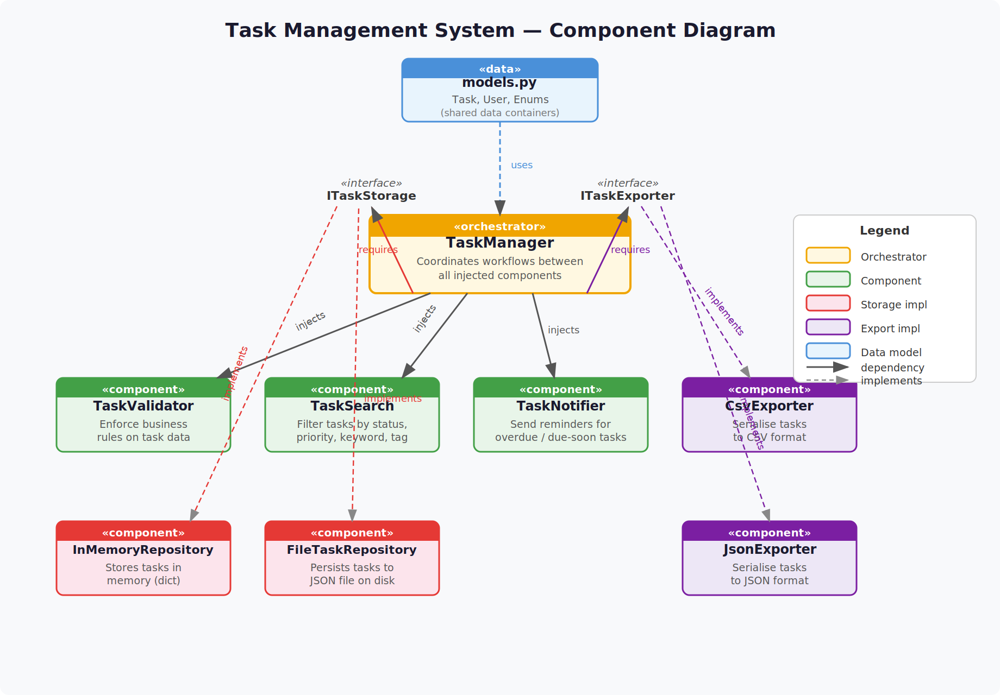

# Part 2 — Cohesion and Coupling Analysis

---

## a) Cohesion Analysis

Cohesion measures how closely the elements inside a single component are
related to each other.  The goal is **functional cohesion** — every element
exists to serve the one stated purpose of the component.

| Component | Cohesion Type | Justification |
|---|---|---|
| **TaskValidator** | **Functional** | Every method (`_check_title`, `_check_due_date`) exists solely to determine whether a task is valid.  No other concern is present. |
| **InMemoryTaskRepository** | **Functional** | Every method (`save`, `get`, `delete`, `list_all`) exists solely to store and retrieve tasks in memory.  Serialisation details are in helper functions in the same file, not mixed into business logic. |
| **FileTaskRepository** | **Functional** | Same argument. Serialisation helpers (`_task_to_dict`, `_dict_to_task`) are colocated because they serve only this component's single job. |
| **TaskSearch** | **Functional** | Every method filters a task list by one specific criterion.  All methods work on the same data type, serve the same purpose, and have no side effects. |
| **JsonExporter / CsvExporter** | **Functional** | Each class does one thing: serialise a list of tasks to a specific format.  The shared helper `_task_to_flat_dict` is in the same file because it exists only to support these two classes. |
| **TaskNotifier** | **Functional** | All methods exist to decide whether and how to notify a user.  Format helpers (`_format_overdue`, `_format_due_soon`) are private because they serve only this component. |
| **TaskManager** | **Communicational** | All methods operate on the same shared domain objects (`Task`, `User`) and delegate to the injected components.  This is acceptable for an orchestrator: the slight reduction from Functional to Communicational cohesion is the deliberate trade-off of having one coordinating layer rather than spreading workflow logic across all components. |

---

## b) Coupling Analysis

### Component-by-Component Coupling

| Dependency | Direction | Type | Level |
|---|---|---|---|
| `TaskManager` → `ITaskStorage` | TaskManager uses | **Interface coupling** | **Low** |
| `TaskManager` → `ITaskExporter` | TaskManager uses | **Interface coupling** | **Low** |
| `TaskManager` → `TaskValidator` | TaskManager uses | **Direct class coupling** | **Medium** |
| `TaskManager` → `TaskSearch` | TaskManager uses | **Direct class coupling** | **Medium** |
| `TaskManager` → `TaskNotifier` | TaskManager uses | **Direct class coupling** | **Medium** |
| All components → `Task` / `User` | Read/write data | **Data coupling** | **Low** |

### How Low Coupling Was Achieved

**1. Interfaces for the two most-likely-to-change dependencies.**  
Storage and export are the components most likely to be swapped (e.g.,
switching from file storage to a database, or adding a new export format).
Both are hidden behind interfaces, so `TaskManager` has zero knowledge of
the concrete implementation.

**2. Constructor injection, not hard-coded instantiation.**  
`TaskManager` never calls `InMemoryTaskRepository()` inside itself.
The concrete binding is established by the caller in `main.py`.  This means
`TaskManager` does not need to be modified or recompiled when the storage or
export implementation changes.

**3. Pure data model in `models.py`.**  
`Task` and `User` carry no behaviour.  All components depend on these data
containers (data coupling), which is the weakest form of coupling — a change
to a field in `Task` is localised and visible.

**4. No circular dependencies.**  
The dependency graph flows in one direction:
`main.py` → `TaskManager` → components → `models`.
No component imports `TaskManager`.

### Coupling I Would Reduce With More Time

- **TaskManager → TaskValidator/TaskSearch/TaskNotifier** are direct class
  couplings.  With more time I would define `ITaskValidator`, `ITaskSearch`,
  and `ITaskNotifier` interfaces for these too.  The benefit would be easier
  substitution (e.g., a `StrictValidator` vs. a `LenientValidator` for
  different environments) and cleaner unit testing via stubs.

- **`models.py` is a shared dependency** of every component.  Right now it
  is small, but if the `Task` dataclass grew large, changes to it would
  ripple everywhere.  A mitigation would be to define separate DTOs per
  component boundary so each component is only coupled to the fields it
  actually uses.

---

## c) SRP Application

| Component | Single Responsibility | One Reason to Change |
|---|---|---|
| **TaskValidator** | Enforce business rules on task data | Business rules change (new field constraints, different length limits) |
| **InMemoryTaskRepository** | Store and retrieve tasks in RAM | The in-memory data structure or lookup strategy changes |
| **FileTaskRepository** | Store and retrieve tasks on disk as JSON | The persistence format or file-handling strategy changes |
| **TaskSearch** | Filter a list of tasks by various criteria | New filter types are added, or existing filter logic changes |
| **JsonExporter** | Serialise tasks to JSON | The JSON schema or output format changes |
| **CsvExporter** | Serialise tasks to CSV | The CSV column layout or escaping strategy changes |
| **TaskNotifier** | Decide when and how to notify users | Notification rules change, or the notification channel changes |
| **TaskManager** | Coordinate the workflow between components | The high-level workflow between components changes (e.g., a new step is inserted into "create task") |

Each component has exactly one answer to "why would this file need to
change?" — which is the practical test for SRP described in the lectures.
