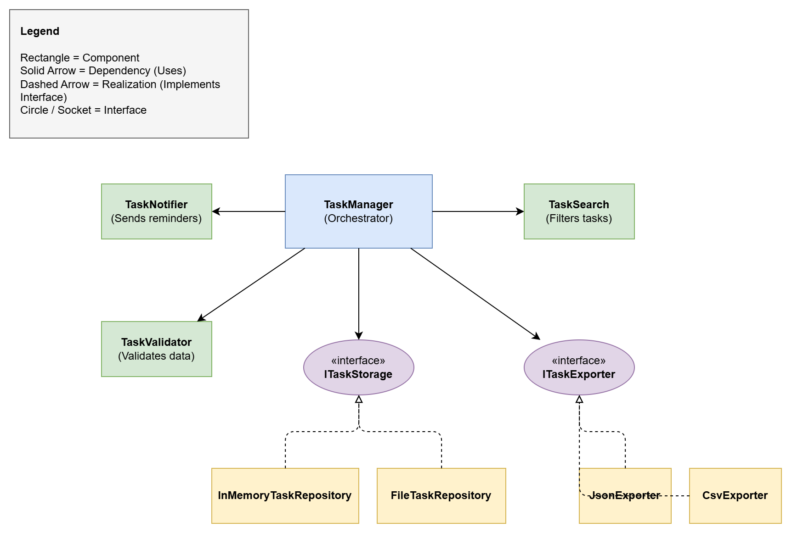

# Part 2: Cohesion and Coupling Analysis

## a) Cohesion Analysis

Cohesion refers to how strongly related and focused the responsibilities of a single component are. In this Task Management System, we achieved extremely high **Functional Cohesion** across all components.

- **TaskValidator**: Contains only logic for verifying Task object properties.
- **ITaskStorage Implementations (InMemoryTaskRepository, FileTaskRepository)**: Solely responsible for the storage, retrieval, and persistence of Tasks. 
- **TaskSearch**: Focuses strictly on applying query criteria to filter Task lists.
- **ITaskExporter Implementations (JsonExporter, CsvExporter)**: Strictly responsible for transforming lists of Tasks into string outputs of a specific format.
- **TaskNotifier**: Exists singularily to trigger reminder messages/notifications.

**Justification:** Every module performs exactly one well-defined computational task (e.g., exporting, validating), which is the definition of functional cohesion. They don't have secondary unrelated side-effects.

## b) Coupling Analysis

Coupling refers to the degree of interdependence between software modules. The design achieves **Low Coupling** (specifically, **Data Coupling** and **Interface / Abstraction Coupling**).

- **Current Coupling Level**: Low.
- **How it was achieved**: 
  - The `TaskManager` class depends strictly on abstractions (`ITaskStorage`, `ITaskExporter`) rather than concrete classes. This adheres to the Dependency Inversion Principle.
  - Dependencies are supplied via the constructor (**Dependency Injection**), removing the responsibility of instantiation from the `TaskManager`.
  - When `TaskManager` interacts with the components, it passes minimal required data (usually just a `Task` instance or a list of tasks), representing **Data Coupling** (which is desirable compared to passing heavy control flags or global state).

- **Future Coupling Reductions**: 
  - To further reduce coupling, the `Task` object itself could be broken down, or we could use simple Data Transfer Objects (DTOs) instead of passing the full domain model to components like `CsvExporter`.
  - We could introduce a full event-driven bus system so that `TaskManager` doesn't even need to hold direct references to `TaskSearch` or `TaskNotifier` directly, but rather fires a `TaskCreatedEvent` that other decoupled services listen to passively.

## c) SRP Application (Single Responsibility Principle)

The SRP states that a class should have exactly one reason to change. 

| Component | Single Responsibility | One Reason to Change |
| :--- | :--- | :--- |
| **TaskValidator** | Guaranteeing data integrity. | If the business rules for what makes a task valid change (e.g., title length requirements). |
| **InMemoryTaskRepository** | Managing the lifecycle of tasks in volatile memory. | If the internal data structure mapping tasks in memory needs optimization. |
| **FileTaskRepository** | Managing the lifecycle of tasks on the local file system. | If the storage location, file name, or atomic write strategy changes. |
| **TaskSearch** | Searching logic. | If the search syntax or filtering capabilities become more complex. |
| **JsonExporter** | Formatting task data into JSON. | If the schema of the JSON export changes. |
| **CsvExporter** | Formatting task data into CSV. | If the columns of the CSV or delimiter requirements change. |
| **TaskNotifier** | Delivering alerts. | If the method of notification shifts (e.g., from console prints to actual Emails or SMS). |
| **TaskManager** | Orchestrating the system workflow. | If the high-level sequence of steps to create or handle a task is altered (e.g., notifying *before* saving instead of after). |
