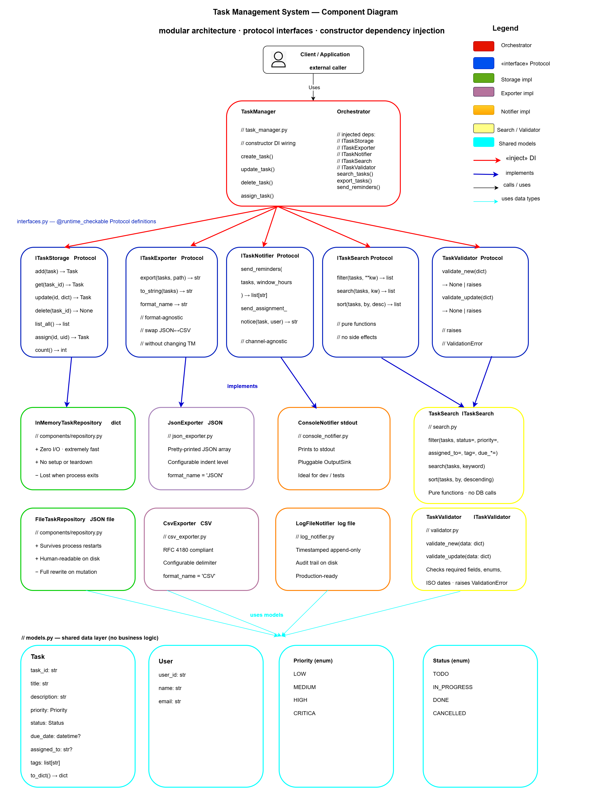

# Part 2 — Task 2.2: Cohesion and Coupling Analysis

## Component Diagram Reference



The diagram shows five interface contracts (blue band) separating the
`TaskManager` orchestrator from its eight concrete implementations.
Every dependency arrow crosses an interface boundary — no component arrow
points directly at another concrete class.

---

## 1. Cohesion Analysis

Cohesion measures how strongly the elements *inside* a module belong
together. The higher the cohesion, the easier the component is to
understand, test, and maintain in isolation.

The scale used below, from weakest to strongest:

> Coincidental → Logical → Temporal → Procedural →
> Communicational → **Sequential** → **Functional**

---

### 1.1 `models.py` — **Functional Cohesion**

| Property | Value |
|----------|-------|
| Cohesion type | **Functional** |
| All elements serve | Representing task-domain data structures |
| Single output | Immutable value objects consumed by every other layer |

`models.py` contains exactly the data types that represent the domain:
`Task`, `User`, `Priority`, and `Status`. Every field, every enum value,
and the single helper method (`Task.to_dict()`) exist for one and only one
reason: to describe what a task and a user *are*. There is no behaviour,
no I/O, no validation logic. The module cannot be split further without
either duplicating imports or creating artificial sub-packages with only
one class each.

**Justification:** Adding a new task field (e.g., `estimated_hours`) is
the *only* reason this file would change. No algorithm change, no storage
change, and no format change touches `models.py` unless the data model
itself evolves.

---

### 1.2 `TaskValidator` — **Functional Cohesion**

| Property | Value |
|----------|-------|
| Cohesion type | **Functional** |
| All elements serve | Deciding whether a raw input dict is valid |
| Single output | `None` (success) or `ValidationError` |

Every private method (`_require_string`, `_require_enum`,
`_optional_date`) and both public methods (`validate_new`,
`validate_update`) exist solely to answer the question: *"Is this data
safe to pass further into the system?"* The class holds no state between
calls and produces no side effects. Even the allowed-value sets
(`ALLOWED_PRIORITIES`, `ALLOWED_STATUSES`) are kept here rather than
scattered across callers.

**Justification:** The one reason `TaskValidator` would change is a
change in business validation rules — for example, adding a maximum
title length, tightening priority options, or requiring that due dates
be in the future. Storage format changes, search algorithm changes, and
notification channel changes are completely irrelevant to this file.

---

### 1.3 `InMemoryTaskRepository` / `FileTaskRepository` — **Functional Cohesion**

| Property | Value |
|----------|-------|
| Cohesion type | **Functional** |
| All elements serve | Storing and retrieving `Task` objects |
| Single output | `Task` instances or `None`/`TaskNotFoundError` |

All seven methods (`add`, `get`, `update`, `delete`, `list_all`,
`assign`, `count`) operate on the same data store and on nothing else.
The shared private helpers `_apply_updates` and `_task_from_dict` also
belong exclusively to the persistence concern: they marshal data to and
from the storage format.

`InMemoryTaskRepository` and `FileTaskRepository` share the same
*functional* responsibility (persist tasks) but differ in their
*strategy* (RAM vs disk). Neither leaks search logic, validation rules,
or message formatting into its methods.

**Justification:** The only reason an implementation would change is a
change in *how tasks are stored* — switching from a flat dict to an
ordered dict, adding an index, changing the JSON serialisation format,
or moving to a database. Search query changes, export format changes,
and notification channel changes do not touch this file.

---

### 1.4 `JsonExporter` / `CsvExporter` — **Functional Cohesion**

| Property | Value |
|----------|-------|
| Cohesion type | **Functional** |
| All elements serve | Serialising a list of `Task` objects to a specific text format |
| Single output | A string or file |

`JsonExporter` contains exactly: one public `export()` method that
writes a file, one public `to_string()` method that returns a string,
one `format_name` property, and one private `_to_json()` helper that
does the actual conversion. Every line participates in "convert tasks to
JSON". `CsvExporter` is structurally identical with CSV-specific logic.

Splitting `export()` (file I/O) from `to_string()` (pure conversion)
within the same class is intentional: both are manifestations of the
same concern — *serialisation* — and separating them into two classes
would force callers to know about two objects when they conceptually want
one.

**Justification:** The single reason either exporter would change is a
change in its format's serialisation rules — changed field ordering,
added metadata headers, a different date format, or a new encoding
requirement. A new *format* (e.g., XML) would be a new class, not a
change to these files.

---

### 1.5 `ConsoleNotifier` / `LogFileNotifier` — **Communicational Cohesion** (approaching Functional)

| Property | Value |
|----------|-------|
| Cohesion type | **Communicational** (both methods operate on the same `tasks` input) |
| All elements serve | Dispatching human-readable notification messages |
| Single output | Emitted strings (to stdout or a log file) |

Both `send_reminders()` and `send_assignment_notice()` operate on `Task`
objects and produce human-readable notification strings. They share the
private `_build_message()` helper and the same output channel
(`_sink` / `_path`). This is *communicational* cohesion because the two
methods process the same data but are triggered by different events
(timer vs assignment action). It sits very close to functional cohesion
because both methods are unified under a single concept: "tell someone
that something happened to a task."

**Justification:** The one reason either notifier would change is a
change in *notification behaviour* — different message wording, changed
urgency thresholds, additional overdue categories, or a different output
encoding. Transport-layer changes (switching from a file to a socket)
would also be the single reason `LogFileNotifier` changes, which is why
splitting `ConsoleNotifier` (stdout) and `LogFileNotifier` (file) into
separate classes was the right call.

---

### 1.6 `TaskSearch` — **Functional Cohesion**

| Property | Value |
|----------|-------|
| Cohesion type | **Functional** |
| All elements serve | Querying a task list without side effects |
| Single output | A filtered / sorted `list[Task]` |

`filter()`, `search()`, and `sort()` are all pure functions: same input
always produces the same output, no object state is mutated, no I/O
occurs. They are grouped together because they all answer the question
*"which tasks match this criterion?"* — i.e., they perform the same
abstract operation on the same data type.

The private `key_fn` inside `sort()` handles the edge case of `None`
due dates (sorting them last) and the non-lexicographic priority order.
This logic belongs in `TaskSearch` because it is *knowledge about how to
order tasks* — not knowledge about validation or persistence.

**Justification:** `TaskSearch` would change only if the filtering model
changes — adding a new filterable field, changing keyword matching from
substring to regex, or adding fuzzy search. Storage changes and export
changes do not affect it.

---

### 1.7 `TaskManager` — **Communicational Cohesion**

| Property | Value |
|----------|-------|
| Cohesion type | **Communicational** |
| All elements serve | Coordinating all components around the same domain objects (`Task`, `User`) |
| Role | Façade / orchestrator — not a logic container |

`TaskManager` is the only class in the system with communicational
(rather than functional) cohesion. Its methods all operate on tasks and
users, but they delegate every concern to an injected component. The
cohesion is acceptable here because `TaskManager`'s purpose *is*
coordination: it is the single public API surface through which the
caller interacts with the whole system.

A system without an orchestrator forces callers to know about five
separate components and call them in the right sequence — which moves
coupling *into* the caller. `TaskManager` absorbs that coordination cost
so it does not escape into user code.

---

### Cohesion Summary Table

| Component | Cohesion Type | Reason |
|-----------|--------------|--------|
| `models.py` | Functional | Pure data structures; every element describes the domain model |
| `TaskValidator` | Functional | All methods answer one question: "is this input valid?" |
| `InMemoryTaskRepository` | Functional | All methods store/retrieve tasks from a dict |
| `FileTaskRepository` | Functional | All methods store/retrieve tasks from a JSON file |
| `JsonExporter` | Functional | All elements serialise tasks to JSON |
| `CsvExporter` | Functional | All elements serialise tasks to CSV |
| `ConsoleNotifier` | Communicational | Both notification methods share the same task input and output sink |
| `LogFileNotifier` | Communicational | Both notification methods share the same task input and log file |
| `TaskSearch` | Functional | All methods are pure query functions over a task list |
| `TaskManager` | Communicational | Coordinates all components around tasks/users; delegates all logic |

---

## 2. Coupling Analysis

Coupling measures how much one module *depends on the internals* of
another. The goal is not zero coupling (that would be a system that does
nothing) but *low, explicit, interface-mediated* coupling.

---

### 2.1 Coupling map

```
TaskManager ──(data coupling)──► ITaskStorage    ──► InMemoryTaskRepository
                                                 ──► FileTaskRepository
            ──(data coupling)──► ITaskExporter   ──► JsonExporter
                                                 ──► CsvExporter
            ──(data coupling)──► ITaskNotifier   ──► ConsoleNotifier
                                                 ──► LogFileNotifier
            ──(data coupling)──► ITaskSearch     ──► TaskSearch
            ──(data coupling)──► ITaskValidator  ──► TaskValidator

All of the above ──(data coupling)──► models.py

Interfaces ──(import coupling)──► models.py (Task type only)
```

---

### 2.2 Coupling levels between each pair

#### `TaskManager` ↔ Interfaces — **Data Coupling** (lowest possible)

`TaskManager` passes `list[Task]` into each component and receives
`Task` or primitive values back. It never reads internal fields of the
components, never calls private methods, and never checks their concrete
type at runtime. The coupling flows entirely through the method
signatures defined in the Protocol interfaces.

This is **data coupling** — the best achievable kind. `TaskManager` does
not even know which concrete class it is holding at runtime.

#### Components ↔ `models.py` — **Data Coupling**

Every component imports `Task`, `Priority`, and `Status` to type its
parameters and return values. This is unavoidable: a task management
system must share a common definition of what a task is. `models.py`
contains no behaviour that could create hidden coupling; it is pure data.

#### `InMemoryTaskRepository` ↔ `FileTaskRepository` — **No Coupling**

Both live in `repository.py` and share private helpers
(`_apply_updates`, `_task_from_dict`), but neither is aware of the
other. They both conform to `ITaskStorage` independently.

#### `JsonExporter` ↔ `CsvExporter` — **No Coupling**

Completely independent classes in separate files. Sharing a common
interface does not create coupling.

#### `ConsoleNotifier` ↔ `LogFileNotifier` — **No Coupling**

Independent implementations of `ITaskNotifier`. Neither imports the
other.

#### `TaskSearch` ↔ `TaskValidator` — **No Coupling**

Both are utility components that depend only on `models.py`. They are
unaware of each other's existence.

#### `TaskManager` ↔ Concrete classes at construction time — **Stamp Coupling (weak)**

`TaskManager.__init__` imports `InMemoryTaskRepository`, `JsonExporter`,
`ConsoleNotifier`, `TaskSearch`, and `TaskValidator` specifically to
provide default values when no argument is injected:

```python
self._storage = storage or InMemoryTaskRepository()
```

This is the *only* place where `TaskManager` knows about concrete
classes. It is a deliberate trade-off: zero-argument construction
(`TaskManager()`) is convenient for quick scripts and tests, but it
requires naming at least one concrete implementation. The coupling is
weak because it is **contained to a single line per dependency** inside
`__init__` and does not affect any method body.

---

### 2.3 How low coupling was achieved

**Technique 1 — Dependency Inversion Principle (DIP)**

Every parameter in `TaskManager.__init__` is typed against an *interface*
(`ITaskStorage`, `ITaskExporter`, etc.), not a class. Python's `Protocol`
makes this structural: a class satisfies an interface by having the right
methods, without any inheritance declaration. This means:

- No component ever `import`s `TaskManager`.
- No concrete class ever `import`s another concrete class.
- The only shared imports are `models.py` (data) and `interfaces.py`
  (contracts).

**Technique 2 — Constructor Dependency Injection**

Components are constructed *outside* `TaskManager` and handed in. This
means the decision of which implementation to use is made at the
*composition root* (the application entry point), not inside the
orchestrator. A test can inject a stub; a production deploy can inject
a database-backed repository — `TaskManager`'s code is unchanged in
both cases.

**Technique 3 — No direct inter-component communication**

No component ever calls another component directly. `TaskSearch` does not
call `InMemoryTaskRepository`; `ConsoleNotifier` does not call
`TaskValidator`. All orchestration flows through `TaskManager`, which
acts as the single coordination point.

**Technique 4 — Pure functions in query components**

`TaskSearch` receives a `list[Task]` as input and returns a
`list[Task]`. It holds no reference to the storage layer. This means
its coupling to the rest of the system is limited to the `Task` type —
the minimum possible.

**Technique 5 — Output-sink injection in notifiers**

`ConsoleNotifier` accepts an `OutputSink` callable at construction time:

```python
def __init__(self, output_sink: Optional[OutputSink] = None) -> None:
    self._sink = output_sink or print
```

This decouples the notification *logic* from the I/O *channel* without
requiring a new class. A test can capture output without patching
`sys.stdout`. The coupling between `ConsoleNotifier` and the outside
world is reduced to a single function pointer.

---

### 2.4 Residual coupling — what would be reduced with more time

#### A. `TaskManager` default-construction coupling

As noted above, `TaskManager.__init__` imports five concrete classes to
provide defaults. A cleaner approach would be a separate factory or
configuration module:

```python
# app_factory.py
def build_default_task_manager() -> TaskManager:
    return TaskManager(
        storage   = InMemoryTaskRepository(),
        exporter  = JsonExporter(),
        notifier  = ConsoleNotifier(),
        search    = TaskSearch(),
        validator = TaskValidator(),
    )
```

This would reduce `task_manager.py` to zero concrete imports, leaving it
coupled *only* to interfaces and `models.py` — true Dependency Inversion
throughout.

#### B. `models.py` shared by interfaces and implementations

All components import from `models.py`. This is the correct design but
it does mean that a breaking change to the `Task` dataclass (e.g.,
renaming a field) propagates to every component simultaneously. A more
mature solution would introduce a separate `domain/` layer with
immutable value objects and keep `models.py` as a thin DTO mapping layer.
For a system of this size, the current approach is proportionate.

#### C. `FileTaskRepository` couples persistence format to storage interface

`FileTaskRepository` both *stores* tasks and *serialises* them to JSON.
A stricter design would separate the JSON serialisation strategy from the
file I/O strategy, allowing either to change independently (e.g., switch
to MessagePack without changing how the file is opened). This would
introduce a `ISerializer` interface, adding complexity only worthwhile
at larger scale.

#### D. `TaskManager` manages users in-memory unconditionally

`TaskManager._users` is always an in-memory dict regardless of the
injected storage backend. If `FileTaskRepository` is injected, tasks
survive restarts but users do not. Introducing an `IUserStorage`
interface parallel to `ITaskStorage` would close this inconsistency at
the cost of one more constructor parameter.

---

### 2.5 Coupling severity summary

| Component pair | Coupling type | Severity | Notes |
|----------------|--------------|----------|-------|
| `TaskManager` ↔ Interfaces | Data | ✅ Very low | Only method signatures cross the boundary |
| All components ↔ `models.py` | Data | ✅ Very low | Shared data, no shared logic |
| `TaskManager` ↔ concrete defaults | Stamp | 🟡 Low | Single line per dep in `__init__`; extractable to factory |
| `FileTaskRepository` ↔ JSON format | Content (internal) | 🟡 Low | Serialisation tied to storage; separable if needed |
| `TaskManager` ↔ user dict | Content (internal) | 🟡 Low | Users always in-memory; inconsistent with pluggable storage |
| Any two concrete classes | None | ✅ None | No cross-component concrete imports |

---

## 3. SRP Application

The Single Responsibility Principle states that a module should have
**one reason to change** — meaning it has one stakeholder whose
requirements can force a modification.

---

### 3.1 `models.py`

| | |
|--|--|
| **Single responsibility** | Define the shared data structures of the task domain |
| **One reason to change** | The *domain model* changes — a new field is added to `Task`, an enum value is renamed, or a new entity (e.g., `Project`) is introduced |
| **Would NOT change when** | Validation rules tighten, a new export format is added, the storage backend changes, or the notification channel switches |

---

### 3.2 `TaskValidator`

| | |
|--|--|
| **Single responsibility** | Decide whether raw input data is acceptable before it enters the system |
| **One reason to change** | *Business validation rules* change — e.g., titles must be ≤ 120 characters, due dates must be in the future, or a new `category` field is required |
| **Would NOT change when** | The storage backend changes, a new export format is added, or the search algorithm is updated |

---

### 3.3 `InMemoryTaskRepository`

| | |
|--|--|
| **Single responsibility** | Persist and retrieve `Task` objects using an in-process Python dict |
| **One reason to change** | The *in-memory storage strategy* changes — e.g., switching from a plain dict to `sortedcontainers.SortedDict` for ordered retrieval, or adding a secondary index for faster lookup |
| **Would NOT change when** | Validation rules change, export formats change, notification wording changes, or search criteria are extended |

---

### 3.4 `FileTaskRepository`

| | |
|--|--|
| **Single responsibility** | Persist and retrieve `Task` objects using a JSON file on disk |
| **One reason to change** | The *file persistence strategy* changes — e.g., switching to line-delimited JSON for append-only writes, adding file locking for concurrent access, or changing the serialisation format |
| **Would NOT change when** | Validation rules change, notification channels change, or search logic is updated |

---

### 3.5 `JsonExporter`

| | |
|--|--|
| **Single responsibility** | Serialise a list of `Task` objects to JSON |
| **One reason to change** | The *JSON serialisation specification* changes — e.g., dates should use Unix timestamps instead of ISO strings, the field order must match a specific schema, or a metadata envelope is required |
| **Would NOT change when** | Storage backend changes, notification channels change, or new filter criteria are added |

---

### 3.6 `CsvExporter`

| | |
|--|--|
| **Single responsibility** | Serialise a list of `Task` objects to CSV |
| **One reason to change** | The *CSV serialisation specification* changes — e.g., a different column ordering is mandated, multi-value fields must be quoted differently, or a BOM must be prepended for Excel compatibility |
| **Would NOT change when** | JSON format changes, storage backend changes, or notification logic changes |

---

### 3.7 `ConsoleNotifier`

| | |
|--|--|
| **Single responsibility** | Emit task reminder and assignment notifications to a console output sink |
| **One reason to change** | The *console notification format* changes — e.g., OVERDUE messages need a different prefix, the urgency threshold changes from 24 h to 12 h, or ANSI colour codes are added |
| **Would NOT change when** | Log file format changes, JSON export format changes, or storage strategy changes |

---

### 3.8 `LogFileNotifier`

| | |
|--|--|
| **Single responsibility** | Append timestamped task notifications to a log file |
| **One reason to change** | The *log file notification format* changes — e.g., the timestamp format switches from ISO to Unix epoch, log rotation is required, or structured JSON log lines replace plain text |
| **Would NOT change when** | Console output format changes, storage backend changes, or search algorithm changes |

---

### 3.9 `TaskSearch`

| | |
|--|--|
| **Single responsibility** | Query a list of `Task` objects using filter, keyword, and sort criteria |
| **One reason to change** | The *search or filter model* changes — e.g., a new filterable field is added, keyword matching switches from substring to regex, fuzzy matching is introduced, or the priority sort order is revised |
| **Would NOT change when** | Storage backend changes, export format changes, validation rules change, or notification logic changes |

---

### 3.10 `TaskManager`

| | |
|--|--|
| **Single responsibility** | Coordinate the five sub-systems (storage, export, notification, search, validation) to deliver the task management use cases |
| **One reason to change** | A *use-case-level requirement* changes — e.g., `create_task` must also send a notification, `assign_task` must validate the user exists before assigning, or a new operation (e.g., `bulk_import`) is needed that orchestrates multiple components |
| **Would NOT change when** | The storage backend changes, the export format is swapped, the notification channel is replaced, search logic is refined, or validation rules are tightened — all of these are absorbed by the injected components |

---

### SRP Summary Table

| Component | Single Responsibility | One Reason to Change |
|-----------|----------------------|----------------------|
| `models.py` | Define task-domain data structures | Domain model evolves |
| `TaskValidator` | Validate raw input dicts | Business validation rules change |
| `InMemoryTaskRepository` | Store/retrieve tasks in RAM | In-memory storage strategy changes |
| `FileTaskRepository` | Store/retrieve tasks in a JSON file | File persistence strategy changes |
| `JsonExporter` | Serialise tasks to JSON | JSON serialisation spec changes |
| `CsvExporter` | Serialise tasks to CSV | CSV serialisation spec changes |
| `ConsoleNotifier` | Emit notifications to console | Console notification format changes |
| `LogFileNotifier` | Append notifications to a log file | Log file format or rotation policy changes |
| `TaskSearch` | Query a task list with filter/search/sort | Search or filter model changes |
| `TaskManager` | Orchestrate all sub-systems for use cases | Use-case requirements change |
