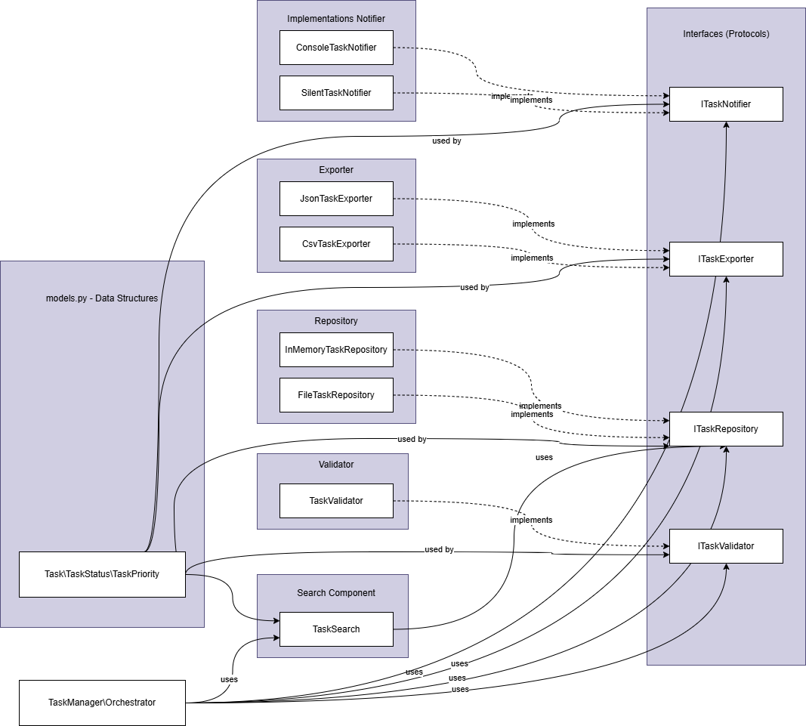

# Part 2.2: Cohesion and Coupling Analysis



---

## 1. Cohesion Analysis

Cohesion measures how closely related the responsibilities within a single component are.
High cohesion means a component does one thing well. The Task Management System is designed so that every component has **functional cohesion** — the highest level — where all elements contribute to a single, well-defined purpose.

---

### 1.1 TaskValidator (`components/validator.py`)

**Cohesion Type:** Functional

**Justification:**
Every method inside `TaskValidator` exists solely to validate task data. `validate_new()` and `validate_update()` both check task fields against business rules such as requiring a non-empty ID, a non-empty title, and a minimum title length of 3 characters. There is no storage logic, no formatting logic, and no notification logic inside this component. All elements serve one purpose: determining whether a task is valid.

---

### 1.2 TaskRepository (`components/repository.py`)

**Cohesion Type:** Functional

**Justification:**
Both `InMemoryTaskRepository` and `FileTaskRepository` contain only methods related to storing and retrieving tasks: `add()`, `update()`, `delete()`, `get()`, and `list_all()`. The `FileTaskRepository` additionally includes private helpers `_read()` and `_write()`, which are tightly related to file-based persistence. No validation or business logic is present inside the repository. All elements serve one purpose: managing task persistence.

---

### 1.3 TaskSearch (`components/search.py`)

**Cohesion Type:** Functional

**Justification:**
`TaskSearch` contains only methods that query or filter tasks: `search_text()`, `filter_by_status()`, and `filter_by_assignee()`. It does not modify tasks or persist data — it delegates retrieval to the repository through its interface. All elements serve one purpose: finding tasks that match given criteria.

---

### 1.4 TaskExporter (`components/exporter.py`)

**Cohesion Type:** Functional

**Justification:**
`JsonTaskExporter` and `CsvTaskExporter` each contain a single `export()` method responsible for converting a list of tasks into a specific string format. There is no storage, validation, or notification logic present. All elements serve one purpose: serialising tasks into an external format.

---

### 1.5 TaskNotifier (`components/notifier.py`)

**Cohesion Type:** Functional

**Justification:**
`ConsoleTaskNotifier` and `SilentTaskNotifier` each implement a single `send_reminder()` method. The component is entirely concerned with how reminders are delivered. There is no task data manipulation or format conversion inside the notifier. All elements serve one purpose: dispatching task reminder messages.

---

### 1.6 TaskManager (`task_manager.py`)

**Cohesion Type:** Functional

**Justification:**
`TaskManager` acts as an orchestrator. Every method it exposes — `create_task()`, `update_task()`, `delete_task()`, `assign_task()`, `search_tasks()`, `export_tasks()`, `send_task_reminder()` — coordinates the components to fulfil a user-facing task operation. It does not contain validation logic, storage logic, or formatting logic itself; it delegates to the appropriate component. All elements serve one purpose: orchestrating task workflows.

---

## 2. Coupling Analysis

Coupling measures the degree of dependency between components. The goal is to keep coupling as low as possible so that components can be changed, replaced, or tested independently.

---

### 2.1 Coupling Between Components

| Component Pair | Coupling Level | Reason |
|---|---|---|
| `TaskManager` → `ITaskValidator` | Low | Depends on Protocol interface, not the concrete class |
| `TaskManager` → `ITaskRepository` | Low | Depends on Protocol interface |
| `TaskManager` → `ITaskExporter` | Low | Depends on Protocol interface, receives a dict of exporters |
| `TaskManager` → `ITaskNotifier` | Low | Depends on Protocol interface |
| `TaskManager` → `TaskSearch` | Medium | Depends on the concrete `TaskSearch` class directly |
| `TaskSearch` → `ITaskRepository` | Low | Depends on Protocol interface |
| All components → `models.py` | Low | All components share the same `Task` data structure, which is a stable data-only module with no behaviour |

---

### 2.2 How Low Coupling Was Achieved

**Interfaces (Protocols)**

The system defines four interfaces using Python's `Protocol` type:

- `ITaskValidator`
- `ITaskRepository`
- `ITaskExporter`
- `ITaskNotifier`

`TaskManager` depends on these abstractions rather than on concrete classes. This means a concrete implementation can be replaced — for example, swapping `InMemoryTaskRepository` for `FileTaskRepository` — without any change to `TaskManager`.

**Dependency Injection**

All dependencies are injected into `TaskManager` through its constructor:

```python
TaskManager(
    validator=TaskValidator(),
    repository=InMemoryTaskRepository(),
    search=TaskSearch(repo),
    exporters={"json": JsonTaskExporter(), "csv": CsvTaskExporter()},
    notifier=ConsoleTaskNotifier()
)
```

No component creates its own dependencies internally. This eliminates hidden coupling and makes each component independently testable by injecting mock or stub implementations.

**Shared Data Model**

All components share `models.py` as a stable, data-only dependency. Because `Task`, `TaskStatus`, and `TaskPriority` contain no business logic, changes to any component do not risk breaking the shared model.

---

### 2.3 Coupling That Would Be Reduced With More Time

| Current Coupling | Issue | Proposed Improvement |
|---|---|---|
| `TaskManager` → `TaskSearch` (concrete) | `TaskSearch` is injected as a concrete class, not an interface | Define an `ITaskSearch` Protocol with `search_text()`, `filter_by_status()`, `filter_by_assignee()` methods, and update `TaskManager` to depend on the interface |
| `TaskSearch` → `ITaskRepository` (direct call to `list_all()`) | `TaskSearch` calls `list_all()` and filters in memory, which is inefficient for large datasets | With more time, introduce a query specification pattern so the repository handles filtering internally |
| `FileTaskRepository` → `os` / file system | The file repository is tightly coupled to the local file system | Abstract file I/O behind a storage interface to allow testing without a real file system |

---

## 3. SRP Application

The Single Responsibility Principle states that a module should have one and only one reason to change.

---

### 3.1 SRP Per Component

| Component | Single Responsibility | One Reason to Change |
|---|---|---|
| `TaskValidator` | Validate task data against business rules | Validation rules or business constraints change |
| `TaskRepository` | Persist and retrieve tasks | Storage mechanism changes (e.g. switch to a database) |
| `TaskSearch` | Filter and search tasks by criteria | Search logic or filtering rules change |
| `TaskExporter` | Serialise tasks into an external format | A new export format is introduced or an existing format changes |
| `TaskNotifier` | Deliver task reminder messages | Notification channel changes (e.g. switch from console to email) |
| `TaskManager` | Coordinate task workflows across components | Task workflow logic or orchestration order changes |
| `models.py` | Define the core data structures | The Task entity's fields or data types change |

---

### 3.2 SRP Justification Per Component

**TaskValidator**
The validator does not know how tasks are stored or how they are displayed. If the rule "title must be at least 3 characters" changes to 5 characters, only `validator.py` needs updating.

**TaskRepository**
The repository does not know what a valid task looks like or how to format it for export. If the team decides to store tasks in a SQL database instead of a JSON file, only `repository.py` needs updating.

**TaskSearch**
The search component does not create, update, or persist tasks. If a new filter — such as filtering by priority — is needed, only `search.py` needs updating.

**TaskExporter**
The exporter does not validate or store tasks. If an XML export format is required in the future, a new `XmlTaskExporter` class is added to `exporter.py` without touching any other file.

**TaskNotifier**
The notifier does not compose the message content or determine when reminders should be sent. If reminders need to be sent by email instead of printed to the console, only `notifier.py` needs updating.

**TaskManager**
The orchestrator delegates all logic to its components. If a new workflow step — such as logging every task creation — is required, only `task_manager.py` needs updating.

**models.py**
The data model does not contain business logic, storage logic, or formatting logic. If the `Task` entity needs a new `due_date` field, only `models.py` needs updating.

---

## 4. Summary

The Task Management System achieves high cohesion and low coupling through three key design decisions:

- **Functional cohesion** in every component — each module contains only elements that serve its single responsibility
- **Interface-based dependencies** using Python `Protocol` — high-level modules depend on abstractions, not concrete classes
- **Dependency injection** throughout — all components receive their dependencies from the outside, making the system flexible and independently testable

These decisions align with the Single Responsibility Principle, the Dependency Inversion Principle, and general modular design best practices.