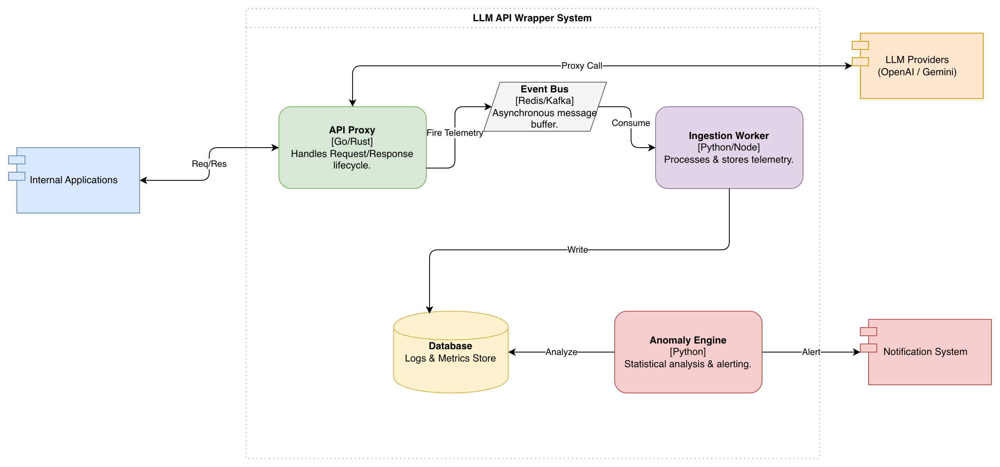

# Containers

## 1. API Proxy

**Technology Example:** Go or Rust

**Description**

The **API Proxy** is the entry point to the LLM wrapper system. All internal applications send their LLM requests to this container instead of directly interacting with external LLM providers.

The proxy manages the full request–response lifecycle. It forwards requests to the appropriate provider and returns the responses to the calling application.

**Responsibilities**

* Accept incoming API requests from internal applications
* Validate requests and authentication
* Route requests to the appropriate LLM provider 
* Measure request latency
* Return responses to the calling application
* Emit telemetry events describing the request

---

## 2. Event Bus

**Technology Example:** Redis Streams or Apache Kafka

**Description**

The **Event Bus** is responsible for decoupling request handling from telemetry processing. It acts as an asynchronous message buffer that receives telemetry events from the API Proxy and distributes them to downstream services.

Instead of directly writing logs or metrics synchronously, the proxy sends telemetry data to the event bus. This prevents monitoring operations from slowing down request handling.

**Responsibilities**

* Receive telemetry events from the API Proxy
* Buffer and queue events
* Deliver events to downstream consumers
* Enable asynchronous processing of monitoring data

---

## 3. Ingestion Worker

**Technology Example:** Python or Node.js

**Description**

The **Ingestion Worker** consumes telemetry events from the event bus and processes them for storage and analysis.

It transforms raw telemetry events into structured metrics and logs that can be stored in the system’s database.

**Responsibilities**

* Consume telemetry messages from the event bus
* Parse and normalize request metadata
* Extract important metrics such as latency, token usage, and model identifiers
* Store structured telemetry data in the metrics database

**Example of Data Captured**

* Request timestamp
* Model used
* Token counts
* Response latency
* Status codes
* Estimated cost

---

## 4. Anomaly Engine

**Technology Example:** Python

**Description**

The **Anomaly Engine** is responsible for analyzing collected metrics and identifying abnormal behavior patterns in LLM usage.

It performs statistical analysis on request metrics stored in the database to detect unexpected patterns such as traffic spikes, latency degradation, or cost anomalies.

When an anomaly is detected, the engine generates alerts.

**Responsibilities**

* Query telemetry data from the metrics database
* Analyze usage trends and system performance
* Apply anomaly detection rules or statistical models
* Generate alerts when anomalies occur
* Send notifications to external alerting systems

**Example Anomalies Detected**

* Sudden spike in request volume
* Increased response latency
* High error rate
* Unexpected growth in token usage or cost

---

## 5. TimescaleDB (Logs & Metrics Store)

**Technology Example:** TimescaleDB (PostgreSQL extension)

**Description**

The **TimescaleDB database** serves as the primary storage system for logs, telemetry data, and performance metrics collected from LLM requests.

Because LLM usage generates time-series data (timestamps, latency measurements, request rates), a time-series optimized database is used.

**Responsibilities**

* Store request metadata
* Store metrics and performance measurements
* Provide historical data for analysis
* Support queries from the anomaly detection engine

---

# External Systems

## Internal Applications

Internal applications are the clients that use the LLM wrapper to send prompts and receive generated responses. These may include backend services, APIs, or batch jobs that rely on language models for functionality.

---

## LLM Providers (OpenAI / Gemini)

These are external cloud services that host the actual language models. The API Proxy forwards requests to these providers and receives the generated responses.

---

## Notification System

The notification system is used to alert operators when anomalies are detected. Typical integrations include Slack, PagerDuty, or other incident management tools.

Alerts generated by the anomaly engine are delivered to this system so that engineering teams can respond to potential issues.

