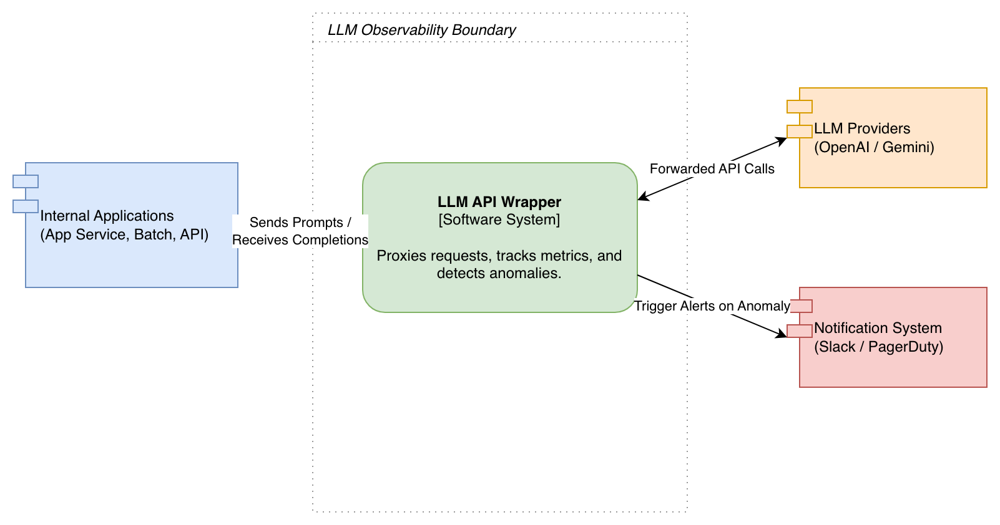

# Components

## 1. Internal Applications (App Service, Batch, API)

**Description**

Internal applications represent the **client systems that consume LLM capabilities**. These may include backend services, scheduled batch jobs, or internal APIs that generate prompts and request responses from language models.

**Responsibilities**

* Send prompts or structured requests to the LLM wrapper.
* Receive generated responses or completions.
* Use the responses for application functionality such as content generation, summarization, or decision support.

---

## 2. LLM API Wrapper (Software System)

**Description**

The **LLM API Wrapper** is the core system in the architecture. It acts as a **proxy** between internal applications and external LLM providers.

**Primary Responsibilities**

* Forward requests from applications to the appropriate LLM provider.
* Capture metadata about each request (e.g., timestamp, model used, latency, tokens).
* Monitor operational metrics such as throughput, latency, and error rates.
* Detect anomalies in usage patterns or performance metrics.
* Trigger alerts when abnormal behavior is detected.

**Key Functions**

* Request proxying and routing
* Usage tracking
* Metrics generation
* Anomaly detection
* Alert triggering

---

## 3. LLM Providers (OpenAI / Gemini)

**Description**

LLM providers are **external services that host and execute large language models**.

Examples include:

* OpenAI APIs
* Google Gemini APIs

**Responsibilities**

* Process prompts received from the wrapper.
* Generate text completions or structured responses.
* Return results to the wrapper for delivery to the calling application.

---

## 4. Notification System (Slack / PagerDuty)

**Description**

The notification system is responsible for **alerting operators when anomalies occur**.

Typical implementations include:

* Slack channels
* PagerDuty alerts
* Email or incident management systems

**Responsibilities**

* Receive alerts from the LLM wrapper.
* Notify operations or engineering teams.
* Enable rapid response to abnormal conditions.

