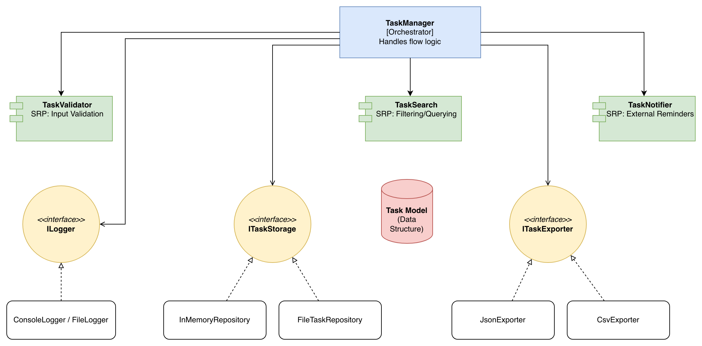

# Part 2.2: Cohesion and Coupling Analysis

---

## a) Cohesion Analysis

Cohesion measures how closely related the internal responsibilities of a single module are. This system achieves **High Cohesion** by ensuring each component follows a specific category of logic.

| Component | Cohesion Type | Justification |
| :--- | :--- | :--- |
| **TaskValidator** | **Functional** | Every line of code exists solely to validate task data integrity. It has no side effects on storage or UI. |
| **TaskRepository** | **Communicational** | All functions (add, get_all) operate on the same central data set (the task storage). |
| **TaskSearch** | **Functional** | It performs a single, well-defined logic operation: filtering a list based on criteria. |
| **TaskExporter** | **Logical** | It groups similar activities (exporting) that are logically related, providing a unified output interface. |
| **TaskNotifier** | **Functional** | Its only job is to communicate task status to an external interface (currently the console). |
| **TaskManager** | **Sequential** | It coordinates a workflow where the output of one component (Validator) becomes the input for the next (Repository). |

---

## b) Coupling Analysis

Coupling measures the degree of interdependence between modules. This design achieves **Low Coupling** through several architectural strategies.

### How Low Coupling Was Achieved
1.  **Dependency Inversion:** The `TaskManager` does not depend on concrete classes like `FileTaskRepository`. Instead, it depends on the `ITaskStorage` protocol (interface).
2.  **Information Hiding:** Components like the `JsonExporter` encapsulate the messy details of `datetime` and `Enum` serialization. The `TaskManager` doesn't need to know how JSON conversion works.
3.  **Dependency Injection:** By passing dependencies through the constructor, the logic of *using* a tool is separated from the logic of *creating* the tool.

### Current Coupling Assessment
* **Level: Low.** Most components are "Pluggable." You can remove the `Notifier` or swap the `Exporter` without the `TaskManager` failing or needing a code rewrite.
* **Control Coupling:** None. We do not pass "flag" variables to change how components behave internally; we use polymorphic implementations instead.

### Future Improvements
With more time, I would reduce the **Data Coupling** between `TaskSearch` and `TaskRepository`. Currently, Search requires the Repository to return a full list of tasks. In a larger system, I would move the search logic directly into the Repository (e.g., using SQL queries) to avoid passing large data objects between components.

---

## c) SRP Application (Single Responsibility Principle)

Each component follows the SRP rule: "A class should have only one reason to change."

| Component | Single Responsibility | One Reason to Change |
| :--- | :--- | :--- |
| **TaskValidator** | Enforce business rules/integrity. | A change in task title length or required fields. |
| **TaskRepository** | Manage data persistence. | Switching from JSON files to a SQL database. |
| **TaskSearch** | Filter task collections. | Adding a new "Search by Date Range" feature. |
| **TaskExporter** | Format data for external use. | Adding support for XML or Excel exports. |
| **TaskNotifier** | Alert users of task events. | Switching from Console prints to Email or Slack. |
| **Models (Task)** | Represent the data structure. | Adding a new field like `TaskPriority` or `Tags`. |