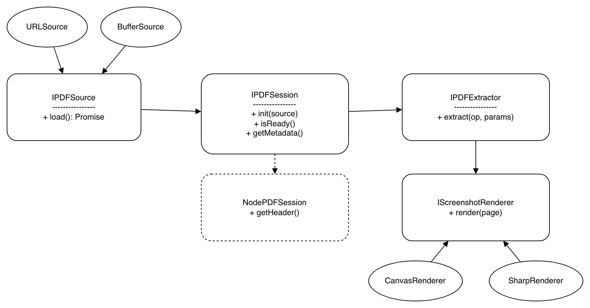

## Task 1.1 Reusability Analysis: pdf-parse Library

In this section, I look at how reusable the current `pdf-parse` API is, based on some common software architecture principles like modularity and clean interface design.

---

### Strengths Supporting Reusability

- **Platform Versatility:**  
  The library works in Node.js, browsers, and serverless environments. This makes it pretty flexible and usable in different kinds of projects.

- **Flexible Data Model:**  
  It can take different input formats like URLs, Buffers, and base64. This is helpful because it makes it easier to integrate into different systems.

- **Abstracted Functionality:**  
  Methods like `getText()` hide the complex logic of parsing PDFs. This makes it easier to use, especially for developers who don’t want to deal with low-level details.

---

### Weaknesses Hurting Reusability

- **Platform Leakage:**  
  The method `getHeader()` only works in Node.js, but it’s still part of the main API. This is confusing for developers working in the browser because they see a method they can’t even use.

- **Monolithic Class Design:**  
  Everything is bundled into one big `PDFParse` class (text extraction, images, tables, etc.). This goes against the idea of small, focused interfaces. If I only need one feature, I still have to deal with everything else.

- **Implicit State Dependencies:**  
  It’s not clear if the library keeps internal state or not. For example, if I call the same method twice, I don’t know if it re-processes the PDF or uses cached data. This makes it harder to predict behavior.

---

### Interface Issues & Concrete Observations

| Method       | Observation | Principle |
|--------------|------------|-----------|
| `getText()`  | This seems like a core (primitive) operation. But since it just returns raw text without a clear structure, it can lead to messy, hard-to-parse results. | Primitive Operations |
| `getImage()` | This could be expensive performance-wise. It’s not clear if the image is generated every time or cached, which breaks the idea of consistent access. | Uniform Access |
| `getHeader()`| Only works in Node.js but is still exposed everywhere. This makes the interface less clean and adds unnecessary clutter. | Clear Interfaces |

---

Overall, the API is easy to use and convenient because everything is in one place. But from a reusability point of view, it has some problems. It doesn’t separate concerns well and includes features that aren’t useful in all environments. A more modular design with smaller, focused interfaces would make it more reusable.