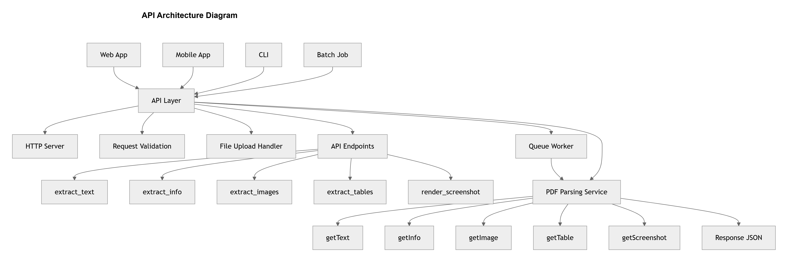
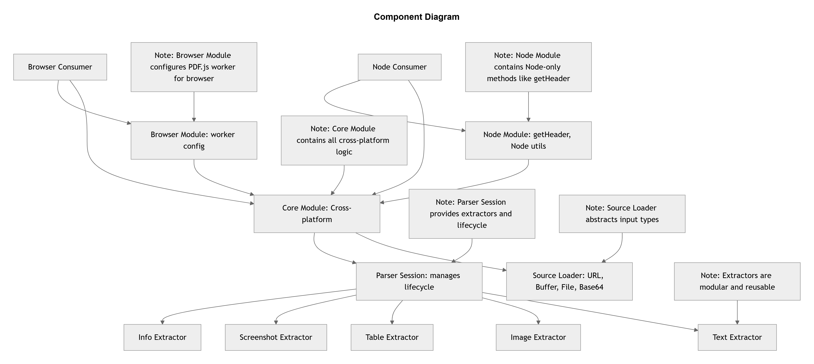

# pdf-parse Redesign Assignment

## Overview

This project presents a redesigned architecture for the *pdf-parse* library, focusing on improving:

- Reusability
- Modularity
- Clear interfaces
- Cross-platform support (Node.js, Browser, CLI, API)

The redesign separates concerns into *Source → Parser → Extractors*, making the system easier to extend and reuse in different environments.

---

## What This Submission Includes

### Part 1 – Reusability & Interface Design

- Analysis of the current pdf-parse API (strengths and weaknesses)
- Identification of reusability issues (monolithic design, unclear contracts)
- Redesigned modular interfaces:
  - IPDFSource (loading PDFs)
  - IPDFParser / PDFSession (parsing lifecycle)
  - IPDFExtractor (modular extraction)

---

### Part 2 – API Design

- REST API that exposes pdf parsing as a service
- Endpoints for:
  - Text extraction
  - Metadata
  - Images
  - Tables
  - Screenshots
- Supports multiple inputs:
  - File upload
  - URL
  - Base64

#### API Architecture Diagram

---

### Part 3 – Reusability Across Contexts

- Same core interface used in:
  - Node.js
  - Browser
  - CLI
  - API client

- Only configuration changes (source type, environment setup)

- Platform abstraction:
  - Core module (shared)
  - Node module (getHeader)
  - Browser module (worker config)

---

### Part 4 – Evolution and Versioning

- Migration from:
  - v1 (function-based) → v2 (class-based)

- Improvements in v2:
  - Instance lifecycle (destroy())
  - Modular extraction methods
  - Cross-platform support

- Future evolution:
  - Streaming text extraction for large PDFs

#### Component Diagram

---

## Key Design Principles

- *Separation of Concerns*  
  Loading, parsing, and extraction are independent

- *Modularity*  
  Each extractor is reusable and replaceable

- *Platform Abstraction*  
  Node-specific features are isolated

- *Extensibility*  
  New features can be added without breaking existing code

 