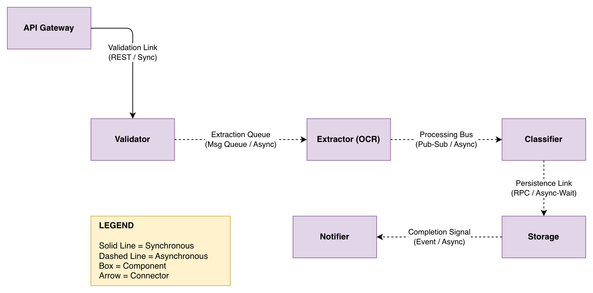
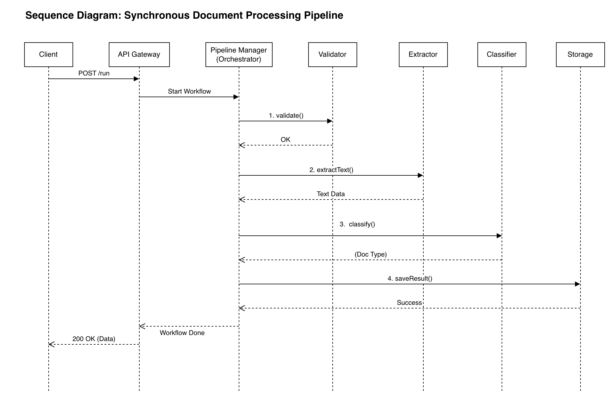

# Document Processing Pipeline – Architecture Design

## Project Overview
This repository contains the architectural design for a  Document Processing Pipeline. The system is designed to handle document uploads, perform OCR/extraction, classify document types, and handle persistence and notifications. 

The architecture supports both **Synchronous**  and **Asynchronous**  processing modes.
---

## 1. Component and Connector Design
The system is decomposed into six modular components, each following the **Single Responsibility Principle**.

* **API Gateway:** Entry point and auth.
* **Validator:** Rapid file integrity and security checks.
* **Extractor:** Heavy-lift OCR and text processing.
* **Classifier:** Machine learning-based document typing.
* **Storage:** Database and blob persistence.
* **Notifier:** Outbound webhooks and alerts.

### Component & Connector Diagram


---

## 2. Orchestration vs. Choreography
I explored two different composition styles for managing the pipeline flow:

1.  **Orchestrated (The "Manager" Pattern):** A central Pipeline Manager directs each step.
2.  **Choreographed (The "Event" Pattern):** Components react to events (e.g., `ExtractionCompleted`) via a message bus. 

I utilize a **Hybrid Approach**. Orchestration is used for the core validation/extraction sequence, while Choreography handles post-processing side effects like storage and notifications.

---

## 3. API and Usage
The API provides two main endpoints to support different client needs:

* `POST /api/v1/pipeline/run`: Synchronous processing for small files.
* `POST /api/v1/pipeline/jobs`: Asynchronous processing for batches or large files.

### Sequence Diagram (Synchronous Flow)
The following diagram illustrates the end-to-end flow where the Pipeline Manager coordinates the services in real-time.



---

## 4. Repository Structure
```text
submissions/Sonia_Mangane/
├── part1_components_and_connectors.md
├── part1_component_connector_diagram.drawio
├── part1_component_connector_diagram.png
├── part2_orchestration.md
├── part2_choreography.md
├── part2_comparison.md
├── part3_api_design.md
├── part3_sequence_diagram.drawio
├── part3_sequence_diagram.png
└── README.md