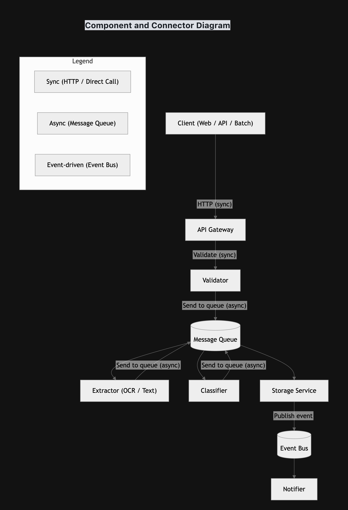
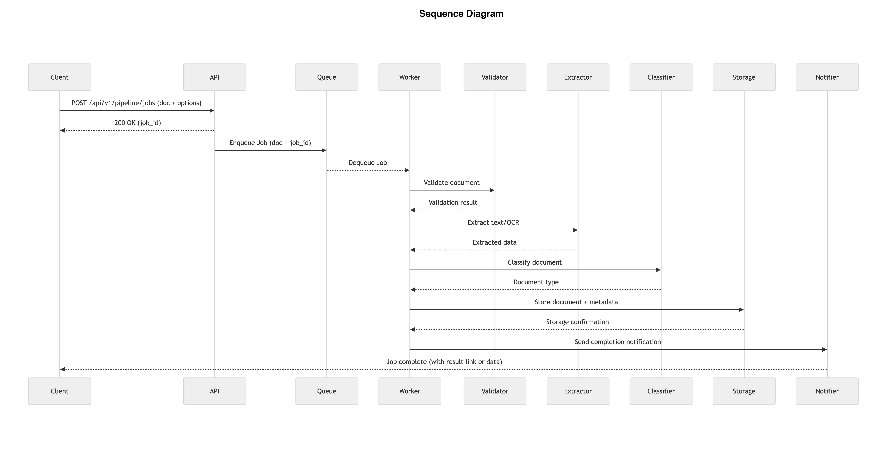

# Composable Document Pipeline

## Overview

This repository contains the architecture and design of a **Composable Document Processing Pipeline**.  
The pipeline supports both **synchronous** (process and return result) and **asynchronous** (process in background, notify when done) flows.

**Pipeline Steps:**
1. **Validate** – Check document format and correctness
2. **Extract** – OCR / text extraction
3. **Classify** – Determine document type (invoice, form, etc.)
4. **Store** – Save extracted data
5. **Notify** – Inform client of results (email/webhook)

---

## Part 1: Components and Connectors

- **Components:**
  - Validator
  - Extractor
  - Classifier
  - Storage
  - Notifier

- **Connector Types:**
  - Sync direct calls for immediate validation
  - Async message queue or event bus for long-running tasks
  - JSON over HTTP or internal message format

**Diagram:**  

---

## Part 2: Orchestration vs Choreography

### Orchestration
- **Orchestrator:** `PipelineOrchestrator` (central control)
- **Flow:** Validator → Extractor → Classifier → Storage → Notifier
- **Advantage:** Simple to follow; easy to change flow in one place
- **Disadvantage:** Central orchestrator can become a bottleneck

### Choreography (Event-Driven)
- **Flow:** Components react to events, e.g., `DocumentReceived`, `ValidationComplete`, `ExtractionComplete`, `DocumentStored`
- **Advantage:** Loose coupling, scalable, flexible
- **Disadvantage:** Harder to trace flow and debug

### Comparison Table

| Criteria                     | Orchestration         | Choreography          |
|-------------------------------|---------------------|---------------------|
| Ease of changing order        | Easy                 | Hard                |
| Ease of adding new steps      | Requires update      | Easy                |
| Debugging / tracing           | Easy                 | Hard                |
| Coupling                      | Tighter              | Looser              |
| Scalability                   | Limited              | High                |
| Latency                       | Medium               | Lower (async)       |

**Recommendation:**  
Hybrid approach: use orchestration for synchronous API requests (immediate feedback) and event-driven choreography for background jobs (async, scalable).

- Validation: synchronous → orchestrator ensures immediate feedback  
- Processing (OCR, classification, storage, notification): asynchronous → event-driven workflow  

---

## Part 3: API Design & Sequence Diagram

### API Endpoints

- **Sync:**
POST /api/v1/pipeline/run
Body: { document, options }
Response: extracted data or error

- **Async:**
POST /api/v1/pipeline/jobs
Body: { document, options }
Response: job_id

GET /api/v1/pipeline/jobs/{job_id}
Response: status + result

### Sequence Diagram (Async Flow)

**Diagram:**  

- Client sends document → API → Job enqueued → Worker processes → Components run → Storage → EventBus → Notifier → Client notified

---

## Notes

- Diagrams are created in **draw.io** and exported as PNG for reference.
- All connectors are labeled with **sync/async** type.
- Pipeline supports both **immediate result** and **background job** modes.
