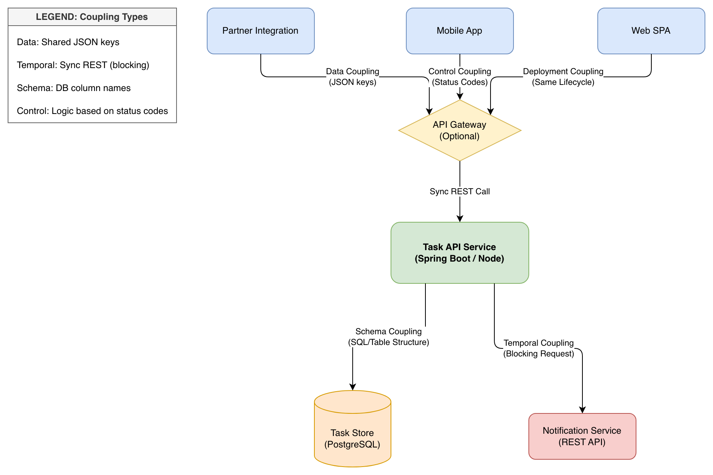
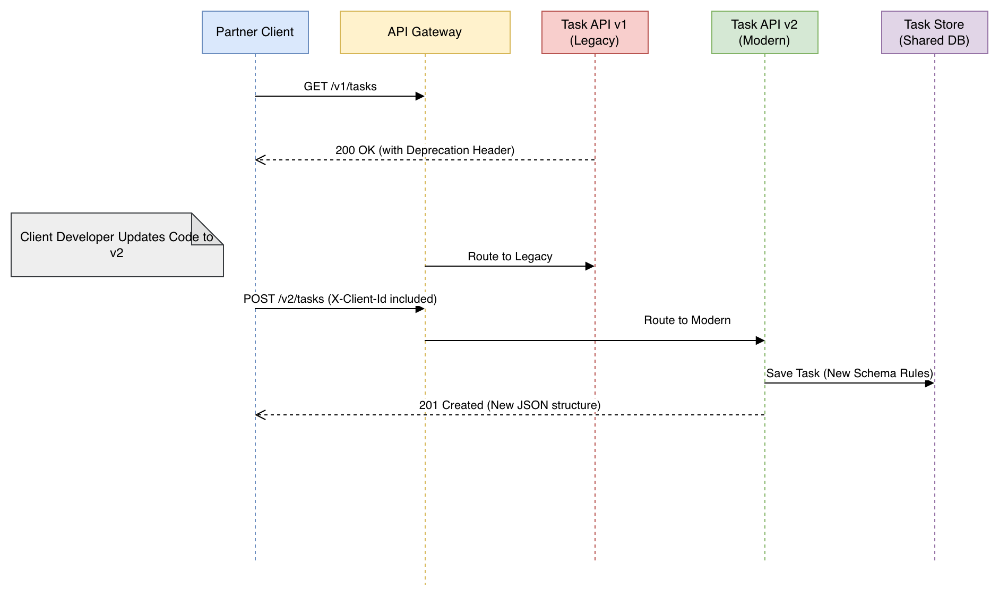

# Task Board API — Compatibility and Coupling Architecture

## Project Overview
This repository contains my architectural analysis for the **Task Board REST API**. I wanted to figure out how we can keep adding cool features for our Web, Mobile, and Partner users without accidentally breaking their apps every time we rename a variable.

In this project, I’ve mapped out our **coupling hotspots**, picked a **versioning strategy** that won't confuse our partners, and wrote a **compatibility policy** so we all know the "ground rules" for making changes.


## 1. Coupling Analysis: What's connected to what?
I looked at how our services talk to each other to find where a change in one place might cause a "ripple effect" elsewhere. I found that while some tight coupling is okay (like the API needing its database), we should really move toward async notifications to make the system more stable.

* **Public API:** How everyone gets their tasks.
* **API Gateway:** Our "traffic cop" that handles version routing.
* **Task API Service:** Where the actual work happens.
* **Task Store:** Our PostgreSQL database (the "brain").
* **Notification Service:** For reminders (currently a bit too "needy" on the API).

### Dependency Diagram
This diagram shows the "hotspots" where I’m most worried about breaking things for our Partners if we change our JSON format.



---

## 2. Compatibility & SemVer (The Breaking Points)
I took five proposed changes and sorted them by how much they'd "scare" a developer using our API.

1.  **The "Safe" Stuff (Minor):** Adding optional fields like `priority` or the new `bulk` endpoint. These shouldn't break anyone's code!
2.  **The "Scary" Stuff (Major):** Renaming `done` to `completed`, shrinking the title limit, or requiring the `X-Client-Id` header. These are **Breaking Changes**.

### My Coexistence Plan
To keep everyone happy, I’m suggesting **URL Path Versioning** (`/v1` and `/v2`). It's super easy to see in the logs, and it lets our legacy partners stay on v1 for a 6-month "sunset window" while we move the cool kids to v2.

---

## 3. Migration & How we move forward
I wrote a **Compatibility Policy** to act as a "Developer's Bible." It ensures our error codes stay consistent and gives our partners a longer heads-up than our internal teams when we're retiring old versions.

### Migration Sequence Diagram
I mapped out a "day in the life" of a partner client: they see a warning header, update their code, and then get routed to our new v2 service by the Gateway.



---

## 4. Repository Structure
Everything is organized here:

```text
submissions/Sonia_Mangane/
├── part1_coupling_analysis.md
├── part1_coupling_diagram.drawio
├── part1_coupling_diagram.png
├── part2_compatibility_changes.md
├── part2_version_coexistence.md
├── part3_compatibility_policy.md
├── part3_migration_sequence.drawio
├── part3_migration_sequence.png
└── README.md